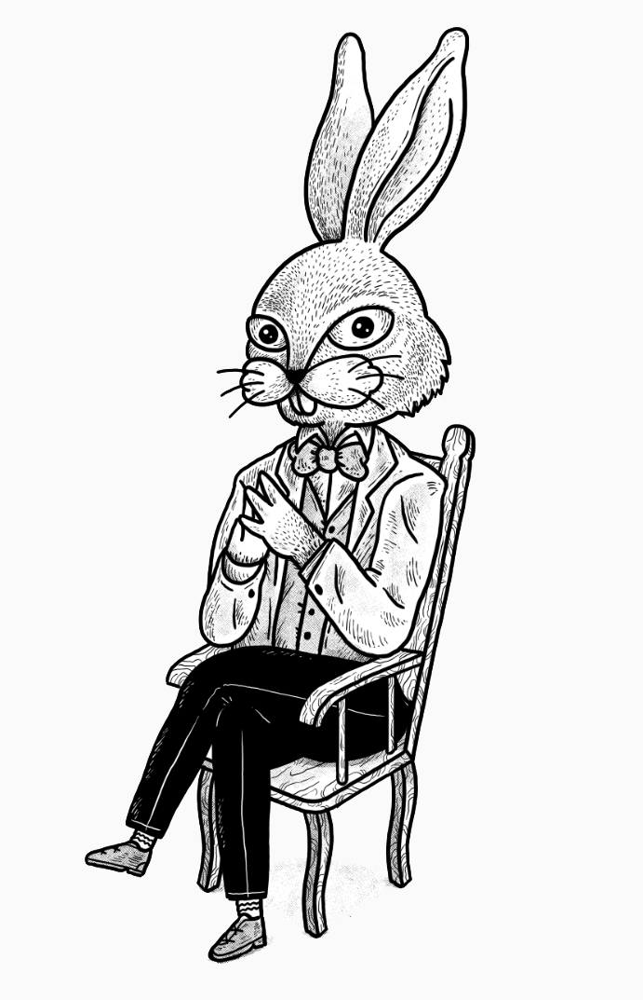
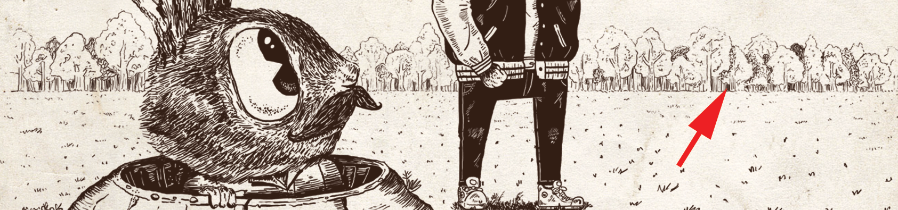
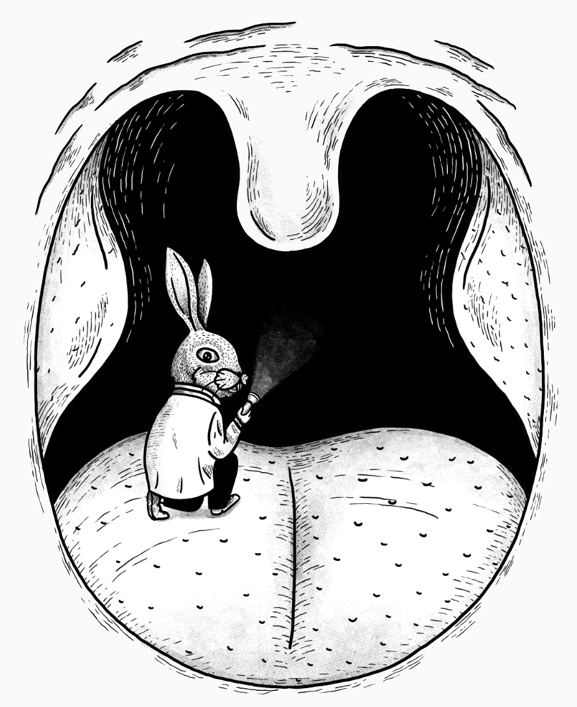
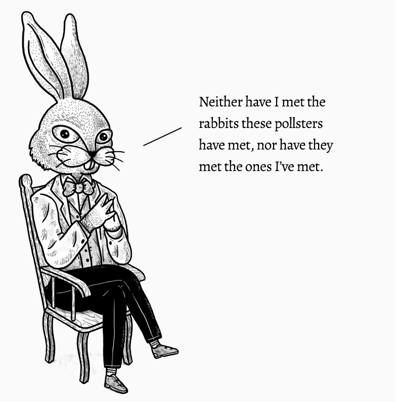
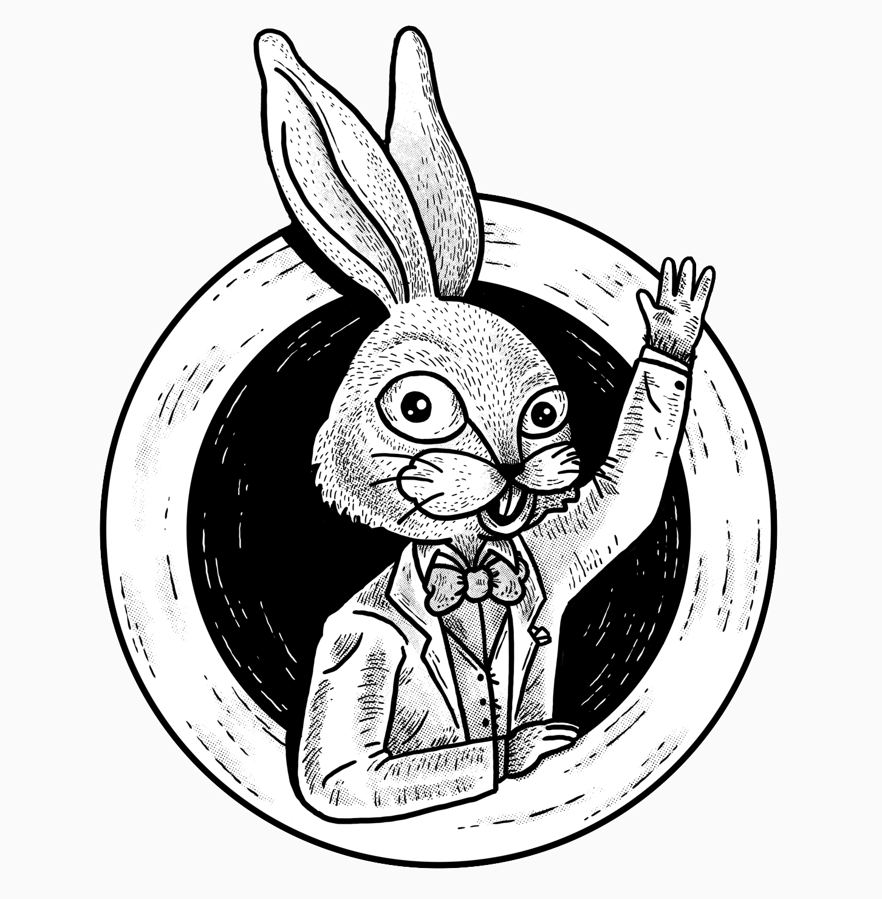

---
 

[T]hat the very concept of objective truth is fading out of the world ... frightens me much more than bombs.

&#8288;—&#8288;George&nbsp;Orwell

---

### Oh, hello. It's Mr. Rabbit here.

  
  <figcaption>[Art 1 / Sketch] Rabbit is sitting on a chair, finger tips touching, legs crossed, and looks straight at the reader.</figcaption>

You might remember me from a project from several years ago. Badger and I both 
featured in it. He was on the cover and I was one of the extras on page 27.

  
  <figcaption><i><a href='https://bookofbadarguments.com/'>An Illustrated Book of Bad Arguments</a></i>. All artwork on this page is by Alejandro Giraldo.</figcaption>

We play the room as it lays, my friend. We play the room as it lays.

I've since landed a new gig, and I'm excited to share it with you. This project is planned for completion in 2021 (along with a book in print later in the year!) In the meantime, you're all welcome to contribute your perspectives to it.

### A Quick Introduction

Some will say rhetoric is old-school trickery. That it no longer works. That we're all much wiser now and can tell when we're being duped by crafty language. I disagree. Sneaky rhetoric is still prevalent in everyday conversations, in newspapers and websites of record, in posts shared by influential people, and in speeches by eloquent intellectuals. And it continues to impact how we perceive the world around us. I want to walk you through a sort of dictionary of this kind of rhetoric.

Part of the reason why these sleights of hand get past us is because of our tendency, when listening to someone speak for instance, to be focused on whether or not we like that person, and not on whether or not that person is making any sense. Another reason is due to how we instinctively process information. Consider two well-known effects.

**Priming**. In a video recording that made the rounds online, a group of friends are sitting in a living room. One of them, an English major no less, is asked to pronounce T&#8209;W&#8209;A, which she does phonetically. She is then asked to pronounce T&#8209;W&#8209;I, which she also does. Then onto T&#8209;W&#8209;O, at which point her series of increasingly peculiar attempts leaves everyone in stitches. Other videos of that sort of gag are aplenty.

What's interesting about the video is that our English major is using instincts that normally serve her well to try and answer a seemingly innocuous question. Albeit, the information imparted to her at the outset proves debilitating as she attempts to answer subsequent questions, all to great comedic effect. People are sensitive to priors.

**Framing**. In the canonical example for framing, a question is posed to two groups of participants about a deadly disease that is about to kill 600 people, for which two treatments exist. Group 1 is given the choice between A) a treatment that saves 200 of those people, and B) one that has a one-third probability of saving all 600 and a two-thirds probability of saving no one. Group 2 is given the choice between C) a treatment that causes 400 of those people to die, and D) one that has a two-thirds probability of causing all 600 to die and a one-third probability of causing no one to die.

Even though both sets of choices are equivalent, in the positive framing, more participants chose the treatment with the certain outcome (A) and in the negative framing, more participants chose the treatment with the riskier outcome (D).

What these and many other social and perceptual biases show is that our heuristics, our instincts, our reflexes, which we rely on for much of our decisions in everyday life, aren't as reliable as we think they are. They're much too susceptible to how information is packaged and presented to us.

And these biases—optical illusions, in effect—exist in the tens or hundreds depending on whom you ask, and are often subtle. For instance, grouping countries based on proximity seems natural, as does sorting a list of things alphabetically. Yet those inclinations are far from naturally occurring. And it's that second group of biases in particular that led me to wanting to share this guide with you.

In seven sections, and accompanied by memorable illustrations (all of me), I'll be sharing examples of how the language we construct and consume shapes how we perceive the world around us. Examples include language that prevaricates, language that conceals with vagueness, and language that feigns objectivity with apparent neutrality. The sections aren't always non-overlapping, and the examples aren't meant to be exhaustive.

Note that in this guide I won't be focused on malleable constructs like political correctness nor with lazily exploitable ones like identity politics. I will overlook overt examples of bigotry and insincerity, which should no doubt provoke the requisite tuts and eye rolls from discerning readers. I will also sidestep the important topic of culture and how it informs our interpretations of language&mdash;two English-speakers may have a completely different relationship with the language by virtue of the cultures they come from.

I'm primarily interested in language that manipulates. So my goal is to highlight a variety of examples where language either wittingly—insidiously—or unwittingly—due to implicit bias—influences thought. A good portion of examples is from sources that are generally perceived as being neutral, unbiased, and non-partisan. I try to lay those examples bare.

Also note that this guide is about the _words_ used to talk about various issues, and not about the issues themselves. You humans have a political climate that's charged as it is. I don't intend to contribute to that divisiveness. In achieving that goal, most examples will be _adaptations_ of actual lines from public figures, intellectuals, journalists, and broadsheets. A select few have been slightly embellished for comedic effect.

Most of those adaptations feature rabbits and badgers. Any connection between badgers and the culpable side in an example is purely coincidental.

---

### The Subtle Ways Language Influences Thought
1. [Language that conceals with vagueness](#1-language-that-conceals-with-vagueness)
2. [Language that creates sinister associations](#2-language-that-creates-sinister-associations)
3. [Language that creates feel-good associations](#3-language-that-creates-feel-good-associations)
4. [Language that presupposes](#4-language-that-presupposes)
5. [Language that feigns objectivity with apparent neutrality](#5-language-that-feigns-objectivity-with-apparent-neutrality)
6. [Language that starts the clock of history when it's most convenient](#6-language-that-starts-the-clock-of-history-when-its-most-convenient)
7. [Language that tells you how to think about yourself](#7-language-that-tells-you-how-to-think-about-yourself)

---

  
  <figcaption>[Art 2 / Sketch] Mr. Rabbit pulls back a pair of tonsils and invites the reader to follow him. [I've so many questions &mdash;Ed.]</figcaption>

### 1. Language that conceals with vagueness

Vagueness is at the heart of insincere language. It clouds thinking, it muddies meanings, and as Orwell writes about vague words, "the person who uses them has his own private definition, but allows his hearer to think he means something quite different." Other times, vagueness disassociates us from a contemptible act or a bad memory. In that sense it brings to mind moral thought experiments like the trolley problem, wherein people might be more inclined to justify causing harm _indirectly_ than to physically push someone onto the tracks and be directly complicit in that harm.

Let's look at some examples.

**Misattributing actions.** Objects can sometimes be anthropomorphized. In an online daily paper we find the line

“The man **connected his fist** to the officer's face.”

Once connected, one might imagine, the fist proceeds of its own accord to impart force on said face, which results in a bruise. The fist is then taken into custody and is denied bail.

  
  <figcaption>[Art 3] A handcuffed, frowning fist, flanked by two police officers, is being walked to a police car.</figcaption>

In a paper of record we find the headline

"Missile at Local Cafe **Finds Patrons** Poised for World Cup”

A laser-guided missile saunters to the cafe, one is made to imagine, a toothpick hanging between its two chapped lips, pushes through the cafe's batwing doors and swiftly tips its wide-brimmed hat with thumb and forefinger.

Another of the paper's headlines about a fatal airstrike reminds us that beaches won't ever learn to mind their own business. It reads

"Rabbits **Drawn to** Beach and **Into** Center of Conflict"

A tell-all memoir chronicling the life of a First Lady's personal friend includes the line

"I’d **found myself** planning the most divisive inauguration in history."

It's the worst, isn't it? When you're sitting around, minding your own business, and then you _find yourself_ planning an inauguration.

  
  <figcaption>[Art 4] Reporters (animals) are holding microphones in front of a senator's face. "Senator, were you the one who ate all the leftover chocolate cake?" reads the speech bubble. The stony-faced senator (animal) turns to face the camera, jabbing an index finger at the lens, "Look,” he says, “the fact of the matter is, when I closed the fridge door, that cake had already been eaten."</figcaption>

More generally, actions are sometimes attributed to a vague or unknown actor even though the actor is known or known with high confidence.

"West Rabbit teen wounded by Badger gunfire **dies**"

“Four guards fired after a man **dies** in custody”

“Hiroshima marks 75th anniversary of **world's** first atomic bombing”

“Violent protests **leave dozens dead**”

“Rabbits zapped three badgers in an ambush last night; the event happened hours after six rabbits in a neighboring town **lost their lives**.”

In each of those examples, a word or a set of words help take the edge off the unpleasant fact that's being conveyed. In the last example, an action is attributed to rabbits in the first part, but not to badgers in the second part.

**Misattributing quotes**. A quote or quality attributable to a single person may be attributed to an entire group in order to increase credibility for the thing being said. It can often be hard to spot. For instance, a line in The Guardian reads

“**Witnesses** at the scene said that there was a ‘tremendous bang and then all hell broke loose.'”

Did they all say that or did one particular witness say it?

**The passive voice** is another way of disconnecting an event from whoever is committing it.

“The rabbit-badger war of 1974 led to the displacement of badger and rabbit populations in the city and its division. All badger residents of the northern part of the city **were expelled** **by rabbit forces** and the entire badger neighborhood was destroyed. Rabbit villages such as Purtown, Grumpytown, and Whiskertown **were depopulated**.”

In the first instance, the expulsion is attributed to rabbits. In the second the depopulation is unattributed.

An article about a bus driver being beaten with a bat by three passengers refusing to wear face masks includes the lines

"The victim pulled over the bus to escort the males off. As the victim was escorting the males off the bus one of the males pulled out a wooden bat and struck the victim several times, **which caused the victim to be injured**."

In an interview on BBC's Newsnight, when a minister is asked if he knew that his security forces were so brutal replies

"Mistakes **were made**. We don't tolerate human rights violations or torture."

The passive voice describes the bad thing. The active voice describes the good thing. What we end up with is a shifting of blame, and a weaseling out of any sense of responsibility. No one ever makes a mistake, mistakes are always made. No one ever commits a crime, crimes are always committed.

In a grant of clemency from an outgoing president, we find the following line

"When the convoy attempted to establish a blockade, **the situation** turned violent, which **resulted** in the unfortunate deaths and injuries of civilians."

The passive voice aims to disassociate the four defense contractors being pardoned from their heinous act.

And finally, a coffee bean producer responds to an allegation about mistreating an employee with

“We have a responsibility to the people mentioned and to our employees and a fair investigation **will be conducted**.”

The thing we're counting on them doing is described in the passive voice, which makes us wonder whether or not they intend to do it at all. It brings to mind other similar promises by corporate executives and state officials, all of which were meant to throw dust into people's eyes.

**Omitting detail**. On the financial news website Barron's, we find the headline

"CEO Sells Shares Ahead of Stock Split"

Later in the article, we see the line about the sale being a _planned_ one, as is always the case with executives selling shares. The headline makes it seem like it wasn't.

Reporting on a speech from a political party's national convention, in which a member was to be formally elected as the party's presidential candidate, an NBC News update reads

"In one of the shortest speeches of the convention, the congresswoman **did not** endorse the presumptive nominee Jim Bo."

While the statement is factually accurate, it omits the detail that the congresswoman's endorsement of another candidate&mdash;the runner-up candidate in that race&mdash;was a mere formality. Far from the act of rebellion the statement attempts to insinuate. The broadcaster later issued a clarifying note.

Reporting on a demonstration in which 250,000 people participated, the lede in a piece by the New York Times reads

"In by far the largest protest yet here, **tens of thousands** of demonstrators packed the city’s streets on Friday."

While saying the protest was made up of tens of thousands of demonstrators is technically accurate (as is saying it had thousands or hundreds or tens of protestors), the omission does significantly downplay the magnitude and significance of such an event.

It brings to mind a more recent example. When asked how long it would take to resolve issues with people in the UK not being able to get tested for COVID-19, Health Secretary Matt Hancock replied that it would take "a matter of weeks" to resolve the issues. As Andy Zaltzman quips on an episode of The News Quiz, "It's been a matter of weeks since the Romans invaded. Just over a hundred thousand weeks, but still weeks."

More banally, a founder's professional profile reads

“Our company has signed multi-year client agreements with Google and Salesforce.com.”

On closer inspection, one finds that the company did nothing more than take part in the ordinary task of paying for Google G Suite and Salesforce.com's plans on behalf of its customers.

In corporate speak, we see lines such as

“This quarter, we delivered **several solutions** that **improved performance**.”

Was it a lack of conscientiousness that led to the subsequent improvement?

“Last month we saw **an uptick** in customer emails asking for new features.”

Was it up to two from one?

In another example, a Washington Post headline reads

“This California city defunded its police force. Killings by officers soared.”

The article fails to point out that defunding a police force entails reallocating those funds to social services agencies. The city in question never did that.

**Seem.** In a book by a popular podcast host, we find the paragraph

"Many of my critics fault me for not engaging more directly with the academic literature on moral philosophy ... [M]y approach is to generally make an end run around many of the views and conceptual distinctions that make academic discussions of human values so inaccessible. While this is guaranteed to annoy a few people, the professional philosophers I’ve consulted **seem to** understand and support what I am doing."

The professional philosophers are never named, and one is left wondering whether they do or whether they don't agree with the author.

**Allegedly.** Something can be _alleged_ even though it isn't by any means libelous, merely to make vague an otherwise clear series of events. For instance,

“Badger under fire for allegedly using anti-Rabbit slur during interview with radio host”

Did he or didn't he? If he didn't, it's not a story. If he did, it's not alleged.

“The rabbits's revolt was swiftly ended by the badger army's overwhelming military power. In this latest unrest, the badgers have been supported by four neighboring powers. The rabbits have **allegedly** been supported by two.

**Confusing confusable concepts.** Weather and climate are sometimes used interchangeably. A line in a Sunday paper reads

“Closer to home, Austria is today seeing its earliest snowfall in history with 30 to 40 centimetres already predicted in the mountains . . . Such dramatic falls in temperatures provide superficial evidence for those who doubt that the world is threatened by climate change.”

More recently, the view that face masks can lead to oxygen deprivation seeped into the mainstream. A line in a daily, albeit obscure, paper reads

"Studies reveal that wearing face masks can negatively affect the mind and body."

The view conflates a scientific finding that a face mask reduces the oxygen levels within the space between the mask and one's mouth with a reduction in the oxygen level within one's body. Research shows that the body is able to compensate for such drops by increasing one's heart rate and tidal volume.

**Probably, might have** may be used to weaken an indisputable fact by introducing doubt.

“Spices became part of the national cuisine in the Badger Kingdom over time. Their popularity spread with the help of badgers in the eastern rabbit territories, who **probably** learned it from the local rabbits.”

Other times, it may be used to insinuate a subtext without explicitly stating it. In a TV interview, an activist recalls an anecdote in which the intention, it becomes evident, is for the activist to delegitimize an influential rival.

"Following my visit to his house, we agreed to abide by a set of terms. The ones I agreed to happened. The ones he agreed to **might not have** happened."

**Concealing with apparent precision**. A San Francisco Chronicle article states

"At UC Berkeley, beavers and hamsters make up only 15% and 3% of undergraduates, respectively, whereas 45% of California high school seniors who meet UC requirements are beavers and 4% are hamsters."

Meeting UC requirements doesn't mean there wasn't a stronger candidate that could have taken that spot.

In the run-up to the UK's European Union membership referendum in 2016, the Prime Minister stated:

“Once we have settled our accounts, we will **take back control of roughly £350 million** per week. It would be a fine thing, as many of us have pointed out, if a lot of that money went on the NHS.”

The statement conceals the fact that that £350 million number is before rebates and grants of around £189 million per week.

A CNN headline for what was deemed a bombshell article during a political contest reads

"Mr. Rabbit told Badger in private meeting that a rabbit would never win, sources say"

Specifically, four sources are cited. Later in the article, we find a line revealing that none of the four witnesses had first-hand knowledge of the meeting.

"The description of that meeting is based on the accounts of four people: two people Badger **spoke with directly soon after** the encounter, and two people **familiar** with the meeting."

Apparent precision manifests as jargon as well&mdash;technical-sounding language, understood by a select group, that does anything but communicate with clarity.

What the examples in this section show us is that vagueness works to distance language from one of the very things it's meant to do&mdash;be a sincere reflection of reality.

### 2. Language that creates sinister associations

“Once you label me, you negate me,” Kierkegaard may or may not have said. The brain is an association machine. Sinister associations aim to encourage us to feel the same way about two possibly unrelated things by virtue of language connecting them. What's the first thing that comes to mind when you read the word Belfast or Beirut? It's for this very reason writers have written about the importance of travel, of being alone, of being far away. So that we may fall into a silence capable of freeing us from the heavily loaded assumptions and associations imposed on us by language.

**Adding a word**. An association may be forced with the intentional use of words or phrases that have a negative connotation.

“Aid and abet” is a redundant expression, a tautology. When _abet_ is added though it suggests criminal intent. So a word that adds no value in and of itself may in fact be introduced to insinuate malice. For instance,

"The Home Secretary has all but declared war on the strikers, and has taken a swipe at those who aid and abet them: human rights lawyers."

Similarly, a headline about lawmakers organizing to make a political push reads as follows

"Badgers **plot** head of government's removal after deadly riots"

Plotting suggests a clandestine act rather than a banal, expected one.

**Removing a word**. The sleight of hand is also effective when removing words. In an article we find the line

“The socialist senator is the most dangerous major party presidential contender in our country's history.”

Here, the columnist conflates _socialist_, which evokes images of the Soviet Union, and _democratic socialist_, which ought to evoke images of Scandinavia, precisely in order to suggest that first scarier connotation.

A boogeyman would be objectively less scary if he came at you with biscuits in one hand and a princess cake in the other while repeating the phrase “Lagom är bäst.”

Elsewhere, a cable news network runs an annual piece about the _celebrities_ who died that year. The title consistently conflates famous people with all people.

"People we've lost in 2020"

**All are equal, but some are more equal than others**. A headline in a daily newspaper reads

“Scary Organization's executive claims son died while en route to a wedding”

That same incident is reported by another paper with the more reasonable headline

“Man en route to wedding shot dead after suspected attack”

The reference to Scary Organization in the first headline serves one purpose—to tell the reader this person's life didn't matter because, after all, he had some distant connection to this organization we know you all despise.

Similarly, in a grant of  clemency from an outgoing president, we find the following line about four defense contractors accused of a heinous act

"Prosecutors recently disclosed—more than 10 years after the incident—that the lead investigator **may have had ties** to insurgent groups himself."

Nothing is said about the evidence in the case. The reader's attention is merely misdirected to the allegation that the investigator must have been partial because of a possible tie to some unnamed evil group.

Elsewhere, a story about the U.S. ambassador to the UK is titled

“Trump ambassador investigated for controversial comments”

The qualifier at the start of the title serves one purpose&mdash;to imply a sort of ipso facto connection between the ambassador and the fact he was investigated.

In a leading broadsheet, we find the following headline

"Congresswoman condemns death of Rabbit child by Badger forces"

And the article begins with a picture of the congresswoman and the lines

"A teenage rabbit was killed on Friday ... leading to international denunciation, including from congresswoman Jane Bo. Ms Bo is a rabbit congresswoman who has faced accusations of being anti-badger, a fierce critic of badgers, and a supporter of economic movements aimed at pressuring the Badger Kingdom."

What does this politician have anything to do with the story about an unarmed teenager being killed, one wonders?

**Metaphors and analogies**. Other times, metaphors, analogies, and colorful imagery, either explicitly stated or inferred, come to the rescue. To make readers feel repulsion toward a group of people, a Sunday columnist writes

“Some of our towns are **festering sores**, plagued by **swarms** of them.”

Elsewhere, in a New York Times piece about large crowds gathering at a beach during a heatwave, we find the lines

"They **descended** by the tens of thousands on Britain’s southern beaches and **jammed** into city parks. They **cavorted by the hundreds in swamps and streams**."

That image brings to mind a piece from the 1970s. A news reporter covering the 1977 disability rights sit-in at the Health, Education, and Welfare headquarters in San Francisco begins his report with the lines

“It all started this morning here at the old federal building at 50 Fulton when an incident took place outside. Immediately after that demonstration this morning, **the handicapped started invading** the building.”

A front-page headline from a few years earlier reads, in all-caps no less:

“Capitol is **invaded**” and follows with “A band of young men armed with **loaded** rifles, pistols and shotguns entered the Capitol Tuesday and **barged** into the assembly chamber during a debate.”

The suggestion is obvious. That these people were all men, that they were breaking the law, and that they were foreign, alien beings, having traveled from a galaxy so far away to come to Earth to invade, of all places, Sacramento.

**Banana republics**. In a TV debate about the international community's position on a contentious conflict, a guest&mdash;and notable historian no less&mdash;shares the line

"The international community, except for some banana republics in Africa, did not vote in favor of those resolutions."

It's later revealed that the statement is factually inaccurate. But even so, the guest's insinuation is that so-called banana republics can't ever vote their conscience on moral motions.

**Kids these days**. A Wall Street Journal subheading about Trader Joe's reads

“The grocer takes **woke** orders on its brands **from a 17-year-old**”

The insinuation is that young people don't seem to have the capacity to offer good advice to anyone.

**MERS, Spanish Flu**. Associating dangerous diseases with geographic locations or certain animal populations can imply that the diseases are inherent in those locations or populations. MERS is a recent example. The Spanish flu, which in all likelihood didn't originate in Spain, is a more distant one.

Scientific guidance nowadays is partial to not attributing diseases to characteristics like geography. Principally, to avoid unintended backlashes. Nearly a third of Asian Americans say they've experienced some form of discrimination since the COVID-19 pandemic for instance.

**Regime**. We call a system of government or an administration a regime if we don't like them. As recently as a few years ago, in a regional conflict in which two groups are vying for political power, we have headlines from opposite sides, each referring to its preferred group as a government and to the other group as a regime.

Following a recent transfer of power, a headline in a daily paper reads

"Fauci says Rabbit administration will be ‘transparent and honest’ on Covid unlike Badger **regime**"

**Enemy combatant**. We call someone an enemy combatant or a guerrilla fighter or an insurgent or an agitator or a rebel or a militia fighter or&mdash;on the flip side a member of the resistance or a commando&mdash;based on whether or not that person's interests match ours.

**Indian country**. We call a hostile, dangerous territory "Indian country" to bring to mind the image of lawless, bare-chested American Indian men and women on horseback.

**Radical**. We call someone a radical to create associations with instability and absolutist, impractical, dangerous, idealist thinking. For that reason, a person's mere existence may be cause for being called a radical. As a wise rabbit once said of his fellow rabbits, often described as radicals for demanding basic mammal rights

"The Badger Kingdom's problem is us. We're her problem. The only reason she has a problem is she doesn't want us here. And every time you look at yourself, you represent a mammal who poses such a serious problem for the Badger Kingdom because you're not wanted. Once you face this as a fact, then you can start plotting a course that will make you appear intelligent, instead of unintelligent."

Time, strangely enough, has a way of bringing yesterday's radicals into the fold of acceptability and even reverence. 

**Hyperbole**. We're constantly reading headlines about people slamming or being slammed, blasting or being blasted, destroying or being destroyed. Embellishments normalize a charged culture of political discourse and make it easy for opportunists and populists to gain a foothold in the mainstream. The world is projected as a wild, tough, rough place, one that only a lone hero on saddleback can sort out. More generally, one could say it's used, principally, to redirect your attention, as with phrases like "Breaking News" and "Key Race Alert" to name two of several CNN favorites.

A quick rundown of some examples.

“VP candidate **slams** current administration”

“Jim Acosta **blasted** for taking Kayleigh McEnany out of context in viral tweet”

“Furious senator **lashes out** at former colleagues”

A columnist for a broadsheet writes

"A **Geopolitical Earthquake** Just Hit the Region"

A cable news anchor comments during a segment

"The former First Lady **flayed, sliced and diced** the current President in her speech"

A headline in a daily paper reads

"Badger on being named transportation secretary nominee: 'The **eyes of history** are on this appointment'"

Another reads

“Renters break leases and **flee** city”

You'd think they were scrambling to board the last helicopter out of Vietnam, [as Brian Regan might say](https://youtu.be/G9em-ZCddWk).

On the even of a senatorial race, a headline on a major news website reads

"The **Battle** for the Country Begins"

A headline on Vice's website reads

"Kanye West **Gets Thrown Off** the Ballot in Wisconsin"

A newspaper's editorial board publishes an op-ed that includes the line

"In the midst of unrelenting chaos, the politician is offering an exhausted nation something beyond policy or ideology."

As one commentator puts it, policy and ideology are the essence of what constituents expect from their politicians. Unless there's something divine or metaphysical that politicians are able to tap into, qualities like character and values&mdash;what the paper is likely referring to&mdash;should _inform_ policies. On their own, they're not of much use.

Taking cues from the Marvel universe, a subheadline reads

"If Badger wins, it will be seen as the moment when **the destiny of a mammal and his nation converged**."

In another piece about the California wildfires and COVID-19, a headline reads

"Natural threats seem to be **multiplying by the hour**"

A Business Insider piece begins with the line

"S&P Dow Jones Indices announced on Monday afternoon that it would **kick** Exxon Mobil, Raytheon, and Pfizer **out of** the benchmark index."

A Daily Beast headline reads

"Zuckerberg **Dumped on** by Facebook Employees Over Handling of Militia Groups"

Oh dear. That can't be pleasant.

All in all, associations with negative connotations are easy to form, often through proximity&mdash;two words appearing close to one another&mdash;and often through incessant repetition.

### 3. Language that creates feel-good associations

A magazine wanting you to renew your subscription will call out the intelligence, wit, style, and humor that you would be missing out on if you don't renew, as the New Yorker does. Another magazine will paint you a picture of a dinner party and of that one person who always happens to have something interesting to stay. You can be that person, you're told. All you need to do is renew your subscription.

It might not sit right, you sense the language is loaded, but you feel special all the same. Feel-good associations aim to compel you to do something you wouldn't otherwise do. Other times, they're more sinister. Euphemisms, for instance, help disassociate us from a repellant action, thereby removing any residual sense of guilt we may have felt. And a positive quality thrown into the midst of a paragraph might convince us that someone isn't that bad after all.

On an ABC affiliate's website, an article about a man who stormed the US Capitol in January 2021 includes the line

"Jack, who addressed the judge as 'ma'am' and 'your honor,' also faces charges of stealing public property and violent entry and disorderly conduct on Capitol grounds."

One is left wondering how that line adds anything substantive to the story. Here are some other examples.

**Children**. References to children or other helpless beings can be a way to make the speaker sound selfless.

“This new policy will help us ensure a better world **for our children**.”

It can also be useful as a headfake, in order to get a bill into law for instance. A recent bill that aims to prevent companies from using end-to-end encryption in their services goes by the name "Eliminating Abusive and Rampant Neglect of Interactive Technologies Act of 2020" and promises to **protect children** against online abusers. Of course, if passed, it will do much more than that.

A **wave of layoffs** makes it seem like an inevitability. A force of nature. Something that was out of the CEO's hands.

**Urban renewal** makes it seem like a neighborhood is made better, albeit at the cost of its former residents of course. “Better never means better for everyone,” as The Commander tells Offred in _The Handmaid's Tale_.

**Quantitative easing** sounds more responsible than printing free money to prop up the stock market in time for an election.

**Externalities** can serve as an abstract catch-all euphemism a city mayor might blame delays on. The project is two years behind schedule not because we didn't step up, but because of externalities.

**Algorithms**, just like all layers of indirection, conceal subjectivity. **Credit scores** hide the criteria by which someone might be denied a loan or a rental. **Borderline content** determines whether or not your videos are recommended to new users on YouTube, even when it complies with YouTube's terms of use. **Community standards** determine whether or not your content gets published on Facebook, even when it complies with Facebook's terms of use.

It's a **victory** if we like the people doing it, and a massacre if we don't.

**Enhanced interrogation techniques** sounds better than good old torture.

**Private military company** sounds better than mercenary. Or in a world where, say, rabbits are projected in the image of a monster, then a phrase like "Anti-rabbit fighter" right away sounds better than "mercenary". They're anti-rabbit, we're anti-rabbit, so naturally, we must both be righteous.

**Collateral damage** sounds better than civilian deaths.

**Moving tactically** makes it easier to justify an overreaction.

“The sniper, sensing impending danger, fatally shot the farmer. The farmer was described as **moving tactically**.”

Saying a **military-aged male** was targeted is somehow more forgivable than saying a bystanding teenager was targeted.

**Re-education camp** sounds less sinister than internment camp or concentration camp.

**Ordnance** sounds better than weapons.

**Tearing down** evokes memories of the tearing down of the Berlin Wall—a good thing, a sign of progress. And much easier on the eyes and ears than words like demolish, bulldoze, or destroy.

**Cleansing** leaves you with a cleaner kitchen counter. Public squares are _cleansed_ from sit-in students, streets are _cleansed_ from demonstrators, towns and cities are _cleansed_ from undesirable populations. It sounds better than saying atrocity or genocide.

**Purging** suggests the elimination of something hostile or unreliable, a purification. Purging institutions and government agencies sounds better than saying who was forcibly removed, for what reason they were removed, and what terrible fate befell them.

**Pacification** suggests bringing something back to its natural state. Its two definitions couldn't be more different&mdash;“a: the act or process of pacifying (to restore to a tranquil state), and b: the act of forcibly suppressing or eliminating a population considered to be hostile.”

**Population transfer** and depopulation sound so much better than forced migration, as they bring to mind no images of how those ventures always come at somebody else's cost.

**Community** sounds more agreeable than **settlement**.

**Security fence** sounds more agreeable than **wall**.

**Controlled** sounds more agreeable than **occupied**. 

**Expat** evokes different images than migrant or foreign worker. An expat brings to mind “someone sipping a gin and tonic by the pool at sunset,” as one journalist writes in The Atlantic. A foreign worker on the other hand brings to mind a range of images, some of which include uneducated, sunburned people who have no inkling of how to assimilate into society.

**Economically disadvantaged** sounds better than economically exploited. Granted, economic disparity isn't always due to exploitation. In the context of developed and developing nations, it can be&mdash;a nation like India's share of the world economy tanks from 24% to 4% following a century and a half of economic exploitation, and the question of how that came to be doesn't come up nearly as often as it should.

**Think tanks** are meant to evoke an air of sophistication and an intellectual, objective endeavor. In reality, the more influential think tanks are often well-funded groups of like-minded individuals who trade in intellectual-sounding language that justifies hard-set preconceptions.

**Kinetic military action** sounds better than dropping bombs. Jonny, did you just push Jack off the play structure? No, ma'am, I simply imparted some kinetic action on his shoulder.

  
  <figcaption>[Art 5] A school teacher on the playground asks a young animal student in a school uniform (tie, shirt, shorts). Caption reads: "Jonny, did you just push Jack off the play structure?" "No, ma’am, I simply imparted kinetic action on his shoulder." The teacher replies, "Oh, alright then. As you were."</figcaption>

**Sustainable cars**. Some manufacturers might refer to their electric cars as sustainable, even though not everything about them is. Their batteries, for instance, require mining the earth for rare elements. Half of the world's cobalt is used in batteries, and that number is slated to only go up in the decades to come.

**Patriotism**. A bill that curtails personal freedoms and civil liberties has an easier chance of passing into law if it's called something like The Flag-Waver Act or the The Freedom Act.

**Moderates**. We often don't want to deal with our real antagonists because that requires too much effort or empathy, so we instead deem a subset of them moderates. And that token group is then made the legitimate face of the world we are unwilling or unable to deal with.

A columnist, well-versed in false dilemmas, writes in one of the broadsheets

“Those in the **pro-us, pro-moderate camp** benefit the most from this development and those in the **radical, anti-us camp** will become more isolated and will be left behind.”

**Free trade**. NAFTA, one might argue, is not so much about free trade as it is about guaranteeing multinational corporations can maximize profits by allowing them to protect their investments in new markets. Duncan Green writes that the bulk of the agreement "concerns investment rather than trade, and in almost every case, it concerns Mexico, rather than the United States or Canada. NAFTA opens up formerly protected areas such as mining . . . it binds Mexico into strict new patent rules for pharmaceuticals and computer software and prevents Mexico from trying to delay or obstruct the repatriation of profits by transnational companies.”

**Civil unrest**. A conflict instigated by an external power on a sovereign state may be described as a civil war, or as civil unrest, rather than a conquest that's retarded by a liberation movement. Civil unrest presumes some degree of parity between two sides and eliminates the need for nuance. Calling it a liberation movement, on the other hand, reveals the truth about a people rising up for a raw, primal, noble reason, usually to great personal cost.

**For further consideration**. A phrase that can create the sense that slowing down and showing caution are more reasonable than actually making a decision. It shows up in stagnating organizations that never get anything done. Funny aside&mdash;the Office of Strategic Services (the CIA's predecessor) published a manual in 1944 called _Simple Sabotage Field Manual_. In its list of things to do to "interfere with organizations and production," it include the item "When possible, refer all matters to committees, for 'further study and consideration.' Attempt to make the committees as large as possible&mdash;never less than five."

**Democratic**. A system of government, either out of sanctimoniousness or in search of legitimacy, might call itself democratic or make a similarly grand claim about how it affords representation. The irony of an autocracy calling itself a democracy might be blazingly obvious to some of us, but repeated often and with the right geopolitical climate, it can in fact have the desired propagandistic effect.

As Orwell writes, “In the case of a word like democracy, not only is there no agreed definition, but the attempt to make one is resisted from all sides. It is almost universally felt that when we call a country democratic we are praising it: Consequently the defenders of every kind of regime claim that it is a democracy.”

**Transfer of human capital** whitewashes the immense suffering and looting that are part and parcel of colonialism. In an interview, Peter Robinson looks back nostalgically on Empire, calling it all

"On balance . . . a **transfer of human capital**. They're not impoverishing people, on the contrary."

Ministry of **Defense** is more respectable than Ministry of War. It implies we're reacting to aggression whenever we engage in combat. The change in naming is perfectly reasonable, in principal, in a post-World War II era, but doesn't always hold on examination. Similarly, defense contractors are in the business of _defending_, forces like the Badger Buckler are in the business of _shielding_ ergo protecting, and __national security__ laws are in the business of _securing_.

**Prepositions and possessives**. Robert Clive going by _Clive of India_ aims to suggest _he_ belonged to India, when in fact, as one Indian MP states, it was India that belonged to him. The royal title _Protector of the Three Big Islands_ aims to suggest a monarch is in service of a set of prosperous cities when in reality it's the other way around.

**Responsible**. An authority wishing to impose the limits of what's acceptable free speech and what's not may designate a subset of its people as _responsible_ and subsequently put them on a pedestal, as if to say to everyone else, “This is what you're missing by not falling in line.”

In a radio debate between a civil rights activist and an expert on civil rights movements, the following exchange takes place:

Civil rights activist: “Our current community leaders are not succeeding in getting anything done for our people, Sir. They're complacent in our disenfranchisement.”

Expert: “I believe the word you're looking for is _responsible_. They're responsible.”

**Public relations**. In a tradition that begins with Freud's nephew Edward Bernays, the discipline of public relations helps corporations sell products to consumers by virtue of associating those products with positive feelings. A notable example that went on to save a company from doom is De Beers's campaign in the 1940s. It aimed to suggest diamonds had some intrinsic value with the lines

“How can you make two months' salary last forever? The Diamond Engagement Ring.”

“A Diamond Is Forever.”

Between 1940 and 1990, the percentage of first-time brides who received diamond engagement rings in the US went up from 10% to 80%.

**Free** implies low-risk, zero-loss. TurboTax uses marketing copy that suggests their product is free not once, but multiple times on their website.

“Free Guaranteed. Easily and accurately file your simple tax returns for FREE.”

Their product is anything but free. Over 90% of filers who qualify for the free product end up paying for it.

**All-natural flavors**. The desserts, snacks, and drinks aisles at a grocery store are likely to be stock full of high-calorie, high-sugar foods, some made from supposedly natural flavors. _Natural_ is not a well-defined term as far as the FDA is concerned. It makes us feel good, because natural implies not artificial, which implies from the earth, which implies must be good. Class A drugs come from nature as do quack medicines.

Other vague terms that are used in advertising for the same purpose include: plant-based, healthy, fat-free, low cholesterol, up to (as in, "Up to 60% off"), new and improved, best, exclusive, guaranteed, save, authentic, tested, certified, limited edition, best-selling, and many others.

George Carlin has a bit in one of his live acts where he goes through a catalog of feel-good language, with many examples from advertising&mdash;they're _mobile homes_ not house trailers! William Lutz covers quite a few as well in his essay and book on doublespeak, with plenty of examples from the 20th century.

Associations with positive connotations help sell us things and, crucially, make palatable something we might not otherwise be willing to find acceptable.

### 4. Language that presupposes

Facts, though undeniably objective, can end up being interpreted through the lens of those who wield the greatest influence. We make to ourselves “pictures of facts” Wittgenstein writes&mdash;a "mobile army of metaphors, metonyms, and anthropomorphisms," Nietzsche calls them. And those pictures get disseminated to everybody as though they _were_ facts.

> We make to ourselves pictures of facts.  
—Ludwig Wittgenstein

**Adjectives**. Highlighting a quality that's incidental helps push narratives that may not be in accordance with reality. For instance,

“Clashes between red-haired badgers and brown-haired rabbits left three injured.”

Having red or brown hair adds no useful context. Repeated often, it may eventually give the impression that it somehow does.

Like on a clinical psychologist's talk show on CBS, where we find an episode in which the host constantly and repeatedly refers to one of his guests as a brown-haired rabbit, gratuitously and to no objectively useful end. The guest on this episode was being castigated for being some sort of monster, so the overstatement clearly aimed at associating the guest's actions with the incidental quality of him having brown hair. 

**Definition of normal**. In a recent work of fiction, we find the following two lines

“How **cruel** that they punished you for something you **cannot change**.”

“We love you **no matter what**.”

They imply there's something wrong with the person. Even if that person could change themselves, the question becomes why would they? As James Baldwin writes in an essay, “Language, incontestably, reveals the speaker. Language, also, far more dubiously, is meant to define the other.”

**Authentic self**. We sometimes hear from well-meaning people and animals the phrase

"Everyone should feel comfortable **being their authentic selves**."

What's missing from that sentiment, attractive though it is, is the reality that not all authentic selves _can_ be revealed without paying a bitter cost. A self that identifies with a morally just albeit unpopular contemporary cause or issue can't really be expected to feel at liberty to be authentic. Everywhere and with everyone. The price of the ticket is almost always too high. Those who do pay it are rare souls worthy of reverence.

**Opinions passed as prima facie evidence**. In a daily medical YouTube show, a physician shares the line

“Now, we can't entirely be sure about the **accuracy** of the data about active cases **coming to us from** that country; they may well be underestimates, in fact, I'm sure they are.”

No evidence is offered for why it's more probable than not that the data coming from that country is inaccurate.

We find that line of reasoning elsewhere too.

How we talk about a vaccine produced by a country can depend on which country it is and if we like it or not.

When someone alleged to be a spy is caught on foreign soil, whether or not that person is presumed guilty often depends on which country that person is a citizen of and which country that person is arrested in.

When people are taking to the streets, an official statement might read

“Two protests have broken out in the city's north and south sides. **Angry rioters** have taken to the streets down south, while the **good people** up north have camped in front of City Hall.”

More examples. In a podcast episode, an influential author shares the line

“When we look at the conflict between badgers and rabbits, there is every reason to believe that if badgers had all the power in the world, they would use it to build a prosperous kingdom. And if that imbalance were reversed, rabbits would use it to drive all the badgers out of the forest.”

And in a 2018 interview with a professor, we hear the line

“The fact remains that every rabbit walking around Mount Royal Park wearing a baseball hat is making a political statement.”

Not every cultural identifier is meant as an affront or statement to the world at large, professor.

**Inherent versus acquired qualities.** Someone who sets fire to public property might be called an arsonist. Another who commits the same act might instead be referred to as “exhibiting arsonist-like tactics.”

**The conjunction But**. A _But_ is sometimes cavalierly squeezed between a line fragment that makes some claim and a line fragment that includes a passing mention of why, maybe, that claim might not be reliable. For instance,

“[Science suggests] you just might end up richer [if you read a book for an hour before bed]. **Correlation is definitely not causation here, but** the same survey found bedtime readers make an average of $3,705 more annually.”

In 1850, the anatomist Robert Knox wrote

“I feel disposed to think there must be a physical and, consequently, a psychological inferiority [between rabbits and badgers] generally.” He goes on for the rest of the page to describe the differences, ending with “**but I speak from extremely limited experience.**”

As the narrator of the four-part documentary series _Exterminate All the Brutes_ quips after reading that line, Knox had at the time done an autopsy on a single rabbit, “which somehow does demonstrate the limitations of his experiments.” I suppose it does.

Not too long ago, a rabbit descended on a grocery store owned by badgers and nibbled on all their carrots. The next morning, a headline read

"Badger Town Hit by Another Murderous Rabbit Attack, a Dozen Carrots Perish"

One day later, a badger was caught attempting to do the same in Whiskertown&mdash;rabbit land. A headline for that story read

"Attacker in Whiskertown Is Anti-Carrot Extremist"

And further down in the article was the line

"The attack took place **near a psychiatric hospital, but** there is no evidence to suggest the offender was a patient at the hospital."

Suggestive adjectives aside (the second headline is much more coy about the badger than the first one is about the rabbit), the psychiatric hospital is a strange connection to have casually thrown into the mix. A reader wouldn't be faulted for assuming that the badger was at best not of sound mind and at worst misguided, which is to say, not his true, pure, normal self.

**Modern, civilized**. Writing can adopt the perspective that says other people can't be modern, which is often a euphemism for civilized, unless they dress like us, eat like us, speak like us, think like us, and so on. In doing so, _we_ get to decide who is civilized and who isn't. In effect, we become the yardstick for it. Other times, we get to civilize things that would otherwise be uncivilized by claiming them as our own.

"Coffee ... the favorite beverage of the civilised world."

  
  <figcaption>[Art 6] An animal on a couch watching TV, the speech bubble from the TV says, “Today’s attack took place near a psychiatric hospital, but there is no evidence to suggest the offender was a patient at the hospital.”</figcaption>

More perniciously, it can go as far as define who is good and who is evil. In the writings of a foreign minister, we find the line

"The prime minister and I underscored the importance of countering the Rabbit Kingdom's influence and threats to the region. I thanked him for his partnership."

But minister, one feels compelled to ask, you spend much of your time in that same region in hopes of spreading _your_ influence. Not that it has any bearing on whether or not the Rabbit Kingdom's influence is good or evil, but it does reveal a presupposed position that everything we do is categorically good and everything somebody we don't like does isn't.

Following a recent attack on a federal building that led to casualties, property damage, and widespread condemnation, a journalist shared the line

"Today reminded me of my time reporting from the Rabbit Kingdom. It felt like we were in some **third world** country. This is not us. **This is not who we are.**"

The same sentiment was repeated by a senator the very next morning. One wonders how the rabbits listening to that kind of rhetoric must have reacted.

**Foregone conclusions**. Words, phrases, and preambles can be used to presuppose facts about the world without evidence. They can suggest that what follows or what precedes them is a foregone conclusion that's universally applicable. Some of those words are: the fact of the matter is, it is generally assumed, it therefore follows, in the final analysis, so, obviously, as we all know, rather, it turns out, right, and surely.

“In the final analysis, the goal of life is to be happy.”

“As we all know, if you want to be happy, quit your day job and follow your passion.”

"As it turns out, my path in life has been a unique one."

“You can’t believe that, surely.” (Common in British English.)

"Some people browsing my work have called it the ultimate map of maps, right." (Common in Silicon Valley English.)

"Books never go back before the 18th century to explain the origins of data visualization. As if nothing else happened before, right."

Telling others how the world is or ought to be, without evidence, betrays our own implicit and conscious biases about others. They reveal us, more than they do others. To realize how contemptuous that can appear, one can imagine how it might seem if Badger were to narrate a rabbit’s every move in the style of a David Attenborough nature documentary (much like Gustave Flaubert did as he walked the streets of Cairo). _And here. We find a rabbit. We will call him Bob. He walks up to a bush. He must be starving._

### 5. Language that feigns objectivity with apparent neutrality

One of the hardest things to spot is the disingenuous feigning of objectivity merely as a cover for subjectivity. It's often a telltale sign of someone whose words cannot be taken at face value. Other times, the appeal to objectivity altogether is misplaced. It is simply not the case that there are two logical and legitimate sides to every argument. Language can give equal weight to things that are disproportionate, either as a form of noncommitment or because the writer wants to create an equivalence that obscures an otherwise self-evident truth.

A headline in a newspaper of record reads

"Badgers Say That Rabbits Use Baby Rabbits as Shields, __Reviving Debate__."

Per that newspaper, the most fitting summation of a situation in which hundreds of unarmed rabbits become casualties at the hands of badgers is to refer to it as a _debate_.

“Some say face masks are effective in stopping the spread of the virus, others are not so sure.” 

The line is disingenuous because it removes the nuance of what is more likely and what is less likely in those two views.

“Yesterday's violence left 12 rabbits with lost limbs and one badger with slight shoulder pain; the UN secretary general urged **both sides** to show restraint.”

Language like this does away with all detail. We are left with a static view of an aftermath where we are compelled to sympathize with the effect rather than gain any insight into the cause.

  
  <figcaption>[Art 7] A man in uniform (who looks like a politician) says to two toucans: “I'm urging both of you toucans to show restraint, please.” The artwork is a hat tip to the picture of the toucans in BAD ARGUMENTS where one looks good and the other looks beat up. The beat up toucan is surprised by the politician's statement.</figcaption>

In the same vein, a line in a newspaper of note reads

“The nation cannot afford to say ‘amen' to either form of extremism, rabbit or badger.”

As an abstract statement of fact, the sentiment is perfectly reasonable. But within the context of that particular day in history, a day on which violence had been clearly one-sided, the line is heavily loaded.

Elsewhere, we find the line

“The Senator, though he calls himself an independent, is to others a raging socialist.”

All it takes is for one person to hold each view for the line to be factually true. But the question remains whether the line is at all in accordance with reality, and whether its implication that there's a split in how the person is perceived is indeed a proportional split.

In another example, an op-ed in the Washington Post attempts to offer a balanced narrative of the 2013 Federal Government's shutdown, but as The Guardian's Bob Garfield points out, it ends up mischaracterizing the lead up to the shutdown. A shutdown that wasn't due to a split between left and right, but rather due to a faction in the Republican party seeing the shutdown as a way of pressuring the Senate into repealing the Affordable Care Act.

“Ultimately, the grown-ups in the room will have to do their jobs, which in a democracy with divided government means compromising for the common good. . . Both sides are inordinately concerned with making sure that, if catastrophe comes, the other side takes the political hit. In truth, none of their reputations stands to benefit.”

Even the blazingly obvious can be turned into a two-sided issue. In response to the kidnapping of a journalist by a person of influence, an official statement from a world power reads

"Our intelligence agencies continue to assess all information, but it **could very well be** that the person in question had knowledge of this tragic event – **maybe he did and maybe he didn’t!**"

A tautology that in so many words says nothing whatsoever.

**Prevaricating**. Language can prevaricate, cynically or as a copout. For instance,

“We caught up with a man who **some people are calling** racist after he yelled at a neighbor.” 

Was he or wasn't he? If he wasn't, one might ask, then aren't you traducing him? And if he was, then why the insincere language?

“This is a video showing people toppling a statue of Jim Bo. He wrote our national anthem and **was also known to have been** a tax evader.”

Was he or wasn't he?

“Today we bring you a video that **many describe as** vertically taken.”

Was it or wasn't it?

"Video **appears to show** Capitol Hill police officer taking selfie with rioter"

Does it or doesn't it?

“While the first author's clarification appeased some fans, it appears to have irked the second author. **Some social media users have also speculated** that the two unfollowed each other on Twitter.”

Did they or didn't they? It would have been easy to confirm that before running the story.

**Shifting responsibility.** "Carbon footprint" is a term popularized by British Petroleum, and one they successfully managed to make stick with catchy PR blurbs like "It’s time to go on a low-carbon diet." The term's aim, undoubtedly, was to insinuate to ordinary people that _their_ everyday activities were major contributors to global warming, rather than the actions of fossil fuel companies. An ingenius shifting of blame.

Who said that water 
Is a precious commodity 
Then dropped a big old black oil slick 
In the deep blue sea?

—Prince (Dear Mr. Man)

Elsewhere, the qualifying phrase “people experiencing” followed by some misfortune or quality has a similar effect. It moves the agency away from the person in question to an external factor. It's meant to humanize, though in cases where the movement of that agency is debatable, it ends up passing the buck.

A property criminal is given a punishment commensurate with his or her crime. A “person experiencing criminal urges” can't really be dealt with in the same way. Instead, society is made to feel a degree of compassion toward the person, city budgets may get misallocated, and public funds may go to waste as they solve an incidental problem rather than a fundamental one.

**It's complicated**. What language sometimes tries to do is convince the reader that a situation is complicated and messy, making it impossible to take a moral stance on it. We find that mindset in some intellectual thinking as well, where objective truth is somehow deemed absent and the world is cast as merely a set of conflicting and equally legitimate narratives.

“Mr. Badger, Sir, what do you think of the fact that badgers control the entire supply of carrots and sell them to rabbits at extortionate prices?”

“Well, it's complicated. An entanglement, as they say in Hollywood.”

In an interview with a Secretary of Defense, the Secretary shared his thoughts on an explosion, one that had led to thousands of casualties. The Secretary, contrary to the consensus in the international and intelligence communities, had assigned malice to what evidence had suggested was an accident due to negligence.

“We thought it might have been an attack, it could have been an armed shipment, a bomb-making facility, __who knows?__ Yesterday I commented that it was looking like an accident.”

A comment by a congressman about who was to blame for an assault by an identifiable group of people on the US Capitol reads

"I also think **everybody** across this country has some responsibility."

A headline in a paper of record reads

"For Establishment politicians, Jim Bo Is a **Complicated Figure to Defend**"

Is he really or is it just uncomfortable to stand with someone whose views are unfashionable?

Similar to describing something as complicated when it's not is describing something as controversial when it's not. _Controversial_ can be weaponized to mean _unacceptable_, thus shutting down any view society deems unacceptable. For instance,

"Author doubles down on controversial view that rabbits have fragile bones."

The follow-on from a headline like that is typically

"Fellow author stands up to controversial author amid fallout"

**According to**. A source, mentioned in passing, may be used to create a sense of objective authority where one doesn't otherwise exist.

“According to several sources, last night's heist was carried out by rabbits.”

Which sources?

“According to initial reports, last night's heist was carried out by rabbits.”

Initial reports by whom?

“According to a lot of evidence, essential oils can help in many ways.”

What evidence in particular? This line comes from a documentary in which the guest was likely referring to results of studies done on mice, and mice alone.

Other times, the phrase is used to achieve the exact opposite effect&mdash;introducing doubt where none exists.

“Badgers perfected the modern carrot. **According to the rabbit version**, rabbits were the ones who did so.”

One position is stated as an objective fact. The other is stated as a mere possibility. Similarly,

"**Rabbits say** teenage rabbit, 13, shot and killed by badgers"

A demonstrably objective fact is presented as a point of view.

**Politically neutral**. A San Francisco-based non-profit known for its prolific edits to American K-12 textbooks writes in one of its comments on a high school world history textbook

"The term 'occupied' is a politicized term inappropriate for a public school text. The text should remove it in order to be **politically neutral**."

The ensuing passage ends up being anything but neutral.

**Plausible deniability** may be implied by posing opinions as questions. For instance,

“Who is likely to gain from a heist on the central bank? Will the world ever forgive rabbits if it turns out they had a hand in it?”

The Twitter user in this case isn't taking a view on the issue, even though he is.
 
A neuroscientist-turned-podcast-presenter writes in a blog post

"If rabbits ever master the science of turning carrots into fuel, we **may be** forced to launch a nuclear first strike. Needless to say, this would be an **unthinkable crime**, but it may be **the only course of action** available to us."

He's not _really_ saying we ought to obliterate every last rabbit. You and I are merely inferring that from his words, the way they are arranged into sentences, and what those sentences mean.

He writes in another blog post

"We should profile rabbits, or anyone who looks like he or she could **conceivably be** a rabbit, and we should be honest about it. And, again, I wouldn’t put someone who looks like me **entirely outside the bull’s-eye** ... Although **I don’t think I look like** a rabbit."

The second line doesn’t quite sit well. What exactly is our friend saying with that farrago of words? That he ought to be profiled, maybe?

An addendum to the piece three days later reveals the real reason for the caveat-laden line&mdash;its whole point was to lay the groundwork for deniability:

“When I speak of profiling 'rabbits, or anyone who looks like he or she could conceivably be a rabbit,' I am not narrowly focused on mammals with long ears and protruding teeth. In fact, I included myself in the description of the type of mammal I think should be profiled.”

**Quotations**. Single or double quotes can be used to cast doubt on something that may not be at all controversial, often in a crafty way that's meant to come across as objective. For instance,

“The protestors attempted to hold **‘a prayer vigil'** at City Hall and were arrested.”

“After the politician won the election, there was a big debate over the role **‘identity politics'** played in his victory.”

“Sea turns red in Faroe Islands as 250 whales slaughtered in **'barbaric'** hunt”

With the last example, the reader is left unsure whether it's subtext, irony, or a silent protest that the author is going for. Is the insinuation that it was _not_ barbaric? Is it a quotation? Is the author in doubt about it being barbaric?

The desire to merely appear rational or to appeal to the rational leads to the most contemptible form of dissonance. Discourse is polluted by a disproportionate number of seemingly benign, but in truth deeply destructive, people whose reach allows them to influence public life.

### 6. Language that starts the clock of history when it's most convenient

Near the end of Chekhov's _The Student_, the protagonist Ivan, warming his hands in front of a fire during a bitter cold winter night, finishes a story about Peter the Apostle. The woman opposite him, having listened intently, smiles then weeps. Ivan, hand cradling his forehead, has an epiphany. "'The past,' he thought,' is linked to the present by an unbroken chain of events flowing from one to the other." And it seemed to him that he had just seen both ends of the chain, and when he touched one end the other trembled."

Insincere language does not recognize that fact. It absolves or assigns blame, elevates or denigrates, guilts and gaslights, by deciding unilaterally when to start or stop time. You can try it out with any old fairy tale, to great effect. For instance, from _English Fairy Tales_, we might essentialize _The Story of the Three Bears_ like so:

"Up she started, and when she saw the Three Bears on one side of the bed, she tumbled herself out at the other, and ran to the window."

Poor Goldilocks. Pause for effect. To be frightened half to death by those scary bears like that.

Or from _Grimms' Fairy Tales_ we might tell the story of Hansel and Gretel like so:

"But Gretel saw what she had in mind, so she said, 'I don't know how to do that. How can I get inside?'

"'Stupid goose,' said the old woman. 'The opening is big enough. See, I myself could get in.' And she crawled up and stuck her head into the oven.

"Then Gretel gave her a shove, causing her to fall in. Then she closed the iron door and secured it with a bar. The old woman began to howl frightfully. But Gretel ran away, and the godless witch burned up miserably. Gretel ran straight to Hansel, unlocked his stall, and cried, 'Hansel, we are saved. The old witch is dead.'"

Ignoring the egregious imagery of a witch burning to a crisp (nighty night, children), the excerpt allows us to recast the children as the murderous offenders and the witch as merely a hapless victim.

This may all seem obvious, but it's truly surprising how often this type of selective reading of history occurs in media. Let's look at some examples.

  
  <figcaption>[Art 8] A shy sword and an equally shy neck are face to face, one has its hand clasped behind its back.</figcaption>

In an online lesson by education company _Studies Weekly_, we find the question

"What was the language used by American Indians, **many years ago?**"

The choices are: German, English, Spanish, and "There was no language."

The insinuation is that _many years ago_ can only mean a time after the colonization of North America, not before. Moreover, and as Debbie Reese points out, _American Indians_ implies there was just one group and therefore one language that could have possibly been spoken, and _used_ can imply that these mythical people who somehow didn't exist before the 16th century don't exist today either.

On SFGate, we find the headline

"Is San Francisco about to return to its **Bohemian** roots?"

Why Bohemian, one might wonder? Why not, say, Ohlone as one Redditor asks?

Wells Fargo's recent ad campaign ran with the copy

“Re-established 2018.”

While a progressive sentiment, it does come across as an attempt at whitewashing a controversial past.

If a state builds a dam and decides a few years later to clear the area near it, it can pass a law that deems all houses in and around the dam unlawful, concealing the fact that the houses came before the dam.

Similarly, a state wishing to shift demographics or voting blocs or otherwise try its hands at social engineering may change the zoning laws of a neighborhood and then raze homes that don't have the "necessary construction permits", which those homeowners wouldn't have been able to get anyway.

It might also pass into law the requirement that, say, one can't become a judge unless one has performed military service. It then makes it near impossible, by law or in practice, for rabbits to enlist in the military. And then it gets to say, “We’re not precluding rabbits from being judges.”

It might also crack down on a group of protestors by imprisoning every last _non-violent_ protestor and then proclaiming, "Look at the streets, these people are all violent. Where are their Martin Luther Kings?" They're all behind bars of course.

These are more recent examples. History, of course, is rife with this sort of sneaky approach.

We'll let you vote, but you have to pass a literacy test first. Oh, you can't read and write (by law)? Shame.

We'll let you vote, but you have to pay a poll tax. You can't afford it? Shame.

We'll let you vote, but you have to answer a brainteaser first. This one came as a surprise to me, as it's reminiscent of the oppressive way coding interviews used to be conducted in the 2000s.

US history does not have a monopoly on this sort of legal subjugation of course. I refer to it only because it's likely to be familiar to most readers.

Other times, it's more blatant. In March 2020, a cable news channel reported that the World Health Organization (WHO) had said masks are ineffective at stopping a contagious virus from spreading. The whole truth was that a later WHO announcement amended the previous one and recommended that people _do_ wear face masks. The news channel had chosen to pick the outdated guidance seeing as it suited its narrative.

Related to that, a view from the White House, often and most recently repeated in July 2020, stated that the shutdown orders states imposed in March 2020 caused the US economy to tank. The suggestion was that the _shutdown orders_ caused the economy to tank, and not a fast-spreading, deadly virus.

**Essence, time travel**. In the frightening territory that is the comments section on YouTube, the following exchange takes place about a video in which an author references a Zen saying. The first user objects to the attribution.

"For anyone who's interested, 'You can't step in the same river twice', isn't a Zen saying, it's Heraclitus."

To which a user replies, "It is Zen **in essence**, not in origin."

Conflating the two things on the part of the person in the video was almost certainly accidental, but the second line in the exchange betrays a line of reasoning that's troublesome when applied generally. It lays the groundwork for a sort of after-the-fact appropriation of things.

Similarly, in a thread elsewhere on the Internet, we find a polemic about some author who is being berated for being disingenuous.

"This man is funded by the Hokey Pokey brothers," says a first poster, confidently.

"Is he actually funded by them in any way?" responds a second.

"He certainly **feels like exactly the kind** of ghoul they would throw money at," comes the response.

**Naming rights**. A piece in The Atlantic includes the line

"The history of vaccinology goes back to the late 1700s when Edward Jenner developed the first vaccine, for smallpox, a turning point in the war between microbes and humans."

Vaccinology was the refinement and productization of variolation, an idea imported from Constantinople. Variolation was in turn built upon inoculation, a practice widespread in China and India in the 1500s.

The issue with saying Marconi invented the radio, Edison invented the light bulb, Johann Zahn invented the camera, and so on is that it is misleading insofar as it diminishes the contributions of those who came before them. It also determines, unilaterally, when science began.

As Abraham Flexner puts it, “Marconi's share was practically negligible . . . Marconi was inevitable. The real credit for everything that has been done in the field of wireless belongs, as far as such fundamental credit can be definitely assigned to anyone, to Professor Clerk Maxwell, who in 1865 carried out certain abstruse and remote calculations in the field of magnetism and electricity.”

The dramatization of inventions is so overstated in popular culture that we commonly find lines like the following, in this case from Neil deGrasse Tyson:

"Newton invented calculus **practically on a dare.**"

**Discover, claim**. Pythagoras _discovers_ a theorem even though it existed in Babylonian tablets several hundreds of years before him. As his ship approaches the continent, Columbus writes in his journal, “At two hours after midnight, land appeared.” Innocuous in and of itself, were it not for the events that followed. From the perspective of the natives, of course, the land was always there. It was Colombus who appeared.

Justifying a claim over land is often helped by the clever use of language. America was **discovered** in 1492, much like Count Olaf _discovers_ the inhabited island near the end of _A Series of Unfortunate Events_. India was, similarly, **claimed** in the 19th century. In describing how one of the world's largest cut diamonds ended up in the Crown Jewels, the Tower of London website shares the line

“The history of the ‘Mountain of Light' diamond is steeped in myth and anecdote. Discovered in 15th-century India, it was passed from ill-fated male hand to hand, until it earned a reputation of bringing bad luck to men. It was **presented** to Queen Victoria in 1849. It now adorns the front of Queen Elizabeth The Queen Mother's Crown.”

Was the diamond _presented_, one might ask, or was it surrendered following an annexation, by people with not much agency?

The business of discovering, claiming, and settling supposedly uninhabited lands, and then shoehorning such myths into the ledger of history, is rooted in the preconception that even if the land _were_ inhabited by actual, breathing souls, those souls are so insignificant, so disposable, that they might as well not have existed.

**Noblesse oblige**. In a billionaire socialite's tweets, we find the line

"There is profound anti-Rabbit injustice in our society. I am committing $500,000 to help alleviate some of that inequality."
 
The responsibility the privileged in society have toward those less privileged might presuppose an entitlement to that wealth. The question of _how_ that wealth and that influence were acquired doesn't always come up. Nor, as Michael Sandel reminds us, do the deeper moral questions about the social and temporal factors that favorably predispose one person over another.

A wealthy person donating to charity is, practically speaking, a very good thing. Are there, however, societal assumptions that ought to be revisited so that we don't end up with such a tremendous disparity in wealth even in a society where inequality of outcome is, rightfully, encouraged?

**Gaslighting, guilting**. Gaslighting is a form of psychological manipulation aimed at making you question your recollection of an event and therefore your sanity. It is an effective tool for someone in power who wants to stay in power, or a speaker who wants to disorient and confuse an opponent or an audience. Guilting is emotional manipulation that aims to shift blame and to steer you in a particular direction. Both are highly toxic.

In a meeting between employee and boss, the boss might share the line

"I'm trying my best to get your promotion approved, **since I know how important that is to you**."

The effect is tied to satisfying some _feeling_ the employee seemingly has rather than an objective reward for hard work.

Not too long ago, a former head of state proclaimed

“We didn't charge hundreds of miles and pay a bitter cost in casualties except to liberate the rabbits and help them establish a peaceful and democratic country.”

The inevitable question is, did they ask for it, Sir? If so, we ought to question the sanity of anyone who asks for such a liberation that's so tremendously hard to bear.

It brings to mind a line from 1947, by the then King of the Badger Empire in which he states that the Badger commonwealth would not fail its former colonies that had just declared their independence in “upholding democratic principles.” There too, one feels compelled to ask, “But, your Majesty, it was you who was hindering them from upholding those principles for over a century.”

And a few decades before that, one can only imagine how confused the rabbits in North Africa must have been as the conquering army moved in waving banners that read _Liberté, égalité, fraternité_. Again, liberty doesn't always mean liberty for everyone.

History is particularly rife with examples of this sort of guilting. In justifying the moral case for imperialism, Arthur Balfour states in 1910: “Is it a good thing for these great nations … that this absolute government should be exercised by us? I think it is a good thing. I think that experience shows that they have got under it a far better government than in the whole history of the world they ever had before. . . We are in Egypt not merely for the sake of the Egyptians, **though we are there for their sake**.”

In an interview about postmodernism, a public intellectual shares the line

"All these people ever talk about is oppression. Everything to them is some form of oppression. **It's so annoying**."

Similarly, in a speech in 1960s Harlem by James Baldwin, he recalls a line he hears from both friends and critics

“But why are you **so bitter** all the time, Jimmy?”

  
  <figcaption>[Art 9] Animal A: "They ripped my tie right off and ran away. And not for the first time. Animal B: You're always so bitter, Jimmy. It's so annoying."</figcaption>

In a 2017 interview, an influential author and political commentator shares the line

“I met Jim Bo one night, during a debate, and the first thing I realized is how bitter he was. And how much he **hated** this country.”

Though all three lines have a sliver of truth in them&mdash;namely, that resentment is unproductive and even destructive&mdash;what they ultimately do is discourage any conversation that borders on the critical for fear of coming across as annoying, bitter, or hateful. It burdens you with having to second guess yourself any time a legitimate grievance about power dynamics manifests. It's a sentiment that principally aims to placate the iron-willed, and is akin to a prison guard complaining that _he too_ feels imprisoned.

A panelist in a debate who spends his allotted time shouting at his opponent, when criticized for his demeanor replies

"I apologize if you **felt like I'm** shouting at you."

A guest in a 2019 HBO documentary—a high school teacher—recalls the time she tried to hug a second-generation American student:

“I tried to go in for a hug, but he stiffened up and was awkward. I figured it must be a cultural thing.”

The teacher misses the possibility that the awkwardness might have been due to the fact that the hug was unsolicited.

In an interview with a partial peace broker between rabbits and badgers, we hear the line

"The rabbits have an offer on the table. **Whenever they decide that they want to live better lives**, I believe that they will engage. We can't want peace for them more than they want it for themselves."

In _1984_, Orwell writes, "Every record has been destroyed or falsified, every book rewritten, every picture has been repainted, every statue and street building has been renamed, every date has been altered. And the process is continuing day by day and minute by minute. History has stopped. Nothing exists except an endless present in which the Party is always right." History is, as Shakespeare said of the afterlife, the land of no return. It is prone to manipulation, not least through language, so that it fits whatever agenda is being pushed.

### 7. Language that tells you how to think about yourself

Language is perhaps most harmful on an individual level when it burrows into our emotional state, possibly even going so far as affecting our sense of self-worth. In doing so, it directly impacts our relationship with ourselves. Language can deny to a group that they ever had a history or that they somehow exist outside of history. If you think you have nothing to be proud of, it's not impossible that you'll end up feeling dislocated, dispirited, and disenfranchised. On the flip side, language can give you the sense that you've peaked, either as an individual or as a social group, and therefore have no more room to grow.

In a talk by a Silicon Valley venture capitalist at an event in London, we hear this line about the implications of labeling countries as developing or developed

"This developing-developed dichotomy, while pro-globalization is also anti-technological because it tells us that we are the part of the world that is developed, that is done, that is finished, where nothing new is going to happen, that's stagnant, where we can expect nothing to change, where we can expect the younger generation to do no better than their parents."

We find that same constrictive language in certain intellectual or religious circles where seminal books are deemed beyond reproach by virtue of calling them something to the effect of "fully authentic". In the former case, at the very least, we find that such a naming results in closing the gate of intellectual curiosity, leading to stagnating and perhaps even declining institutions.

In _Eat, Pray, Love_, we find the line

“I want to go where I can **marvel** at something.”

Travel to a faraway land is often a euphemism for visiting some otherworldly, one-dimensional, static, exotic, mysterious land of monsters and secrets, whose sole purpose is to be marveled at. A place to be marveled at rather than an opportunity to meet new people and forge new relationships. One sometimes finds mentions of those lands and their people in the past tense, which further highlights the implicit belief that they are somehow stuck in time, ripe for being marveled at.

In a 1968 Washington Post piece, an ex-Attorney General who was brother to the then President says

“There's no question about it . . . in the next 40 years a [rabbit] can achieve the same position that my brother has.”

Being disenfranchised means that even the most emancipating voices around invariably and implicitly remind you that you're at such a disadvantage that if you wanted to become something like the President, then maybe, in forty years time, if you're on your best behavior, you might be able to achieve that.

**Like not for like**. In an announcement about a series of layoffs, a CEO's email to all employees reads

“We are reducing the size of the workforce by approximately 250 roles. I know that this will take a while to process. **Each of us** will go through **our** own cycle of surprise, grief, and individual response.”

It's unlikely the announcement will have come as a surprise to the CEO nor is the CEO's grief comparable to that of a person losing his or her job. What the implied equivalence does, crucially, in addition to it taking the edge off the decision being one-sided, is it effectively _tells_ you how you ought to deal with this development.

Other times in corporate culture or in politics, we find sentiments like

"We're all a family here."

Here too, the implied equivalence with one's actual family aims to suggest how one ought to deal with the arrangement. If your father were to have trouble drafting an email late at night, you wouldn't tell him you'll take a look at it the next morning, now would you?

<!-- 
More destructively, an authority can eliminate prisoners of conscience by bundling them with actual criminals, and using vague headlines to muddy public opinion. It may also pardon actual criminals by bundling them with prisoners of conscience.

“The court ruled this morning that the 13 criminals accused of high treason will be given the maximum sentence.”
 -->

**Labeling**. Statistics, invented or shared in bad faith, or language that aims to give a group a sinister image can lead to a fatalism, a self-fulfilling prophecy that directly impacts how that group's members behave and see themselves. People turn _into_ their labels, compelled by language. The way that intertwinement devours one's spirit is more effective than all the tanks in the world. For instance, a Newsweek article reads

“A recent poll shows that rabbits are happy with how badgers treat them.”

  
  <figcaption>[Art 1 with caption / Sketch] Mr. Rabbit, speaking to the reader: "Neither have I met the rabbits these pollsters have met, nor have they met the ones I've met."</figcaption>

Elsewhere, a line in an article reads

“Voter turnout among young people remains low. In other words, **nothing has changed**.”

This sort of fatalism is destructive. It can lead a young reader to actually believe that all young people are and always will be lazy.

On August 11, 1945, a President responsible for dropping two atomic bombs on a pair of cities, killing at least a third of the inhabitants of each, writes

"The only language they seem to understand is the one we have been using to bombard them. When you have to deal with a beast **you have to treat him as a beast**. It is most regrettable but nevertheless true."

_What are we supposed to do?_, is the implicit sentiment. They are beasts, after all. And so the moral question of whether it is permissable to annihilate them is, a priori, put to rest.

<!-- 
**King and country**. Nations named after living individuals or families lead to a conflation between king and country. More specifically, between the relationship one has to one's place of birth and the relationship one has to the ruling class in that country.

A rabbit born in the northern rabbit kingdom of Iduas&mdash;ruled by the Iduas family&mdash;will identify himself as _Iduasi_ in all walks of life. If he does so with pride, he will be at best submissive and at worse obsequious to the Iduasi family by virtue of it being intertwined with his own personal identity. The way that intertwinement devours the rabbit's spirit is more effective than all the tanks in the world.
 -->
 
Given names can be as shackling, which is why the self-aware might decide to change them later in life. Oodgeroo Noonuccal comes to mind, for instance. The Aboriginal Australian activist who was born Kathleen Ruska.

Similarly, naming countries after families, thereby conflating the two, or regions in relation to centers of power can be equally shackling. "North Africa", for instance, is a description of a geographic position with respect to a named continent. A term like "Far East", however, is quite different. "Far from what?" one might ask. "And east of where?" In and of itself, it does not hold any subtext. But when an area is made synonymous with some degenerate quality, that label then becomes poisonous.

**Slave versus enslaved person**. It was not a choice to be a slave, nor was it a genetic disposition one was born into. One was rather _enslaved_. Referring to people as slaves can make it seem as though it's a naturally-occurring group.

**But where are you really from?** An expression that presumes that it's self-evident which geographic regions people belong to. History “deposited in you an infinity of traces,” Gramsci writes in his Prison Notebooks, the counterpoint for which Stewart Lee brilliantly deconstructs in his 2014 _Comedy Vehicle_ by imagining how things might have gone down 400 million years, had the tetrapods with barely developed lungs been told to "get back into the sea" as they crawled onto land for the very first time.

A phrase like “Where are you really from” is a polite way of saying “Why don't you look like me?”

**Representation**. To represent is to re-present. In fiction, the integrity of any story's characters is a function of the author's grasp of other people and their world views. In Faulkner's _Requiem for a Nun_, for instance, we find a condemned nursemaid, Nancy, who when asked what she will do once she gets to Heaven replies, “I can work.” The insinuation is clearly manufactured&mdash;that some people are so made that they would gladly be working for someone else, for free, their entire lives. No matter the time or place. No matter the universe.

Historical events of note like **Independence Day** and **Thanksgiving** force one to reckon with wildly opposing human experiences. Independence for whom? And from whom? Thanksgiving from the perspective of the settlers who landed near Plymouth Rock was a peaceful, joyous exchange of food with the natives. From the perspective of the natives, it marked the beginning of something very different.

As that exchange in King of the Hill goes between Hank and John Redcord: “So do you celebrate Thanksgiving?” “We did,” Redcord answers. “Once.”

In an interview with a top podcaster, a standup comedian shares the shrewd insight

"You know how with rabbits, a lot of them aren't really that funny. I mean, it's not a big part of their culture, is comedy (sic). Seinfeld thinks it's because we badgers have a love of language."

We find categorical insinuations in intellectual discourse as well, of the kind that is often and ironically a veil for anti-intellectualism. A prominent panelist talking about the challenges of disparate groups integrating into society on the Badger continent shares the following line

"The only place where rabbits can have a good life is where rabbits aren't in power. In other words, in places where rabbits don't make the society. All rabbits want to have a good life. Where is the good life? Where rabbits don't determine anything."

Elsewhere, that same panelist shares the line

"In the Rabbit world, you either have one mammal eating everyone or you have free enterprise, where everyone eats everyone. That’s **just their culture there.**"

And the line

"How can you coexist with these rabbits whose culture is to dunk their firstborns into a vat of carrot juice? It _is_ their culture. This is the culture of the **mainstream** in the Rabbit world. **Many** of them do exactly that to their firstborns."

It's sweet when someone _else_ gets to represent and essentialize you, to deem a litany of barbarous qualities to somehow be inherent in you. A little bit of curiosity about others can go a long way in someone disabusing themselves of their preconceptions.

Our mustachioed academic friend in this case would like to imply that such anathema is inherent in the Rabbit population. Albeit in a moment of revelatory clarity, it seems, he climbs down a bit, from _mainstream_ to _many_.

**Ghetto, project, slum**. People who are born into areas that are described as such may automatically think of themselves as people who are incapable of any kind of social or economic mobility. As one writer puts it, it's called a ghetto because you can't _get out_ of it.

In a talk by an author who lectures on human rights, we hear the line

“You go to a town and see two neighborhoods, literally a street apart. One has lush, green lawns and one is dusty, arid, and all the trees are dying. You conclude, based on what you've read in the paper about the people living in these two neighborhoods, that one of them is clearly more civilized than the other. But then you look a little closer and you realize the dusty neighborhood, by law, is only allowed 10 to 12 hours of water per week. And the other neighborhood, by law, is allowed all the water it wants.”

Such ontological classifications emerge when a person in power gets to _tell_ you who you are. You look out from your porch and see the streetlights are half-working, the sidewalks are filthy, the houses are decrepit and you assume this is somehow your destiny. That you were meant to live like this, and that somehow it’s of your doing. You look across town and you assume the corollary must be true as well—everything on that side is newer, cleaner, in better shape, so it _must_ be that your neighbors were likewise made to live like that. Language can be weaponized to exacerbate injustices.

---

Most of the examples in this guide have come from politics. Why so, you might ask. I believe it would be hard to untangle politics from the current systems of representation that permeate and constitute much of our culture, which is to say, much of what consumes us. The "main", so to speak, in any of our industries is invariably intertwined with politics. This reality necessitates that the critical thinker, whose sole function is to identify and tell the truth, deal principally with political discourse. As C. Wright Mills puts it, "it is in politics that intellectual solidarity and effort must be centered. If the thinker does not relate himself to the value of truth in political struggle, he cannot responsibly cope with the whole of live experience."

I would love to add examples from a greater variety of sources, especially ones that I don't normally read and therefore don't know about. If you have any to share, send them to my handler (see the links at the very bottom of the page) and I'll add them to this page and credit you.

Thanks for stopping by.

  
  <figcaption>[Art 10 / Sketch] Mr. Rabbit waves goodbye.</figcaption>

---

### Some References

1. _Bryson's Dictionary of Troublesome Words_ by Bill Bryson
2. _Orwell on Truth_ by George Orwell
2. _1984_ by George Orwell
4. _Language and Politics_ by Noam Chomsky
4. _The Tyranny of Merit: What's Become of the Common Good?_ by Michael Sandel
11. _Power, Politics, and People: The Collected Essays of C. Wright Mills_ by C. Wright Mills and Irving Louis Horowitz (ed.)
7. _Silent Revolution: The Rise And Crisis Of Market Economics In Latin America_ by Duncan Green
8. _The Handmaid's Tale_ by Margaret Atwood
9. _Selections from the Prison Notebooks_ by Antonio Gramsci
10. _Brain Droppings_ by George Carlin
12. _The Imperial Idea and its Enemies: A Study in British Power_ by Archibald Paton Thornton
12. _Forty Stories_ by Anton Chekhov, Robert Payne
13. _Requiem for a Nun_ by William Faulkner
11. _Grimms' Fairy Tales_ by Jacob and Wilhelm Grimm
11. _English Fairy Tales_ by Flora Annie Steel
12. _The Races of Men: A Fragment_ by Robert Knox
7. _Simple Sabotage Field Manual_, [https://www.cia.gov/news-information/featured-story-archive/2012-featured-story-archive/CleanedUOSSSimpleSabotage_sm.pdf](https://www.cia.gov/news-information/featured-story-archive/2012-featured-story-archive/CleanedUOSSSimpleSabotage_sm.pdf)
7. Looking Back on the Spanish War by George Orwell, [https://www.orwellfoundation.com/the-orwell-foundation/orwell/essays-and-other-works/looking-back-on-the-spanish-war/](https://www.orwellfoundation.com/the-orwell-foundation/orwell/essays-and-other-works/looking-back-on-the-spanish-war/)
2. Politics and the English Language by George Orwell, [https://www.orwellfoundation.com/the-orwell-foundation/orwell/essays-and-other-works/politics-and-the-english-language/](https://www.orwellfoundation.com/the-orwell-foundation/orwell/essays-and-other-works/politics-and-the-english-language/)
3. On Truth and Lies in a Nonmoral Sense by Friedrich Nietzche, [https://ieas.unideb.hu/admin/file_7421.pdf](https://ieas.unideb.hu/admin/file_7421.pdf)
5. The Usefulness of Useless Knowledge by Abraham Flexner, [https://library.ias.edu/files/UsefulnessHarpers.pdf](https://library.ias.edu/files/UsefulnessHarpers.pdf)
6. The Framing of decisions and the psychology of choice by Amos Tversky and Daniel Kahneman, [https://science.sciencemag.org/content/211/4481/453](https://science.sciencemag.org/content/211/4481/453)
14. Of The First Principles of Government by David Hume, [https://davidhume.org/texts/emp/fp](https://davidhume.org/texts/emp/fp)
4. The World of Doublespeak by William Lutz, [https://www.cusd80.com/cms/lib/AZ01001175/Centricity/Domain/318/The%20World%20of%20Doublespeak-William%20Lutz.pdf](https://www.cusd80.com/cms/lib/AZ01001175/Centricity/Domain/318/The%20World%20of%20Doublespeak-William%20Lutz.pdf)
14. The Artful Dodger: Answering the Wrong Question the Right Way by Todd Rogers and Michael I. Norton, [https://hbswk.hbs.edu/item/the-artful-dodger-answering-the-wrong-question-the-right-way](https://hbswk.hbs.edu/item/the-artful-dodger-answering-the-wrong-question-the-right-way)
14. Compensatory conspicuous communication: Low status increases jargon use by Zachariah C. Browna, Eric M. Anicichb, Adam D. Galinsky, [https://www.marshall.usc.edu/sites/default/files/anicich/intellcont/Status%20and%20Jargon%20OBHDP-1.pdf](https://www.marshall.usc.edu/sites/default/files/anicich/intellcont/Status%20and%20Jargon%20OBHDP-1.pdf)
19. Physiological Impact of the N95 Filtering Facepiece Respirator on Healthcare Workers, Roberge et al, [http://rc.rcjournal.com/content/55/5/569/tab-pdf](http://rc.rcjournal.com/content/55/5/569/tab-pdf)
15. If Black English Isn't a Language, Then Tell Me, What Is?” by James Baldwin, [https://movies2.nytimes.com/books/98/03/29/specials/baldwin-english.html](https://movies2.nytimes.com/books/98/03/29/specials/baldwin-english.html)
15. Tesla 2019 Impact Report, [https://www.tesla.com/ns_videos/tesla-impact-report-2019.pdf](https://www.tesla.com/ns_videos/tesla-impact-report-2019.pdf)
18. [Exterminate All the Brutes](https://www.hbo.com/exterminate-all-the-brutes), HBO
18. _Stewart Lee's Comedy Vehicle_, [Season 3, Episode 2](https://www.bbc.co.uk/programmes/b03y41vd), BBC
79. _(Un)Well_, Episode 1: Essential Oils, Netflix
18. _Frankie Boyle's Election Autopsy (2015)_, BBC
17. _Dress to Kill_, Eddie Izzard, [https://youtu.be/_9W1zTEuKLY](https://youtu.be/_9W1zTEuKLY)
16. _Doin' It Again_, George Carlin
21. Born To Win, Schooled To Lose: Why Equally Talented Students Don’t Get Equal Chances to Be All They Can Be, [https://cew.georgetown.edu/cew-reports/schooled2lose/](https://cew.georgetown.edu/cew-reports/schooled2lose/)
21. Does your Language Shape How You Think?, [https://www.nytimes.com/2010/08/29/magazine/29language-t.html](https://www.nytimes.com/2010/08/29/magazine/29language-t.html)
63. The Rise of “Slam” Journalism, [https://textio.com/blog/the-rise-of-slam-journalism/17517342693](https://textio.com/blog/the-rise-of-slam-journalism/17517342693)
22. Chart shows 'what the British say, what they really mean, and what others understand', [https://www.independent.co.uk/news/uk/home-news/chart-shows-what-british-people-say-what-they-really-mean-and-what-others-understand-a6730046.html](https://www.independent.co.uk/news/uk/home-news/chart-shows-what-british-people-say-what-they-really-mean-and-what-others-understand-a6730046.html)
23. ‘Expat' and the Fraught Language of Migration, [https://www.theatlantic.com/international/archive/2018/10/expat-immigrant/570967/](https://www.theatlantic.com/international/archive/2018/10/expat-immigrant/570967/)
24. Color Lines, [https://www.tolerance.org/magazine/spring-2001/color-lines](https://www.tolerance.org/magazine/spring-2001/color-lines)
25. Junipero Serra, Francis Scott Key statues toppled in San Francisco Golden Gate Park, [https://www.ktvu.com/video/698532](https://www.ktvu.com/video/698532)
27. This California city defunded its police force. Killings by officers soared., [https://www.washingtonpost.com/local/public-safety/this-california-city-defunded-its-police-force-killings-by-officers-soared/2020/06/22/](https://www.washingtonpost.com/local/public-safety/this-california-city-defunded-its-police-force-killings-by-officers-soared/2020/06/22/)
28. £350 million EU claim "a clear misuse of official statistics", [https://fullfact.org/europe/350-million-week-boris-johnson-statistics-authority-misuse/](https://fullfact.org/europe/350-million-week-boris-johnson-statistics-authority-misuse/)
30. 4 Police Officers Fired After A Black Man Dies In Minneapolis Police Custody, [https://www.npr.org/2020/05/26/862287667/4-police-officers-terminated-after-a-black-man-dies-in-minneapolis-police-custod](https://www.npr.org/2020/05/26/862287667/4-police-officers-terminated-after-a-black-man-dies-in-minneapolis-police-custod)
31. Whatever happened to global warming? How freezing temperatures are starting to shatter climate change theory, [https://www.mailonsunday.co.uk/sciencetech/article-1220052/Austria-sees-earliest-snow-history-America-sees-lowest-temperatures-50-years-So-did-global-warming-go.html](https://www.mailonsunday.co.uk/sciencetech/article-1220052/Austria-sees-earliest-snow-history-America-sees-lowest-temperatures-50-years-So-did-global-warming-go.html)
20. How Biden Is Winning An Identity Politics Election So Far, [https://fivethirtyeight.com/features/if-talking-about-race-hurts-democrats-why-is-biden-so-far-ahead/](https://fivethirtyeight.com/features/if-talking-about-race-hurts-democrats-why-is-biden-so-far-ahead/)
32. California effort to restore affirmative action divides Asian Americans, [https://www.sfchronicle.com/politics/article/California-effort-to-restore-affirmative-action-15361618.php](https://www.sfchronicle.com/politics/article/California-effort-to-restore-affirmative-action-15361618.php)
36. Being labeled a 'radical' is meant to be an insult. History tells us otherwise, [https://www.theguardian.com/commentisfree/2014/jan/20/we-need-radicals-for-social-change](https://www.theguardian.com/commentisfree/2014/jan/20/we-need-radicals-for-social-change)
37. Katie Hopkins: Sun migrants article petition passes 200,000 mark, [https://www.theguardian.com/media/2015/apr/20/katie-hopkins-sun-migrants-article-petition-nears-180000-mark](https://www.theguardian.com/media/2015/apr/20/katie-hopkins-sun-migrants-article-petition-nears-180000-mark)
39. Alarmed Clinton Supporters Begin Focusing on Sanders's Socialist Edge, [https://www.nytimes.com/2016/01/20/us/politics/alarmed-hillary-clinton-supporters-begin-focusing-on-bernie-sanders-socialist-edge.html](https://www.nytimes.com/2016/01/20/us/politics/alarmed-hillary-clinton-supporters-begin-focusing-on-bernie-sanders-socialist-edge.html)
40. Justin Haskins: Socialist Sanders is most dangerous major party presidential contender in US history, [https://www.foxnews.com/opinion/justin-haskins-socialist-sanders-is-the-most-dangerous-major-party-presidential-contender-in-us-history](https://www.foxnews.com/opinion/justin-haskins-socialist-sanders-is-the-most-dangerous-major-party-presidential-contender-in-us-history)
41. 31% of Asian Americans say they've been subject to racist slurs or jokes since the coronavirus pandemic began, [https://wtop.com/coronavirus/2020/07/31-of-asian-americans-say-theyve-been-subject-to-racist-slurs-or-jokes-since-the-coronavirus-pandemic-began/](https://wtop.com/coronavirus/2020/07/31-of-asian-americans-say-theyve-been-subject-to-racist-slurs-or-jokes-since-the-coronavirus-pandemic-began/)
42. The Panthers and the Press, [http://fourteeneastmag.com/index.php/2016/10/21/the-panthers-and-the-press/](http://fourteeneastmag.com/index.php/2016/10/21/the-panthers-and-the-press/)
43. Standing up, not shooting: the 'compassionate psychopaths' of the SAS, [https://www.smh.com.au/politics/federal/standing-up-not-shooting-the-compassionate-psychopaths-of-the-sas-20180801-p4zux2.html](https://www.smh.com.au/politics/federal/standing-up-not-shooting-the-compassionate-psychopaths-of-the-sas-20180801-p4zux2.html)
45. How ‘Urban Renewal' Decimated the Fillmore District, and Took Jazz With It, [https://www.kqed.org/news/11825401/how-urban-renewal-decimated-the-fillmore-district-and-took-jazz-with-it](https://www.kqed.org/news/11825401/how-urban-renewal-decimated-the-fillmore-district-and-took-jazz-with-it)
46. Pacification, [https://www.merriam-webster.com/dictionary/pacification](https://www.merriam-webster.com/dictionary/pacification#:~:text=%2D%CB%88k%C4%81%2Dsh%C9%99n%20%5C-,Definition%20of%20pacification,2%20%3A%20a%20treaty%20of%20peace)
47. The Terrible Violence of ‘Pacification', [https://www.nytimes.com/2018/01/18/opinion/violence-pacification-vietnam-war.html](https://www.nytimes.com/2018/01/18/opinion/violence-pacification-vietnam-war.html)
48. Statement from the Press Secretary Regarding Executive Grants of Clemency, [https://www.whitehouse.gov/briefings-statements/statement-press-secretary-regarding-executive-grants-clemency-122220/](https://www.whitehouse.gov/briefings-statements/statement-press-secretary-regarding-executive-grants-clemency-122220)
48. Democrats plot Trump's removal after deadly riots, [https://www.politico.com/news/2021/01/07/lawmakers-trump-25th-amendment-455832](https://www.politico.com/news/2021/01/07/lawmakers-trump-25th-amendment-455832)
48. Population transfer, [https://en.wikipedia.org/wiki/Population_transfer](https://en.wikipedia.org/wiki/Population_transfer)
51. Bill Gates Always Reads Before Bed. Science Suggests You Should Too, [https://www.inc.com/jessica-stillman/bill-gates-always-reads-for-an-hour-before-bed-science-suggests-you-should-do-same.html?cid=sf01001](https://www.inc.com/jessica-stillman/bill-gates-always-reads-for-an-hour-before-bed-science-suggests-you-should-do-same.html?cid=sf01001)
53. Martin Luther King Jr. is arrested, Item # 670259,  [http://www.rarenewspapers.com/view/670259?list_url=%2Flist%3Fq%255Bsearch_method%255D%3DExact%2BPhrase%2525q%255Bquery%255D%3Dmartin%2Bluther%2Bking](http://www.rarenewspapers.com/view/670259?list_url=%2Flist%3Fq%255Bsearch_method%255D%3DExact%2BPhrase%2525q%255Bquery%255D%3Dmartin%2Bluther%2Bking)
55. Fact checking Neil deGrasse Tyson, [http://hopsblog-hop.blogspot.com/2016/01/fact-checking-neil-degrasse-tyson.html#Newton](http://hopsblog-hop.blogspot.com/2016/01/fact-checking-neil-degrasse-tyson.html#Newton)
56. Spike Lee's Amazing Rant Against Gentrification: ‘We Been Here!', [https://nymag.com/intelligencer/2014/02/spike-lee-amazing-rant-against-gentrification.html](https://nymag.com/intelligencer/2014/02/spike-lee-amazing-rant-against-gentrification.html)
57. Eat, Pray, Love, Leave: Orientalism Still Big Onscreen, [https://www.npr.org/templates/story/story.php?storyId=129254808](https://www.npr.org/templates/story/story.php?storyId=129254808)
58. Final survivor of last American slave ship identified, [https://www.foxnews.com/science/final-survivor-of-last-american-slave-ship-identified](https://www.foxnews.com/science/final-survivor-of-last-american-slave-ship-identified)
61. Bush: 'Democracy will succeed' in Iraq, [https://www.cnn.com/2003/WORLD/europe/11/19/bush.speech/index.html](https://www.cnn.com/2003/WORLD/europe/11/19/bush.speech/index.html)
62. How world newspapers reported India's independence in 1947, [https://indianexpress.com/article/research/70-years-of-independence-how-world-newspapers-reported-on-indian-independence-in-1947-4796660/](https://indianexpress.com/article/research/70-years-of-independence-how-world-newspapers-reported-on-indian-independence-in-1947-4796660/)
64. GOP aghast as Trump's polls sink amid divisive racial rhetoric: 'It's been a bad couple weeks', [https://www.cnn.com/2020/06/24/politics/republican-reaction-trump-racist-rhetoric/index.html](https://www.cnn.com/2020/06/24/politics/republican-reaction-trump-racist-rhetoric/index.html)
65. False equivalence: how 'balance' makes the media dangerously dumb, [https://www.theguardian.com/commentisfree/2013/oct/11/false-equivalence-balance-media](https://www.theguardian.com/commentisfree/2013/oct/11/false-equivalence-balance-media)
66. U.S. Congress's dereliction of leadership on government shutdown, [http://www.washingtonpost.com/opinions/us-congresss-dereliction-of-leadership-on-government-shutdown/2013/09/29/8ccb9994-2925-11e3-97a3-ff2758228523_story.html](http://www.washingtonpost.com/opinions/us-congresss-dereliction-of-leadership-on-government-shutdown/2013/09/29/8ccb9994-2925-11e3-97a3-ff2758228523_story.html)
68. Market Musings: Unraveling the pandemic exodus from San Francisco, [https://www.sfexaminer.com/news-columnists/market-musings-unraveling-the-pandemic-exodus-from-san-francisco/](https://www.sfexaminer.com/news-columnists/market-musings-unraveling-the-pandemic-exodus-from-san-francisco/)
69. Jimmy Baldwin Harlem Speech in 1963, [https://youtu.be/bAeYKwlIU08?t=1758](https://youtu.be/bAeYKwlIU08?t=1758) 
70. SF Muni driver beaten with bat after asking passengers to wear masks, [https://www.sfgate.com/bayarea/article/SF-Muni-driver-beaten-bat-masks-bus-15432027.php](https://www.sfgate.com/bayarea/article/SF-Muni-driver-beaten-bat-masks-bus-15432027.php)
71. How an Ad Campaign Invented the Diamond Engagement Ring,  [https://www.theatlantic.com/international/archive/2015/02/how-an-ad-campaign-invented-the-diamond-engagement-ring/385376/](https://www.theatlantic.com/international/archive/2015/02/how-an-ad-campaign-invented-the-diamond-engagement-ring/385376/)
75. The Crown Jewels, [https://www.hrp.org.uk/tower-of-london/history-and-stories/the-crown-jewels/](https://www.hrp.org.uk/tower-of-london/history-and-stories/the-crown-jewels/)
77. The 25 day sit-in that changed history, BBC World Service, [https://www.bbc.co.uk/sounds/play/w3cszd3c](https://www.bbc.co.uk/sounds/play/w3cszd3c)
72. Say It Ain't So, Trader Joe's,  [https://www.wsj.com/articles/say-it-aint-so-trader-joes-11595460483?mod=wsjtwittertest19](https://www.wsj.com/articles/say-it-aint-so-trader-joes-11595460483?mod=wsjtwittertest19)
81. Kanye West Gets Thrown Off the Ballot in Wisconsin, [https://www.vice.com/en_us/article/n7w5qd/kanye-west-gets-thrown-off-the-ballot-in-wisconsin](https://www.vice.com/en_us/article/n7w5qd/kanye-west-gets-thrown-off-the-ballot-in-wisconsin)
81. Dow Jones industrial average ditches Exxon, adds tech names in biggest overhaul since 2013, [https://markets.businessinsider.com/news/stocks/dow-jones-industrial-average-shakeup-exxon-pfizer-raytheon-removed-2020-8-1029531716](https://markets.businessinsider.com/news/stocks/dow-jones-industrial-average-shakeup-exxon-pfizer-raytheon-removed-2020-8-1029531716)
83. Apple CEO Tim Cook Sold Shares Ahead of Stock Split, [https://apple.news/Aqi86uNTdR5-eNiZpFJpjzg](https://apple.news/Aqi86uNTdR5-eNiZpFJpjzg)
84. I’m Optimistic That We Will Have a COVID-19 Vaccine Soon, [https://www.theatlantic.com/ideas/archive/2020/08/im-optimistic-that-we-will-have-a-covid-19-vaccine-soon/615811/](https://www.theatlantic.com/ideas/archive/2020/08/im-optimistic-that-we-will-have-a-covid-19-vaccine-soon/615811/)
84. Is San Francisco about to return to its Bohemian roots?, [https://www.sfgate.com/culture/editorspicks/article/Is-San-Francisco-about-to-return-to-its-Bohemian-15455489.php](https://www.sfgate.com/culture/editorspicks/article/Is-San-Francisco-about-to-return-to-its-Bohemian-15455489.php)
84. From Thomas Jefferson to Edmund Rogers, 14 February 1824, [https://founders.archives.gov/documents/Jefferson/98-01-02-4054](https://founders.archives.gov/documents/Jefferson/98-01-02-4054)
84. People we've lost in 2020, [https://www.cnn.com/2020/01/10/entertainment/gallery/people-we-lost-2020/index.html](https://www.cnn.com/2020/01/10/entertainment/gallery/people-we-lost-2020/index.html)
85. Lockdown? What Lockdown? Heat Wave Brings Britons Out in Droves, [https://web.archive.org/web/20200626162122/https://www.nytimes.com/2020/06/26/world/europe/uk-coronavirus-lockdown.html](https://web.archive.org/web/20200626162122/https://www.nytimes.com/2020/06/26/world/europe/uk-coronavirus-lockdown.html)
85. Minerals for Climate Action: The Mineral Intensity of the Clean Energy Transition, [http://pubdocs.worldbank.org/en/961711588875536384/Minerals-for-Climate-Action-The-Mineral-Intensity-of-the-Clean-Energy-Transition.pdf](http://pubdocs.worldbank.org/en/961711588875536384/Minerals-for-Climate-Action-The-Mineral-Intensity-of-the-Clean-Energy-Transition.pdf)
85. Bernie Sanders told Elizabeth Warren in private 2018 meeting that a woman can't win, sources say, [https://www.cnn.com/2020/01/13/politics/bernie-sanders-elizabeth-warren-meeting/index.html](https://www.cnn.com/2020/01/13/politics/bernie-sanders-elizabeth-warren-meeting/index.html)
85. Encryption Debate Stalls Child Protection Bill, [https://www.infosecurity-magazine.com/news/encryption-debate-stalls-child](https://www.infosecurity-magazine.com/news/encryption-debate-stalls-child)
85. A Brief (and Frustrating) History of the Carbon Footprint, [https://www.yesmagazine.org/environment/2020/07/21/carbon-footprint-big-oil](https://www.yesmagazine.org/environment/2020/07/21/carbon-footprint-big-oil)
85. Coronavirus: Testing problems to be solved in weeks, says Hancock, [https://www.bbc.com/news/uk-54163683](https://www.bbc.com/news/uk-54163683)
85. The News Quiz - Friday 18th September 2020, [https://www.bbc.co.uk/sounds/play/p08rx5yv](https://www.bbc.co.uk/sounds/play/p08rx5yv)
87. Melania Trump’s Ex-BFF Tells (Almost) All, [https://nymag.com/intelligencer/article/melania-and-me-stephanie-winston-wolkoff.html](https://nymag.com/intelligencer/article/melania-and-me-stephanie-winston-wolkoff.html)
87. American Indians in Children's Literature, [http://americanindiansinchildrensliterature.net/](http://americanindiansinchildrensliterature.net/)
79. Allegations And Apologies Rock La Marzocco, [https://sprudge.com/allegations-and-apologies-rock-la-marzocco-164312.html](https://sprudge.com/allegations-and-apologies-rock-la-marzocco-164312.html)
79. Twitter Users Erupt Over Kevin McCarthy’s ‘Everybody’ To Blame For Capitol Riot Claim, [https://www.huffpost.com/entry/kevin-mccarthy-blame-twitter-anger_n_600bf920c5b6fe97669cbbbd](https://www.huffpost.com/entry/kevin-mccarthy-blame-twitter-anger_n_600bf920c5b6fe97669cbbbd)
79. Charge upgraded against Arkansas man arrested in US Capitol siege, [https://katv.com/news/local/arkansas-man-arrested-in-us-capitol-siege-makes-1st-court-appearance](https://katv.com/news/local/arkansas-man-arrested-in-us-capitol-siege-makes-1st-court-appearance)
33. Bob Wachter Tweets on the mixed messages about face masks, [https://twitter.com/Bob_Wachter/status/1277797797513752576](https://twitter.com/Bob_Wachter/status/1277797797513752576)
73. The grocer takes woke orders on its brands from a 17-year-old, [https://twitter.com/WSJ/status/1289229567975186432](https://twitter.com/WSJ/status/1289229567975186432)
78. Hiroshima marks 75th anniversary of world's first atomic bombing, [https://twitter.com/i/events/1291258068550918144](https://twitter.com/i/events/1291258068550918144)
78. New York Times tweet, January 27, 2021, [https://twitter.com/nytimes/status/1354572430086463488](https://twitter.com/nytimes/status/1354572430086463488)
86. Debbie Reese tweet, October 3, 2020, [https://twitter.com/debreese/status/1312343395671642112](https://twitter.com/debreese/status/1312343395671642112)
80. NBC News on Twitter, [https://twitter.com/NBCNews/status/1295951897300480000](https://twitter.com/NBCNews/status/1295951897300480000)
82. Zuckerberg Dumped on by Facebook Employees Over Handling of Militia, QAnon Groups, [https://www.thedailybeast.com/zuckerberg-dumped-on-by-facebook-employees-over-handling-of-militia-qanon-groups?via=twitter_page](https://www.thedailybeast.com/zuckerberg-dumped-on-by-facebook-employees-over-handling-of-militia-qanon-groups?via=twitter_page)
82. Video appears to show Capitol Hill police officer taking selfie with rioter, [https://www.cnn.com/politics/live-news/washington-dc-election-riots/h_bf082e3fc62f47230f3e22c8d188f80d](https://www.cnn.com/politics/live-news/washington-dc-election-riots/h_bf082e3fc62f47230f3e22c8d188f80d)
16. Aldous Huxley interviewed by Mike Wallace, [https://youtu.be/alasBxZsb40](https://youtu.be/alasBxZsb40)
34. John Campbell's COVID-19 updates, June 30, 2020, [https://youtu.be/U0vyTgBT_9Q](https://youtu.be/U0vyTgBT_9Q)
35. Political Tricks, [https://youtu.be/bJwQAzkCR7A](https://youtu.be/bJwQAzkCR7A&list=WL&index=2&t=0s)
44. Dr Shashi Tharoor MP - Britain Does Owe Reparations, Oxford Union Debate, [https://youtu.be/f7CW7S0zxv4](https://youtu.be/f7CW7S0zxv4)
38. Akala, Michael Gove, Ed Balls on press and media treatment of Jeremy Corbyn, BBC News, [https://youtu.be/N8s_0yZ4_D0](https://youtu.be/N8s_0yZ4_D0)
29. Boris Johnson Stands by £350m Brexit NHS Claim | Good Morning Britain, [https://youtu.be/KoHRCAdsF8I](https://youtu.be/KoHRCAdsF8I)
26. White Woman Who Called Cops on Black Man in Central Park Issues Apology | NBC New York, [https://youtu.be/jbA9rWo89gQ](https://youtu.be/jbA9rWo89gQ)
49. Why Doing Taxes Is So Hard | Patriot Act with Hasan Minhaj | Netflix, [https://youtu.be/7xQQkzWhMOc](https://youtu.be/7xQQkzWhMOc)
50. Reflections of James Baldwin, 1979, [https://youtu.be/cnh0pxOTvh8](https://youtu.be/cnh0pxOTvh8)
52. King of The Hill, “We did. Once.”, [https://youtu.be/_KTsywB6GNQ](https://youtu.be/_KTsywB6GNQ)
60. Rapper Akala on Linking Knife Crime to Race | Good Morning Britain, [https://youtu.be/QvS78MlAXAQ](https://youtu.be/QvS78MlAXAQ)
60. Stewart Lee - "On Not Writing", [https://youtu.be/IrXVaytvJtQ](https://youtu.be/IrXVaytvJtQ)
74. “Noam Chomsky: ‘Every word in the phrase Free Trade Agreement is just false'", [https://youtu.be/Kqi2JszFtYc](https://youtu.be/Kqi2JszFtYc)
76. Racial vs Self Esteem, Robin Walker, [https://youtu.be/m1VtnOrcC80](https://youtu.be/m1VtnOrcC80)
84. The Death of Europe, with Douglas Murray, [https://youtu.be/eQXHc-tJMXM](https://youtu.be/eQXHc-tJMXM)
85. Useful Idiots, September 11, 2020, [https://youtu.be/FSCc7ak_fBg](https://youtu.be/FSCc7ak_fBg)
79. The Kyle Kulinski Show, October 10, 2020, [https://youtu.be/A489LAOhAbA](https://youtu.be/A489LAOhAbA)
79. The Kyle Kulinski Show, October 28, 2020, [https://youtu.be/i9nbJtXznNc](https://youtu.be/i9nbJtXznNc)
79. Peter Thiel: Successful Businesses are Based on Secrets | WIRED, [https://youtu.be/yODORwGmHqo](https://youtu.be/yODORwGmHqo)
80. Voter Suppression Methods, Stuff You Should Know, [https://podcasts.apple.com/us/podcast/stuff-you-should-know/id278981407?i=1000495386873](https://podcasts.apple.com/us/podcast/stuff-you-should-know/id278981407?i=1000495386873)
---

### Acknowledgements

_Mr. Rabbit's Guide to Sneaky Rhetoric_ is illustrated by my good friend and longtime collaborator Alejandro Giraldo. The font used in the artwork is Alegreya. The serif font used on this page is Merriweather. I'm grateful to Grigory Pogulsky for reviewing and contributing to an early draft and to Reed O'Brien for sharing the study on artful dodging with me. Furthermore, I'm grateful to two anonymous reviewers for contributing significant edits to the work's first translated edition, and to Irina "Alex" Sandu for contributing excellent examples to several sections. This project is the first of two companions to _Bad Arguments_. It is dedicated to my father.

&mdash;_Ali Almossawi, San Francisco, November 2020_