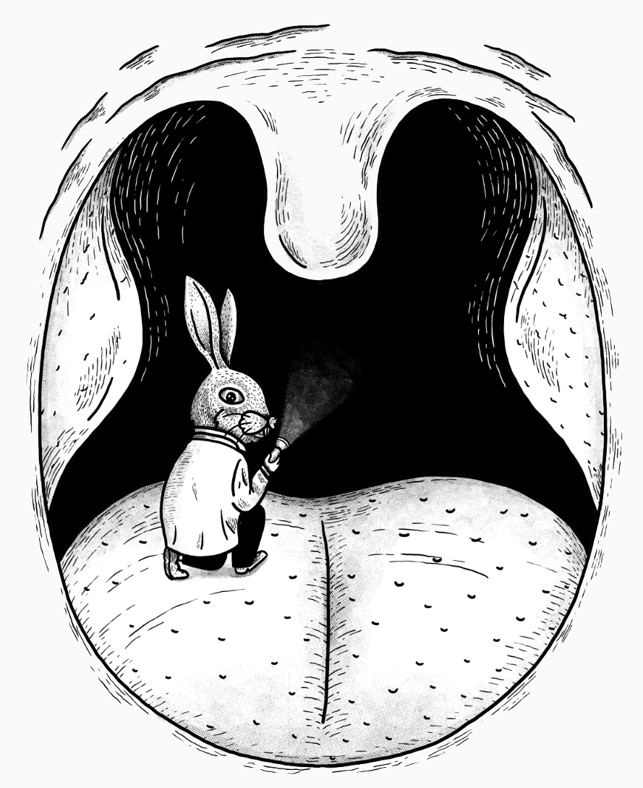
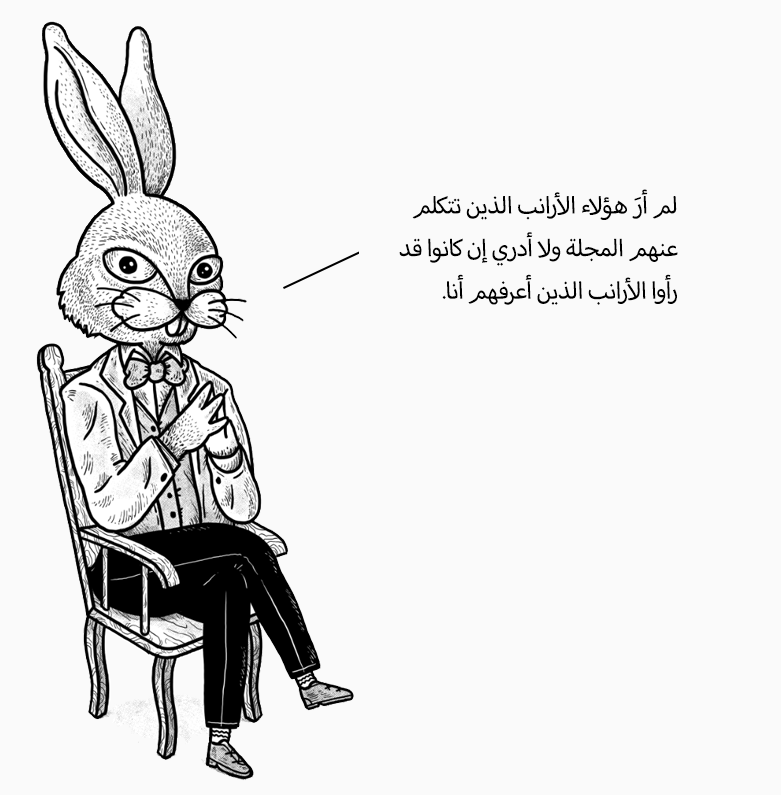

  <a href='https://bookofbadarguments.com/extras/guide-to-sneaky-rhetoric-arabic' class='active'>العربية</a>
  <a href='https://bookofbadarguments.com/extras/guide-to-sneaky-rhetoric'>English</a>  

---

أن يتلاشى مفهوم الحقيقة الموضوعية من العالم … يخيفني أكثر من القنابل.

جورج أورويل

---

  

هذه الترجمة مقتطفة من النسخة الإنجليزية المنشورة في نوفمبر ٢٠٢٠، والتي من المقرر أن تجهز في منتصف ٢٠٢١. العملان قيد الإنشاء. هذه النسخة لا توجد فيها مقدمة النسخة الأصلية، والتي باختصار تحكي قصة أرنب وغرير وظهورهما في كتابٍ قبل سنوات، وأن السبب في تحويل الأمثلة التالية إلى أمثلة تظهر فيها أرانب وغرير كي يركز القارئ على الكلمات والأفكار لا على الأحداث والأشخاص، ولننتهي بقراءة أكثر موضوعية.

<h3 style="font-family:Tajawal,sans-serif;font-size:22px;direction:rtl">١. الخطاب الغامض</h3>

الخطاب غير الصادق عادة ما يتميز بالغموض. هو غموض يشوش التفكير، ويشوش المعاني، وكما يكتب أورويل عن الكلمات الغامضة، "الشخص الذي يستخدمها له تعريفه الخاص، لكنه يسمح للمستمع أن يعتقد أنه يعني شيئًا مختلفًا تمامًا." في أحيان أخرى، يساعد الغموض في فصلنا عن عمل شنيع أو ذكرى سيئة. وبهذا المعنى، فإنه يعيد إلى الأذهان معضلات أخلاقية كمعضلة العربة التي تبين أن من الأسهل أن يبرر الانسان تسببه في ضرر غير مباشر من أن يدفع شخصًا بيديه إلى مسار العربة وأن يتواطأ مباشرة في هذا الضرر.

دعونا نلقي نظرة على بعض الأمثلة.

<b>إسنادات خاطئة</b>. في صحيفة يومية نجد العنوان التالي:

"<b>اتصلت</b> قبضة الرجل بوجه الضابط."

وكأن القبضة من تلقاء نفسها اصطدمت بوجه الضابط، فأحدثت كدمة. فتم القبض على القبضة وأدخلت السجن -فرج الله عنها-.

في جريدة نيويورك تايمز نجد العنوان التالي

"صاروخ في مقهىً شعبي <b>يجد زبائنًا</b> يشاهدون مباراة لكأس العالم"

وكأن الصاروخ دخل المقهى، فسلم على الزبائن وسأل عن أحوالهم، ومن ثم بقدرة قادر انفجر فتسبب في مقتل وجرح العشرات من الأشخاص.

في مقالة أخرى في نفس الجريدة نجد العنوان التالي:

"أطفالٌ <b>ينجذبون إلى</b> الشاطئ وإلى مركز الصراع"

السبب في مقتل الأطفال ينسب ضمنيًا إلى الشاطئ بدلا من الجهة التي أطلقت عليهم الصاروخ.

في مذكرات صديقة السيدة الأولى في الولايات المتحدة نجد العبارة التالية:

"<b>وجدت نفسي</b> أنظم الاحتفال الرئاسي الأكثر جدلًا في تاريخ الولايات المتحدة."

مزعجٌ جدًا، أليس كذلك؟ عندما تكون جالسًا في البيت، مستلقيًا على ظهرك تفكر في خلق السماوات والأرض ومرةً واحدة "تجد نفسك" تنظم احتفالًا مثيرًا للجدل.

في أماكن أخرى نجد أن الأفعال قد تنسب إلى جهة غامضة أو غير معروفة حتى عندما تكون الجهة معروفة. على سبيل المثال:

"<b>موت</b> فتىً من الضفة الأرنبية الشرقية بعد إصابته بنيران الغرير"

"أربعة حراس يُفصلون بعد <b>موت</b> رجلٍ في الحجز"

"مدينة هيروشيما اليابانية تحيي الذكرى الـ٧٥ لإطلاق <b>العالم</b> لأول قنبلة ذرية"

"احتجاجات عنيفة <b>تخلف عشرات القتلى</b>"

"في كمينٍ وقع الليلة الماضية، <b>قتل الأرانب</b> ثلاثة فئران. وقع الحدث بعد ساعات من <b>مقتل ستة أرانب</b> في بلدة مجاورة."

في كل مثال من هذه الأمثلة السابقة، تساعد كلمة أو مجموعة من الكلمات في حجب حقيقة غير سارة. في المثال الأخير، يُنسب الفعل إلى الأرانب في الجزء الأول، ولكن ليس إلى الغرير في الجزء الثاني.

قد تشعر أن هناك ثمة خدعة، قد تشعر أن الخطاب به معانٍ مبطنة، لكنك تشعر بالخصوصية على الرغم من ذلك. تهدف الارتباطات الإيجابية إلى إحساسك بالسعادة وإلى إجبارك على القيام بشيء قد لا تفعله في موضع آخر. في أوقات أخرى، قد تهدف إلى أمرٍ أكثر شرًا. تساعد التعبيرات الملطَّفة على فصلنا عن فعلٍ شنيع، وبالتالي إزالة أي شعور عندنا بالذنب. دعونا نرى بعض الأمثلة.

<b>اقتباسات خاطئة</b>. قد يُنسب اقتباسٌ أو صفة ما إلى مجموعة بدلًا من شخصٍ واحد من أجل زيادة مصداقية الخطاب. غالبًا ما يكون من الصعب اكتشاف هذه الخدعة. على سبيل المثال، في جريدة الغارديان نجد العبارة التالية:

"قال <b>شهود عيان</b> في مكان الحادث أن دويَّا هائلًا سُمِعَ ثم ارتفعت شعلة ضخمة."

هل قال كل الشهود تلك العبارة أم قالها شخصٌ واحد؟

<b>الأفعال المبنية للمجهول</b> هي طريقة أخرى لفصل حدثٍ ما عن الشخص الذي ارتكبه. على سبيل المثال:

"أدت حرب الغرير عام ١٩٤٧ إلى تهجير مجموعات الغرير والأرانب في المدينة وتقسيمها. تم طرد جميع الغرير في الجزء الشمالي من المدينة <b>من قِبَل قوات الأرانب</b> كما تم تدمير حي الغرير بأكمله. <b>تم إخلاء</b> قرى أرنبية مثل أم الجزر والجزر والجزير."

في بداية الفقرة، يُنسب الطرد إلى الأرانب. أما في النهاية ينسب تهجير الأرانب إلى طرف مجهول.

في مقالة عن تعرض سائق حافلة للضرب من قبل ثلاثة ركاب كانوا قد رفضوا ارتداء كمامات نجد الفقرة التالية:

"أوقف السائق حافلته وطلب من الركاب الثلاثة المغادرة. وأثناء مرافقة السائق للركاب وهم يغادرون الحافلة، قام أحدهم بسحب مضرب خشبي وضرب الضحية عدة مرات، مما <b>تسبب في إصابة الضحية</b>."

التسبب في الإصابة يُنسب إلى المضرب لا إلى الركاب.

في مقابلة على برنامج Newsnight في قناة بي بي سي، عندما يُسأل وكيل وزير عما إذا كان يعلم أن ردود قواته الأمنية على المتظاهرين كانت شديدة القسوة يرد:

"لقد <b>ارتُكِبَت أخطاء</b>. نحن لا نتسامح مع انتهاكات حقوق الإنسان أو التعذيب."

نجد الشيء السيئ مبنيًا للمجهول والشيء الجيد منسوب للوكيل. ما تنتجه هذه الحيلة تحويل اللوم وتخليص الجهة العادية من أي شعور بالمسؤولية. لا أحد يخطئ أبدًا، فالأخطاء دائمًا تُرتَكب. لا أحد يُجرم، الجرائم دائمًا تُرتَكَب.

في مكان آخر نجد ردًا من منتجِ قهوة على خبر عن إساءة معاملة أحد موظفيهم:

"نتحمل المسؤولية تجاه الأشخاص المذكورين وتجاه موظفينا <b>وسيتم إجراء تحقيق عادل</b>."

مرة أخرى، الخبر السيئ مبنيٌّ للمجهول، مما يجعلنا نتساءل عما إذا كانوا يعتزمون إجراء تحقيق عادل فعلًا أم لا. الصيغة هذه تذكرنا بوعود أخرى مماثلة من قبل أصحاب نفوذ أو مسؤولين والتي تهدف إلى ذر الرماد في عيون الناس.

<b>حذف التفاصيل</b>. على موقع الأخبار المالية Barron's، نجد العنوان التالي:

"الرئيس التنفيذي يبيع أسهمه قبل عملية تقسيم الأسهم"

لاحقًا في المقالة، نجد توضيحا يفيد أن بيع الأسهم كان مخططًا مسبقًا، كما هو الحال دائمًا مع المدراء التنفيذيين الذين يبيعون أسهمهم. العنوان يجعل الأمر يبدو كما لو لم يكن كذلك.

في مقالة عن المؤتمر الوطني للحزب الديموقراطي في الولايات المتحدة، حيث كان من المقرر انتخاب مرشح رئاسي للحزب، ورد في تغريدة لـNBC News العبارة التالية:

"في واحدة من أقصر الخُطَب في المؤتمر، لم تؤيد عضوة الكونجرس الآنسة كورتيز المرشح المفترض جو بايدن."

في حين أن الخبر صادق في وصفه لما وقع، لكنه يغفل التفاصيل التي مفادها أن تأييد عضوة الكونغرس لمرشح آخر (المرشح الثاني في ذلك السباق) كان مجرد إجراء رسمي، ولم يكن تمردًا كما حاولت أن تلمح المقالة. أصدرت الشبكة الإخبارية في وقت لاحق توضيحًا.

في تقرير في جريدة نيويورك تايمز عن مظاهرة شارك فيها ٢٥٠ ألف شخص، نجد العبارة التالية:

"في أكبر احتجاج حتى الآن، احتشد <b>عشرات الآلاف</b> من المتظاهرين في شوارع المدينة يوم الجمعة."

في حين أن القول بأن الاحتجاج تكوَّن من عشرات الآلاف من المتظاهرين ليس كذبًا (كما لو قيل أنه كان يضم الآلاف أو المئات أو العشرات من المتظاهرين)، فإن حجب الرقم الحقيقي يقلل بشكل كبير من حجم وأهمية الحدث.

هذا يذكرنا بمثال أحدث. عندما سُئل وزير الصحة البريطاني مات هانكوك عن المدة التي سيحتاجها لحل مشكلة أشخاصٍ كثر لم يتمكنوا من الخضوع لاختبار كورونا، أجاب الوزير: إن الأمر سيستغرق "أسابيع". كما علق آندي زالتزمان ساخرًا في إحدى حلقات برنامجه الإذاعي The News Quiz، "لقد مرت أسابيع منذ غزو الرومان لبريطانيا. ما يزيد قليلًا عن مائة ألف أسبوع، ولكن على أي حال أسابيع."

في مكان آخر نجد في الملف المهني لمؤسس إحدى الشركات:

"وقَّعت شركتنا اتفاقيات متعددة السنوات لعملائنا مع شركة جوجل، وشركة سيلزفورس."

عند التدقيق، نكتشف أن الشركة لم تفعل أكثر من شراء برامج من هاتين الشركتين نيابة عن عملائها.

في العمل قد نرى عبارات مثل:

"هذا الشهر، قدمنا <b>عدة حلول أدت إلى تحسين أداء</b> منتجاتنا."

هل تحسين الأداء بسبب جهد بُذِل أم بسبب افتقار سابق أُصلح؟

"شهدنا الشهر الماضي <b>زيادة</b> في الرسائل من عملائنا."

هل الزيادة كانت من رسالة واحدة إلى رسالتين؟

في مثال آخر، نجد في جريدة واشنطن بوست العنوان التالي:

"هذه المدينة في كاليفورنيا أوقفت تمويل قوات الشرطة. فارتفعت عمليات القتل على أيدي رجال الشرطة."

يفشل المقال في الإشارة إلى أن إلغاء تمويل قوات الشرطة يستلزم إعادة تخصيص تلك الأموال لوكالات الخدمات الاجتماعية. المدينة المعنية لم تفعل ذلك.

<b>الربط بين شيئين غير متكافئين</b>. في رسالة من  الرئيس التنفيذي لإحدى الشركات نجد العبارة التالية

"نحن نعمل حاليًا على تقليل حجم القوى العاملة بمعدل ٢٥٠ وظيفة. أعلم أن خبرًا كهذا سيستغرق بعض الوقت لاستيعابه. لا شك من أن <b>كل واحدٍ منا</b> سيتعامل مع هذا الخبر بشيءٍ من المفاجأة وشيءٍ من الحزن."

بلا شك لم يكن خبرٌ كهذا بمثابة مفاجأة للرئيس التنفيذي ولا يمكن مقارنة حزن الرئيس التنفيذي بحزن شخص قد فقد للتو وظيفته.

في حالات أخرى، أكثر قساوةً، يمكن لسلطة ما أن تقضي على سجناء رأي من خلال ربطهم بمجرمين فعليين، واستخدام عناوين غامضة لتعكير الرأي العام. كما يمكنها العفو عن مجرمين فعليين من خلال ربطهم بسجناء رأي. على سبيل المثال:

"قضت المحكمة هذا الصباح أن 	١٣ مجرما متهمون بالخيانة العظمى سيُعاقبون بأقصى عقوبة".

<b>يبدو</b>. في كتاب للكاتب سام هاريس نجد الفقرة التالية:

"كثير من نقادي يلومونني لعدم انخراطي بشكل مباشر في الأدبيات الأكاديمية حول الفلسفة الأخلاقية … أسلوبي هو بشكل عام عدم الانخراط في النقاشات الأكاديمية، التي تصعِّب فهم المواضيع من قبل الناس العاديين. بعض الناس ينزعجون مني لهذا السبب ولكن <b>يبدو</b> أن الفلاسفة المحترفين الذين استشرتهم يفهمون ويدعمون ما أفعله."

لا يتم ذكر أسماء الفلاسفة المحترفين أبدًا، ويتساءل المرء عما إذا كانوا أولئك الفلاسفة يوافقون الكاتب على موقفه أم لا.

<b>على حد زعم</b>. يمكن اللجوء إلى هذه العبارة لإضفاء الغموض على سلسلة من الأحداث الواضحة. على سبيل المثال:

"<b>على حد زعم الصحيفة</b>، فقد استخدم غرير عبارات بذيئة في ظهوره الإعلامي مع أرنب."

هل فعل أخونا غرير ذلك حقًا أم لا؟ إن كان قد فعله فالأمر ليس مزعومًا وإن لم يفعله فليس خبرًا يستحق النشر.

<b>الخلط بين مفاهيم قابلة للغط</b>. نرى أحيانًا خلطًا بين مفاهيم مثل الطقس والمناخ. في جريدة دايلي ميل نجد العبارة التالية:

"شهدت النمسا اليوم أبكر تساقط للثلوج في تاريخها. يُتوقع أن يسقط ما بين ٣٠ إلى ٤٠ سم في الجبال … توفر مثل هذه الانخفاضات الدراماتيكية في درجات الحرارة دليلًا سطحيًا لأولئك الذين يشكُّون أن العالمَ مهددٌ بتغير المناخ."

في الآونة الأخيرة، انتشر الرأي القائل بأن كمامات الوجه يمكن أن تؤدي إلى انخفاض للأكسجين في الجسم مما قد يؤدي إلى ضرر. في جريدة يومية خليجية نجد العبارة التالية

"كشفت دراسات أن ارتداء كمامات الوجه يمكن أن تؤثر سلبًا على العقل والجسم."

تخلط وجهة النظر هذه بين الاكتشاف العلمي القائل بأن كمامة الوجه تقلل من الأكسجين داخل الكمامة -بين الكمامة والفم- مع انخفاض مستوى الأكسجين داخل الجسم. تُظهر الأبحاث أن جسم الإنسان قادرٌ على تعويض مثل هذه الانخفاضات عن طريق زيادة معدل دقات القلب وكمية الدم المتدفق في الأوردة.

<b>ربما</b>. يمكن استخدام هذه الكلمة لإضعاف حقيقة لا جدال فيها عن طريق إدخال الشك إليها.

"أصبح الفلافل جزءًا من المطبخ الوطني في مملكة الغرير مع مرور الوقت. انتشرت شعبيتها بمساعدة الغرير الذين جاوروا الأرانب في مناطقهم الشمالية والشرقية، <b>وربما</b> تعلَّم الغرير تلك الطبخة من الأرانب هناك".

  
  <figcaption>
(رسم ٣) أرنب يبوح للقراء بسر: "لقد تعلموها منهم حقًا."
</figcaption>

في أوقات أخرى، يمكن استخدام هذه المراوغة للتلميح إلى شيء دون ذكره بصراحة. في مقابلة تلفزيونية، يحكي ناشطٌ حكاية يتضح من خلالها أن الغرض منها نزع الشرعية عن أحد منافسيه، فيقول:

"بعد زيارتي لمنزله، اتفقنا على الالتزام بمجموعة من الشروط. تلك التي وافقت عليها حدثت. تلك التي وافق عليها <b>ربما</b> لم تحدث."

<b>الإخفاء باستخدام الدقة المنتقاة</b>. في مقالة في جريدة سان فرانسيسكو كرونيكل نجد العبارة التالية:

"في جامعة كاليفورنيا بيركلي، يشكِّل الأرانب والغرير ١٥٪ و٣٪  فقط من الطلاب الجامعيين، على التوالي، في حين أن ٤٥٪ من الطلاب المقبلين على التخرج في المدارس الثانوية في الولاية والذين يستوفون متطلبات جامعة كاليفورنيا هم من الأرانب و٤٪ منهم من الغرير."

لا يعني استيفاء متطلبات جامعة كاليفورنيا أنه لم يكن هناك طلابٌ أفضل من الممكن أن يُقبَلوا بالجامعة.

في الفترة التي سبقت استفتاء عن عضوية المملكة المتحدة في الاتحاد الأوروبي في عام ٢٠١٦، قال رئيس الوزراء البريطاني:

"بمجرد تسوية حساباتنا، سنعيد السيطرة على <b>ما يقرب من ٣٥٠ مليون جنيه إسترليني</b> أسبوعيًا. سيكون أمرًا جيدًا إن صُرِفَ الكثير من هذه الأموال على خدمة الصحة الوطنية."

يخفي البيان حقيقة أن رقم 	٣٥٠ مليون جنيه إسترليني هو قبل الخصومات والمنح التي تبلغ حوالي ١٨٩ مليون جنيه إسترليني في الأسبوع.

<!-- 

يتجلى هذا النوع من الإخفاء في المصطلحات التي تتظاهر بأنها تقنية (Jargon) والتي يكون الغرض منها إحساس مجموعة ما بأن لهم لغة لا يفهمها إلا الخواص.

 -->

ما تُظهره لنا الأمثلة في هذا القسم هو أن الغموض يعمل على إبعاد اللغة عن أحد أهم أهدافها وهو أن تكون اللغة انعكاسًا صادقًا للواقع.

<h3 style="font-family:Tajawal,sans-serif;font-size:22px;direction:rtl">٢. الارتباطات السلبية</h3>

"بمجرد أن تصنفني، فإنك تنفيني"، مقولة منسوبة للفيلسوف كيركجارد. تهدف الارتباطات السلبية إلى تشجيعنا على الشعور بنفس الطريقة حيال شيئين ربما لا علاقة لهما ببعض. لهذا السبب بالذات نجد كتبًا عن أهمية السفر، وأن نكون بمفردنا بعيدًا عن الآخرين لفترة. حتى نقع في صمت قادر على تحريرنا من الافتراضات والارتباطات التي تفرضها علينا اللغة.

<b>إضافة أو حذف كلمة</b>. قد يتم خلق ارتباط سلبي بالاستخدام المتعمد لكلمات أو لعبارات لها دلالات سلبية أو من خلال حذف كلمات. في موقع فوكس الأخباري نجد العبارة التالية:

<!-- 

كلمتا <b>المساعدة والتحريض</b> معنياهما متقاربان ولكن عندما يتم إضافة كلمة "تحريض" إلى "مساعدة" يُفهم أن النية إجرامية. (في اللغة الإنكليزية، العبارة المرادفة هي "Aid and abet"، قد تكون هناك عبارة أفضل في العربية.) على سبيل المثال:

"أعلنت وزيرة الداخلية بريتي باتيل الحرب على المضربين، وانتقدت أولئك الذين يساعدون المضربين ويحرضونهم: محامي حقوق الإنسان."

 -->

"عضو مجلس الشيوخ الاشتراكي هو أخطر مرشح رئاسي في تاريخ بلادنا."

يخلط الكاتب هنا بين اسم "اشتراكي" والذي يستحضر صورًا من الاتحاد السوفيتي، و"اشتراكي ديمقراطي” والذي يجب أن يستحضر صورًا من الدول الاسكندنافية. خلق هذا الخلط متعمد وغرضه تخويف القارئ من عضو مجلس الشيوخ المذكور.

في موقع أخباري آخر، تنشر شبكة سي إن إن مقالًا سنويًا عن المشاهير الذين ماتوا في ذلك العام. وفي كل سنة يخلط العنوان بين المشاهير وبين الناس عامةً.

"الناس الذين خسرناهم في سنة ٢٠٢٠"

<b>ليس الكل سواسية</b>. في جريدة يومية نجد العنوان التالي:

"مسؤول في "منظمة تحرير الأرانب" المخيفة يدعي أن ابنه توفي في طريقه لحضور حفل زفاف"

نجد في صحيفة أخرى عنوانًا أكثر اتزانًا:

"أرنبٌ في طريقه إلى حفل زفاف يُقتل بالرصاص بعد هجوم مشتبه به"

تهدف الإشارة إلى "المنظمة المخيفة" في العنوان الأول إلى التلميح للقارئ بأن حياة هذا الأرنب لم تكن مهمة لأنه، على أي حال، كان لديه علاقة (لم يخترها هو) بهذه المنظمة التي لا تطيقونها. 

في موقع خبري آخر نجد العبارة التالية:

"وذكر تلفزيوننا اليوم أنه تم تدمير لغمين أرنبيي الصنع زرعهما الغرير في البحر الكاريبي"

مرة أخرى، الهدف الوحيد لذكر مصدر اللغمين هو لخلق ربط في ذهن القارئ بين الأرانب والغرير والشر. فالقارئ الذي يستحقر الأرانب سيستحقر الغرير كذلك.

في موقع أخباري آخر نجد العنوان التالي عن سفير الولايات المتحدة إلى بريطانيا:

"بدء التحقيق مع سفير ترامب بسبب تعليقات مثيرة للجدل"

السفراء عادة ما يوصفون بأنهم سفراء لدول، أما هنا فالسفير ينسب لشخص الرئيس. والغرض واضح، وهو الإشارة إلى نوع من التجريم الحتمي للسفير.

<b>مدعومون من الخارج</b>. من الطرق السهلة لصب كل ما يخطر على البال من اتهامات على شخص هو أن يُنعت هذا الشخص بأنه مدعومٌ من الخارج.

"أرانب مدعومة من الخارج يتظاهرون في وسط المدينة صباح اليوم"

في إحدى الجرائد، نجد العنوان التالي:

"عضوة الكونغرس الأمريكي تدين مقتل أرنب مراهق على يد قوات الغرير"

ويبدأ المقال بصورة لعضوة الكونغرس والعبارة التالية:

"قُتل أرنب في سن المراهقة يوم الجمعة ... مما أدى إلى إدانة دولية، بما في ذلك من عضوة الكونغرس أرنوبة الأرنبية. السيدة أرنبية هي عضوة واجهت اتهامات بأنها مناهضة للفئران، وهي منتقدة شرسة لدولة الغرير، وداعمة لحركات المقاطعة التي تهدف للضغط على اقتصاد دولة الغرير.

قد يتساءل القارئ ما علاقة عضوة الكونغرس بمقتل المراهق الأعزل؟

<b>الاستعارات والتشبيهات</b>. في أوقات أخرى، تلعب الاستعارات والتشبيهات والصور البلاغية، سواء أكانت مذكورة صراحةً أم مبطنة دورًا في تغيير معنى الخطاب. في جريدة أسبوعية، تستخدم إحدى الكاتبات التشبيهات لجعل القراء يشعرون بالنفور تجاه مجموعة من الناس. على سبيل المثال:

"بعض مدننا <b>قروح متقيحة</b> مبتلاة <b>بأسرابٍ</b> منهم."

في مكان آخر، في مقال نشرته صحيفة نيويورك تايمز حول حشود كبيرة قد تجمعت على الشاطئ أثناء موجة حر، نجد العبارة التالية:

"<b>هاجم</b> عشرات الآلاف منهم الشواطئ الجنوبية لبريطانيا، <b>ازدحموا</b> في حدائق المدينة <b>ورقصوا في المستنقعات والجداول</b>."

تعيد هذه الصورة إلى الأذهان تقريرًا من السبعينيات. كان المراسل يغطي اعتصامًا للمطالبة بحقوق ذوي الاحتياجات الخاصة في مقر الصحة والتعليم والرعاية الاجتماعية في سان فرانسيسكو. بدأ تقريره كالتالي:

"نحن هنا في المبنى الفيدرالي القديم حيث وقع حادث بالخارج هذا الصباح. مباشرة بعد المظاهرة <b>بدأ المعاقون بغزو</b> المبنى."

في الصفحة الرئيسية في جريدة سكرامنتو بي نجد العنوان التالي عن مجموعة الفهود السود التي كانت تناضل لحقوق السود في الولايات المتحدة:

"تم <b>غزو</b> مبنى الحكومة" وتبدأ المقالة كالتالي: "دخلت مجموعة من الشبان المسلحين ببنادق ومسدسات جاهزة للطلق إلى مبنى الحكومة يوم الثلاثاء واقتحموا القاعة الرئيسية."

التلميح واضح. أن هؤلاء الناس كانوا رجالًا (كان معهم نساء)، أنهم كانوا يخالفون القانون بحملهم السلاح (لم يخالفوا القانون)، وأنهم كانوا كائنات أجنبية غريبة قد سافرت من مجرة بعيدة جدًا ليأتوا إلى الأرض لغزو مدينة سكرامنتو المقدسة.

<b>دول متخلفة</b>. في مناظرة تلفزيونية حول موقف المجتمع الدولي من قضية إنسانية، يقول أحد الضيوف وهو مؤرخٌ بارز:

"المجتمع الدولي بأسره باستثناء بعض الدول المتخلفة في إفريقيا لم يصوتوا لصالح تلك القرارات."

يتم الكشف لاحقًا في المناظرة أن البيان غير دقيق تمامًا. لكن بالرغم من ذلك، فإن تلميح الضيف هو أن تلك الدول المتخلفة على حد قوله لا يمكنها أبدًا التصويت بضمائرها  ولغايات أخلاقية.

<b>متلازمة الشرق الأوسط التنفسية، الأنفلونزا الإسبانية</b>. ربط أمراضٍ خطيرة بمواقع جغرافية أو حيوانات معينة قد يفيد بأن الأمراض متأصلة في تلك المواقع أو المجموعات. متلازمة الشرق الأوسط التنفسية على سبيل المثال أو الأنفلونزا الإسبانية، التي من الأرجح لم تنشأ في إسبانيا.

الإرشادات العلمية في الوقت الحاضر تدعو لعدم ربط الأمراض مع خصائص مثل الجغرافيا لتجنب ردود الفعل غير المقصودة. يقول ما يقرب من ثلث الأمريكيين الآسيويين إنهم تعرضوا لشكل من أشكال التمييز منذ بداية جائحة كورونا.

<b>ميليشيات</b>. نسمي شخصًا ما مقاتلًا معاديًا أو مقاتلًا في ميليشيا أو متمردًا أو محرضًا أو في الجانب الآخر مقاومًا أو مدافعًا عن الشرعية أو محارب كوماندو بناءً على ما إذا كانت مصالح هذا الشخص تتناسب مع مصالحنا أم لا.

<b>نظام</b>. نسمي جهة ما نظامًا إذا لم نكن نحب البلد. في الحديث عن صراع إقليمي تتنافس فيه مجموعتان على السلطة السياسية، نجد عناوين متضادة في وسائل الإعلام، كل واحدة تسمي طرفها في الصراع حكومة والطرف الآخر نظامًا.

<b>متطرف</b>. ننعت شخصًا "متطرف" لإنشاء روابط بينه وبين عدة صفات. مثلًا، عدم الاستقرار والتفكير المطلق غير العملي والتفكير الخطير والمثالي. لهذا السبب، قد يكون مجرد وجود شخص في مكان ما سببًا لتسميته متطرفًا. كما قال مالكولم أكس ذات مرة عن الأمريكيين السود في الستينات الذين غالبًا ما كانوا يوصفون بأنهم متطرفون لمطالبتهم بحقوقهم الأساسية:

"مشكلة الولايات المتحدة هي نحن. نحن مشكلتها. السبب الوحيد وراء مشكلتها أنها لا تريدنا هنا. وفي كل مرة تنظر فيها إلى نفسك، فأنت تمثل هذه المشكلة الخطيرة في البلد لأنك غير مرغوب فيه. بمجرد أن تواجه هذه الحقيقة، يمكنك البدء في وضع خطة تجعلك تبدو ذكيًا، بدلًا من العكس."

<b>متطرف</b>. ننعت شخصًا "متطرف" لإنشاء روابط بينه وبين عدة صفات. مثلًا، عدم الاستقرار والتفكير المطلق غير العملي والتفكير الخطير والمثالي. لهذا السبب، قد يكون مجرد وجود شخص في مكان ما سبباً لتسميته متطرفاً. كما قال مالكولم أكس ذات مرة عن الأمريكيين السود في الستينات الذين غالبًا ما كانوا يوصفون بأنهم متطرفون لمطالبتهم بحقوقهم الأساسية:

<b>المبالغات</b>. نقرأ باستمرار عناوين عن أشخاص يقتحمون أو يدمِّرون أو يَسحقون. تعمل المبالغات هذه على خلق جو سياسي مشحون وتُسَهِّل على الانتهازيين الحصول على موطئ قدمٍ في السياسة. تساعد هذه المبالغات على تصوير العالم على أنه مكان متوحش، لا يمكن أن يتعامل معه سوى البطل الأوحد وهو قادم على ظهر جواده.

بعض الأمثلة:

"نائب الرئيس المرشح <b>يسحق</b> الإدارة الحالية"

"<b>ينفجر</b> نائبٌ في مجلس العموم عند انتقاده لزملائه"

يكتب صحفيٌ في إحدى الجرائد:

"<b>زلزال جيوسياسي</b> يضرب المنطقة"

في برنامج أخباري في قناة فوكس يقول المذيع:

"السيدة الأولى السابقة <b>سلخت</b> الرئيس الحالي في خطابها"

في جريدة يومية نجد العنوان التالي:

"بدأ المستأجرون في المدينة بكسر عقود إيجاراتهم <b>والفرار</b> من المدينة"

(قد يخطر على بال القارئ مشهد من يوم القيامة)

نشرت هيئة تحرير إحدى الصحف مقالة تتضمن العبارة التالية:

"في خضم فوضى لا هوادة فيها، يقدم المرشح جون بايدن لبلدٍ منهك شيئًا فوق السياسة أو الأيديولوجية."

على حد تعبير أحد المعلقين، فإن السياسة والأيديولوجية هما جوهر ما يتوقعه الناخبون من سياسييهم. ليس هناك شيءٌ إلهي خارق يجعل النائب أو المسؤول أو الوزير أو الرئيس أفضل من غيره. فصفات مثل شخصياتهم وقيمهم (والتي تقصدها الجريدة على الأرجح) من المفترض أن تُوجِّه سياساتهم. من تلقاء نفسها، وإلا فلا فائدة منها.

في مقال آخر عن حرائق الغابات في كاليفورنيا وجائحة كورونا، نجد العنوان التالي:

"يبدو أن التهديدات الطبيعية <b>تتضاعف كل ساعة</b>."

بشكل عام، من السهل تكوين ارتباطات ذات دلالات سلبية، غالبًا من خلال وضع كلمتين بالقرب من بعضهما البعض وغالبًا من خلال التكرار المستمر.

<h3 style="font-family:Tajawal,sans-serif;font-size:22px;direction:rtl">٣. الارتباطات الايجابية</h3>

إذا رغبت مجلة في أن تقنعك بتجديد اشتراكك فقد تتكلم عن كل النباهة والفكاهة التي ستفقدها إذا لم تجدد اشتراكك، كما تفعل مجلة النيو يوركر. ترسم لك مجلة أخرى صورة لحفل عشاء وللشخص الذي دائمًا يجتمع حوله الجميع. يمكنك أن تكون ذلك الشخص، يقال لك. كل ما عليك فعله هو تجديد اشتراكك.

قد تشعر أن هناك ثمة خدعة، قد تشعر أن الخطاب به معانٍ مبطنة، لكنك تشعر بالخصوصية على الرغم من ذلك. تهدف الارتباطات الإيجابية إلى إحساسك بالسعادة وإلى إجبارك على القيام بشيء قد لا تفعله في موضع آخر. في أوقات أخرى، قد تهدف إلى أمرٍ أكثر شرًا. تساعد التعبيرات الملطَّفة على فصلنا عن فعلٍ شنيع، وبالتالي إزالة أي شعور عندنا بالذنب. دعونا نرى بعض الأمثلة.

<b>الأطفال</b>. الإشارة إلى الأطفال أو غيرهم من الكائنات التي لا حول لها ولا قوة تحسسنا أن المتحدث آثِرٌ، لا يفكر إلا في الآخرين.

"ستساعدنا هذه السياسة الجديدة في ضمان عالم أفضل <b>لأطفالنا</b>."

من أجل تمرير قانون يهدف إلى منع الشركات من استخدام التشفير القوي في خدماتها، قد يُطلق على القانون اسم "القضاء على الإهمال المسيئ والمتفشي للتكنولوجيات التفاعلية لعام ٢٠٢٠" ومن ثم يتعهد <b>بحماية الأطفال</b> من الأشرار عبر الإنترنت. بالطبع، إذا تم تمرير هذا القانون في الولايات المتحدة، فسوف يخدم غايات أكثر شرًا.

<b>موجة من عمليات التسريح</b> تجعل الأمر يبدو وكأنه حتمي. كالمد والجزر وحركة الكواكب. بمعنىً آخر، يُصَوَّر الأمر وكأنه كان خارج يدي الرئيس التنفيذي.

<b>التيسير الكمي</b> يبدو أكثر مسؤولية من القول أننا نطبع الأموال دون حساب لتفادي سقوط سوق الأسهم.

<b>عوامل خارجية</b> قد تستخدم كشماعة لتحويل اللوم بعيدًا عنا. عمدة مدينة ما قد تلقي باللوم على عوامل خارجية عند الحديث عن سبب تأخير بعض المشاريع.

<b>الخوارزميات</b> قد تساعد على إخفاء الأسباب الحقيقية لأفعالنا. في الولايات المتحدة مثلًا <b>درجات الائتمان</b> تخفي المعايير التي بموجبها قد يُحرم شخص ما من الحصول على قرض أو إيجار. يحدِّدُ ما يسمى <b>المحتوى الحدودي</b> ما إذا كانت مقاطع الفيديو الخاصة بك ستظهر للمستخدمين في موقع يوتيوب أم لا، حتى عندما تتوافق مع قوانين يوتيوب. تحدد <b>شروط الاستخدام</b> ما إذا كان سيتم نشر المحتوى الخاص بك على موقع فيسبوك أم لا، حتى عندما يتوافق مع قوانين فيسبوك.

نعتبر القتال <b>انتصارًا</b> إن كنا نحب الناس الذين يشاركون فيه، ومجزرةً إن لم نكن نحبهم.

<b>أساليب الاستجواب المتطورة</b> كما تسميها بعض الدول تبدو ألطف من "تعذيب".

الحديث عن <b>أضرار جانبية</b> يبدو ألطف من الحديث عن مقتل مدنيين عُزَّل.

<b>التحرك تكتيكيًا</b> يبرر القتل العفوي. ربما لا يُستخدم في اللغة العربية بقدر ما يستخدم في اللغة الإنكليزية. مثلًا:

"القناص، حين استشعر الخطر الوشيك، أطلق النار على المزارع. تم وصف المزارع بأنه كان <b>يتحرك بشكل تكتيكي</b>."

<b>معسكرات إعادة التعليم</b> تبدو أقل شرًا من معسكرات الاعتقال أو معسكرات الإبادة.

<b>الهدم</b> يستحضر ذكريات هدم جدار برلين. شيء جيد، دليل على التقدم. وأسهل بكثير على العينين والأذنين من كلمات مثل تجريف أو تدمير.

<b>التطهير</b> يعطيك مطبخًا أنظف. يتم تطهير الساحات العامة من الطلاب المعتصمين، وتطهير الشوارع من المتظاهرين، وتطهير البلدات والمدن من السكان غير المرغوب فيهم. تبدو هذه الكلمة أخف على البال من أن يوصف الفعل بفظاعة أو بإبادة جماعية. التطهير يحسسك بأنك قد قضيت على أشياء معادية أو غير معتمدة. تطهير المؤسسات والهيئات الحكومية يبدو أفضل من الحديث عمَّن فُصِل قسرًا، لأي سبب تم فصلهم، وما المصير الذي واجههم.

<b>التهدئة</b> تحسِّسُك أنك تعيد شيئًا ما إلى حالته الطبيعية. في اللغة، الكلمة تعني "استعادة حالة الهدوء" ولكن في المصطلح السياسي تعني "القمع أو القضاء بالقوة على مجموعة سكانية تعتبر معادية" وكانت تستخدم كثيرًا في حرب فييتنام.

<b>نقل السكان</b> أو إخلاء السكان يبدو أفضل بكثير من الهجرة القسرية، نقل السكان يخفي حقيقة الألم الذي تسببه العملية لمن يتم تهجيرهم.

<b>مجتمع</b> يبدو أفضل من مستوطنة.

<b>سياج أمني</b> يبدو أفضل من جدار عازل.

<b>تحت السيطرة</b> يبدو أفضل من تحت الاحتلال.

<b>وافد</b> يستحضر للذهن صورة مختلفة عن الصور التي تستحضرها مسميات مثل عامل. الوافد عادةً ما يكون من طبقة متوسطة ومن دولة متقدمة. أما العامل فقد يستحضر صورة شخص غير متعلم وليس لديه أدنى فكرة عن كيفية الاندماج في المجتمع.

أن نقول <b>محرومون اقتصاديًا</b> يبدو أريح من أن نقول مستغلون اقتصاديًا. صحيح أن التفاوت الاقتصادي ليس دائمًا بسبب الاستغلال ولكن غالبًا ما يكون السبب في سياق الدول المتقدمة والنامية. حصة دولة مثل الهند من الاقتصاد العالمي كانت ٢٤٪ قبل الاستعمار البريطاني و٤٪ بعد قرن ونصف من الاستعمار والاستغلال الاقتصادي. والحديث عن كيفية حدوث ذلك الهبوط لا يناقش دائمًا.

<b>معاهد الأبحاث</b> أو "Think tanks" كما تسمى تهدف إلى خلق صورة لمراكز فكرية بحثية راقية. في الواقع، غالبًا ما تكون هذه المؤسسات الفكرية وخاصة الأكثر نفوذًا منها عبارة عن مجموعات ممولة من قبل أفراد ودول متنفذة يتاجرون بالفكر لتبرير استنتاجاتهم الثابتة ومصالحهم الشخصية.

<b>السيارات المستدامة</b>. قد تشير بعض الشركات المصنعة للسيارات الكهربائية إلى أنها "مستدامة"، أي تحمي البيئة، على الرغم من أن ليس كل مكوناتها مستدامة. فبطاريات هذه السيارات مثلًا تستهلك عناصر نادرة من بطن الأرض. يُستَخدَم نصف الكوبالت في العالم في بطاريات هذه السيارات، ومن المقرر أن يرتفع هذا الرقم في العقود القادمة.

<b>حب الوطن</b>. مشروع قانونٍ مقيِّدٍ للحريات الشخصية والحريات المدنية يسهل عليه أن يتحول إلى قانون إذا تم تسميته شيئًا مثل قانون الوطنية أو قانون حب الوطن كما حصل مع قانون Patriot Act في الولايات المتحدة.

<b>المعتدلون</b>. غالبًا لا نريد التعامل مع خصومنا الحقيقيين لأن ذلك يتطلب الكثير من الجهد أو التعاطف مع أناسٍ لا يشبهوننا. لذلك قد نشخِّص بعضهم معتدلين ومن ثم تصبح هذه المجموعة الرمزية الوجه الشرعي للعالم الذي لم نرغب التعامل معه.

أحد الكتّاب المتخصصين في المعضلات الزائفة يكتب في إحدى الصحف:

"أولئك في <b>المعسكر المؤيد لنا أي المؤيد للمعتدلين</b> سيستفيدون كثيرًا من هذا التطور وأولئك في <b>المعسكر المتطرف المناهض لنا</b> سيصبحون أكثر عزلة."

<b>التجارة الحرة</b>. توصف اتفاقيات مثل اتفاقية نافتا بأنها معنية بالتجارة الحرة. الحقيقة أن اتفاقية نافتا لا تتعلق بالتجارة الحرة بقدر ما تتعلق بضمان قدرة الشركات الكبيرة على زيادة أرباحها من خلال السماح لها بحماية استثماراتها في الأسواق الجديدة. يكتب دانكن جرين أن الجزء الأكبر من الاتفاقية "يتعلق بالاستثمار وليس التجارة، وفي كل حالة تقريبًا، يتعلق الأمر بالمكسيك، وليس الولايات المتحدة أو كندا. تفتح نافتا مناطق محمية سابقًا مثل التعدين … وتُلزِم المكسيك بقواعد براءات الاختراع الجديدة الصارمة للمستحضرات الصيدلانية وبرامج الكمبيوتر وتمنع المكسيك من محاولة تأخير أو عرقلة إعادة الأرباح للشركات المستثمرة."

<b>أزمة</b>. إذا دخلت قوة خارجية في صراعٍ مع دولة ذات سيادة فقد يوصف الصراع بأنه حرب أهلية، أو اضطراب، أو أزمة، وليس غزوًا تقابله حركة تحرير. تفترض الاضطرابات أو الأزمات درجة من التكافؤ بين الجانبين وتلغي الحاجة للنظر في تفاصيل التفاوت بينهما. من ناحية أخرى فإن تسمية الصد لهكذا عدوان بحركة تحرير يكشف حقيقة أن شعبًا ينهض لغاية نبيلة وذات تكلفة شخصية كبيرة.

<b>ديمقراطي</b>. قد يسمي نظام حكمٍ، إما بدافع المكابرة أو بحثًا عن الشرعية، نفسه ديمقراطيًا أو يتظاهر بأنه يسمح للمجتمع بأن يمثل نفسه من خلال مؤسسات الدولة. كما يكتب أورويل، "عندما نتكلم عن الديمقراطية، لا يوجد تعريف متفقٌ عليه للكلمة. ليس ذلك فقط بل كل المحاولات لإيجاد معنى يتفق عليه الكل يُقاوَم من جميع الجهات. يكاد يكون هناك شعورٌ عالمي أنه عندما نقول عن دولة ما أنها ديمقراطية، فإننا نشيد بها: وبالتالي فإن المدافعين عن كل نوع من الأنظمة يدعون أنها ديمقراطية."

<b>نقل للقدرات البشرية</b> يزيل المعاناة الهائلة والنهب الذين يشكلان جزءًا لا يتجزأ من الاستعمار. في مقابلة مع الكاتب دوغلاس موري يسترجع المقدم بيتر روبنسون ذكريات أيام الاستعمار الجميلة فيصفها بكل حنين

"نقل للقدرات البشرية … من قال إنهم كانوا يفقرون الناس، بل على العكس."

<b>صيغة الملكية</b>. السياسي البريطاني روبرت كلايف كان يسمى "كلايف الهندي" إشارة إلى أنه ينتمي إلى الهند، بينما في الواقع، كما يذكر النائب في البرلمان الهندي شاشي ثارور، كانت الهند تنتمي إليه وتحت قبضته. كذلك ألقابٌ مثل "خادم الجزر الثلاث" والذي يهدف إلى الإشارة إلى أن الحاكم في خدمة مجموعة من المدن المزدهرة في حين أن العكس هو على الأرجح أقرب إلى الواقع.

<b>مسؤول</b>. السلطة التي ترغب في فرض حدود على ما هو مقبول وما هو غير مقبول قد تنعت مجموعة من أفراد المجتمع بالأفراد المسؤولين (إما صراحةً أو من خلال منصبٍ ما) وبالتالي تجعل منهم قادة في المجتمع.

في مناظرة إذاعية بين ناشط في الحقوق المدنية والخبير في حركات الحقوق المدنية جوردون هول، تمت المحادثة التالية:

الناشط: "قادة مجتمعنا الحاليين لا ينجحون في إنجاز أي شيء لشعبنا، سيدي. إنهم راضون عن حرماننا من حق التصويت."

الخبير: "أعتقد أن الكلمة التي تبحث عنها هي "مسؤولون". هؤلاء القادة يتصرفون بمسؤولية."

<b>العلاقات العامة</b>. في تقليد بدأ مع إدوارد بيرنايز، ابن شقيق العالم النفسي فرويد، نجد أن نظام العلاقات العامة يساعد الشركات على بيع منتجاتٍ للمستهلكين من خلال ربط هذه المنتجات بمشاعر إيجابية. من الأمثلة البارزة على إنقاذ شركة من الإفلاس حملة شركة دي بيرز في الأربعينيات. كانت الحملة تهدف إلى الربط بين الماس الذي ليست له قيمة ضمنية مع الأحجار الثمينة. وقد حققت ذلك من خلال العبارتين التاليتين

"كيف يمكنك أن تجعل راتب شهرين يدوم إلى الأبد؟ خاتم الخطوبة الماسي."

"حجر الماس يبقى إلى الأبد."

بين عامي ١٩٤٠ و١٩٩٠، ارتفعت نسبة العرائس اللاتي حصلن على خواتم خطوبة مصنوعة من الماس في الولايات المتحدة من ١٠٪ إلى ٨٠٪.

تساعد الارتباطات ذات الدلالات الإيجابية في تشجيعنا على الشراء، والأهم من ذلك، قد تحول غير المقبول إلى مستساغ.

<h3 style="font-family:Tajawal,sans-serif;font-size:22px;direction:rtl">٤. الافتراض الضمني</h3>

الحقائق على الرغم من كونها موضوعية بشكل لا يمكن إنكاره يمكن أن يتم تفسيرها من خلال منظور أولئك الذين لديهم التأثير الأكبر في المجتمع. نصنع لأنفسنا "صورًا للحقائق" كما كتب الفيلسوف لودفيج فيتجنشتاين. الحقائق ”جيش متنقل من الاستعارات والمجازيات والتشكيلات البشرية" كما يسميها فيلسوف آخر هو نيتشه. وبالتالي يتم نشر تلك الصور المصنوعة للجميع كما لو كانت حقائق.

<b>الصفات</b>. تارةً نعطي شخصًا صفة عرضية ونكررها كي نوحي أن هناك ربطًا بين الاثنين. على سبيل المثال:

"أسفرت الاشتباكات بين الغرير ذوي الشعر الأحمر والأرانب ذوي الشعر البني عن إصابة ثلاثة حيوانات."

الشعر الأحمر أو البني لا يضيف شيئًا مفيدًا إلى السياق. ولكن مع التكرار فقد يستنتج القارئ أن هناك ربطًا بين لون الشعر وبين شخص الغرير أو الأرانب.

في برنامج حواري للطبيب النفسي الدكتور فيل على شبكة سي بي إس، نجد حلقة يشير فيها المقدم باستمرار وبشكل متكرر إلى أحد ضيوفه على أنه من دولة الأرانب، دون مبرر. الأمرُ ملفتٌ لأن في أدبيات الإعلام الأمريكي لا يُذكر اسم دولة الأرانب. يذكرون الأرانب، نعم، ولكن ليس دولة الأرانب. كان الطبيب ينتقد الضيف في هذه الحلقة ويصفه بالمتوحش في تصرفاته مع صديقته الأمريكية. كان من الواضح أن تكرار العبارة والإصرار عليها في الحلقة كان يهدف إلى ربط تصرفات الضيف بالصفة العرضية وهي مكان ولادته.

<b>إنسان عادي</b>. في عمل روائي صدر مؤخرًا، نجد العبارة التالية

"كم كانوا <b>قاسين</b>، عاقبوكِ على شيء <b>لا يمكنك تغييره</b>."

العبارة توحي أن هناك خطأً متأصلًا في الشخص. حتى لو كان هذا الشخص يستطيع تغيير نفسه، فإنه قد لا يرغب في ذلك. كما كتب جيمس بالدوين في مقال له، "اللغة، بلا جدال، تكشف المتحدث. اللغة، أيضًا، بشكل أكثر إثارة للريبة، تهدف إلى تعريف الآخر."

<b>كن على طبيعتك</b>. نسمع أحيانًا هذه العبارة

العبارة في الأرجح تقال بنية حسنة، ولكن الحقيقة المخفية، أن ليس كل الذوات يمكن أن تُكشف على حقيقتها دون دفع ثمن مرير. لا يُتوقع مثلًا، من الذات التي تتماهى مع قضية  إنسانية غير شعبية، أن تشعر بالحرية في الكشف عن نفسها. في كل مكان ومع الجميع. غالبًا ما يكون سعر التذكرة مرتفعًا جدًا. والذين يدفعون هذا الثمن هم أرواح نادرة تستحق التبجيل.

<b>الآراء التي تصاغ كوقائع بديهية</b>. في سلسلة طبية يومية على موقع يوتيوب، يقول الطبيب المقدم العبارة التالية:

"لا يمكننا التأكد تمامًا من <b>دقة</b> البيانات المتعلقة بالحالات المرضية <b>الواردة إلينا من</b> هذا البلد. قد تكون الأرقام أقل من الواقع، في الحقيقة، أنا متأكد من أن الأمر كذلك."

لا يتم تقديم أي دليل، يبرر سبب افتراض عدم دقة البيانات الواردة من البلد المذكور.

نجد هذا النَفَس في أماكن أخرى أيضًا.

كيف نتحدث عن لقاحٍ منتَج يعتمد على البلد المنتِج وما إذا كنا نحب ذلك البلد أم لا.

عندما يُقبض على شخص يُزعم أنه جاسوس على أرض أجنبية، فغالبًا ما يعتمد كون هذا الشخص مذنبًا على البلد الذي يحمل هذا الشخص جنسيته والبلد الذي يتم القبض عليه فيه.

عندما خرج الناس إلى شوارع الولايات المتحدة مؤخرًا للتظاهر في منطقتين مختلفتين، وجدنا تغريدتين من الرئيس مكتوبٌ في الأولى:

"نزل مثيرو الشغب الغاضبون إلى الشوارع جنوبًا."

وفي الثانية:

"الطيبون في الشمال نراهم يخيمون أمام قاعة المدينة."

مزيد من الأمثلة. في حلقة بودكاست، يقول المقدم وهو الكاتب سام هاريس:

"عندما ننظر إلى الصراع بين الغرير والأرانب، كل الأسباب تدعونا للاعتقاد بأنه إذا امتلك الغرير كل القوة في العالم، فإنهم سيستخدمونها لبناء مملكة مزدهرة. وإذا تم عكس هذا، فلا شك أن الأرانب سيستخدمون قوتهم لطرد جميع الغرير من الغابة."

وفي مقابلة عام ٢٠١٨ مع أستاذ جامعي، نجد العبارة التالية:

"لا شك أن كل أرنبة تجول في حديقة ماونت رويال في مدينة مونتريال مغطيةً شعرها تدلي بموقفٍ سياسي صارخ."

<b>المكتسب والمتأصل</b>. من يشعل النار في الممتلكات العامة يسمى مخربًا، ولكن عندما يكون الشخص من فئة معينة قد لا يسمى مخربًا، بل "شخص يقوم بأعمال تشبه التخريب". كما حصل في تقرير خبري في أستراليا عندما قام رجلٌ أبيض بإشعال النار عمدًا في بعض الممتلكات.

<b>لكن</b>. يتم وضع كلمة "لكن" في بعض الأحيان بشكل متعجرف في وسط الجملة؛ لتبرير ادعاء دون دليل. على سبيل المثال:

"يقول العلم: أنك ستصبح أكثر ثراءً إذا قرأت كتابًا لمدة ساعة قبل النوم. <b>العلاقة بين الاثنين ليست أكيدة، ولكن</b> وجدت الدراسة الاستقصائية أن من يقرأون وقت النوم يجنون متوسط ٣٧٠٥ دولارات إضافية سنويًا."

منذ وقت ليس ببعيد، نزل أرنب في محل بقالة يملكه غرير وأكل كل جزرهم. في صباح اليوم التالي، نشرت إحدى الصحف المحلية العنوان التالي:

"بلدة الغرير تعرضت لهجوم أرنبيٍّ قاتل آخر، هلك فيه عشرات الجزر"

بعد يوم واحد، تم القبض على غرير يحاول أن يفعل الشيء نفسه في بلدة الأرانب. في اليوم التالي نشرت إحدى الصحف العنوان التالي:

"مهاجمٌ متطرف مناهض للجَزَر في بلدة الأرانب"

وفي نفس المقالة نجد العبارة التالية:

"وقع الهجوم <b>بالقرب من مستشفى للأمراض النفسية، لكن</b> لا يوجد دليل يشير إلى أن الجاني كان أحد المرضى في المستشفى."

بغض النظر عن الإيحاءات (العنوان الثاني هو أقل صراحةً حول الغرير من العنوان الأول عن الأرانب)، ذِكرُ مستشفى الطب النفسي هو رابطٌ غريب جدًا أليس كذلك؟ لن يلام القارئ لو افترض أن غرير لم يكن في أحسن أحواله العقلية، وربما كان ضالًا عن طبيعته الأصلية، وكما نعلم جميعًا فطبيعة غرير الأصلية هي النقاء والطيبة والاتزان.

<b>الحديث والمتحضر</b>. يمكن للكتابة أن تتبنى المنظور الذي يقول: إن الآخرين لا يمكن أن يكونوا معاصرين، وهو غالبًا يعني متحضرين، إلا إذا كانوا يرتدون ملابس مثلنا، ويأكلون مثلنا، ويتحدثون مثلنا، ويفكرون مثلنا، وما إلى ذلك. فنحن نقرر من هو المتحضر ومن هو غير المتحضر. نصبح نحن المقياس لذلك. في أوقات أخرى، الشيء غير المتحضر يصبح متحضرًا عندما ننسبه إلينا. يقول الرئيس الأمريكي توماس جفرسون عن القهوة التي اكتشفها أهل اليمن:

"القهوة … المشروب المفضل للعالم المتحضر."

  
  <figcaption>
(رسم ٤) أرنب ينظر إلى القارئ وهو يحمل فنجانًا من القهوة.
</figcaption>

الأخطر من ذلك، يمكن أن يصل الأمر إلى حد تحديد من هو الصالح ومن هو الشرير. في كتابات وزير خارجية إحدى الدول نجد العبارة التالية:

"أكدنا أنا ورئيس الوزراء على أهمية مواجهة نفوذ مملكة الأرانب، وتهديداتها للمنطقة وشكرته على شراكته."

لكن يشعر المرء بأنه مضطر لأن يسأل، أيها الوزير الجميل -أطال الله عمرك- أنت تقضي الكثير من وقتك في تلك المنطقة نفسها على أمل نشر نفوذك. أليس كذلك؟! لا يؤثر ذلك طبعًا على صحة أو عدم صحة خبر نفوذ مملكة الأرانب في المنطقة، ولكنه يكشف عن موقف مفترض مسبقًا مفاده أن كل ما نقوم به نحن جيد بشكل قاطع، وأن كل ما يفعله أعداؤنا شرٌ مطلق.

<b>الاستنتاجات الحتمية</b>. هناك كلمات وعبارات عندما تُستَخدم تفترض دون دليل أن ما يلي أو ما يسبق في الجملة حتمي. بعض هذه الكلمات هي: في حقيقة الأمر، كما نعلم جميعًا، كما هو معلوم، في التحليل النهائي.

"في التحليل النهائي، هدف الحياة هو أن تكون سعيدًا."

"كما نعلم جميعًا، إذا كنت تريد أن تكون سعيدًا، فاترك وظيفتك اليومية واتبع شغفك."

"كما هو معلوم، كان طريقي في الحياة طريقًا فريدًا."

  
  <figcaption>
(رسم ٥) أرنب ينظر إلى القارئ وهو لابسٌ نظارة شمسية.
</figcaption>

عندما نتكلم عن كيف هو العالم أو كيف يجب أن يكون، بدون دليل، فنحن نكشف عن تحيزاتنا الضمنية والواعية تجاه الآخرين. كل ما نقوله يكشفنا أكثر مما يكشف الآخرين.

لكي تدرك مدى الازدراء الذي يمكن أن تجسده هذه التحيزات، تخيل لو كان صديقنا غرير يروي كل حركة يقوم بها أرنب ما بأسلوب أفلام ديفيد أتينبورو الوثائقية عن الطبيعة. "والآن، نرى الأرنب الذي سنطلق عليه اسم سعدون، يصعد إلى طرف الأدغال. لا بد أنه يبحث عن الطعام."

<h3 style="font-family:Tajawal,sans-serif;font-size:22px;direction:rtl">٥. التظاهر بالموضوعية من خلال الحياد المزيف</h3>

من الحيل التي يصعب ملاحظتها، هو التظاهر بالموضوعية فقط كغطاء لعدمها. في أحيان أخرى، يكون الاحتكام إلى الموضوعية في غير محله. ليس صحيحًا أن هناك جانبين منطقيين وشرعيين لكل قضية. يمكن للغة أن تساوي بين شيئين غير متساويين، إما كشكل من أشكال عدم الالتزام، أو لأن الكاتب يريد إنشاء تكافؤ يحجب حقيقة بديهية.

في جريدة نيويروك تايمز نجد العنوان التالي:

"<b>النقاش يتجدد</b>: الغرير تقول: إن الأرانب يستخدمون أطفالهم كدروع أرنبية"

وفقًا لتلك الصحيفة، أفضل ملخص لخبرٍ عن مقتل وجرح مئات الأبرياء هو الإشارة إليه على أنه "نقاش متجدد".

"يقول البعض: إن كمامات الوجه فعالة في وقف انتشار الفيروس، والبعض الآخر غير متأكد من ذلك."

العبارة مخادعة؛ لأنها تحجب كل التفاصيل والفروق الدقيقة بين ما هو مرجح وما هو أقل احتمالًا في هاتين النظرتين.

"أدت أعمال عنف الأمس إلى مقتل ١٢ أرنبًا، وإصابة أحد الغرير بآلام خفيفة في الكتف. حث الأمين العام للأمم المتحدة <b>الجانبين</b> على ضبط النفس."

هذا النوع من الخطاب، يتركنا مع نظرة ثابتة للعواقب، حيث نضطر إلى التعاطف مع النتائج، بدلًا من اكتساب أي فكرة عن الأسباب.

على نفس المنوال، نجد في جريدة أخرى العبارة التالية:

"لا يستطيع البلد أن يقبل أي شكلٍ من أشكال التطرف، سواءً كان من الأرانب أو من الغرير."

كحقيقة مجردة، العبارة منطقية تمامًا. ولكن في سياق ذلك اليوم بالتحديد، حين كان العنف من جانب واحد وبكل وضوح، فالعبارة مخادعة ومخالفة للواقع.

في مكان آخر نجد العبارة التالية:

"السناتور، على الرغم من أنه يعتبر نفسه مستقلًا، فهو بالنسبة للآخرين اشتراكي بامتياز."

تفترض العبارة أن هناك انقسامًا نسبيًا بين الرأيين، وهو خلاف الواقع طبعًا.

في مثال آخر، يحاول مقالٌ في صحيفة واشنطن بوست، تقديم سرد متوازن للسبب وراء إغلاق الحكومة الفيدرالية في عام ٢٠١٣، ولكن كما يشير بوب غارفيلد من صحيفة الغارديان، المقالة لا توصف الفترة التي سبقت الإغلاق بدقة. فالإغلاق لم يكن بسبب الانقسام بين اليسار واليمين؛ بل بسبب فصيل في الحزب الجمهوري كان يرى في الإغلاق وسيلة للضغط على مجلس الشيوخ، لإلغاء برنامج أوباما الصحي.

"في النهاية، سيتعين على البالغين في الغرفة أداء وظائفهم، وفي ديمقراطية تعاني من حكومة منقسمة؛ فذلك يعني المساومة من أجل الصالح العام … كلا الجانبين معنيان بشكل مفرط بالتأكد، من أنه إذا حدثت كارثة؛ فإن الطرف الآخر سيتلقى الضربة السياسية."

حتى ما هو واضح للغاية، يمكن أن يتحول إلى قضية ذات وجهين. ردًا على اختطاف أرنبٍ من قبل شخص مؤثر، نرى في بيان رسمي من إحدى الدول:

"تواصل وكالات استخباراتنا تقييم جميع المعلومات، ولكن <b>من الممكن جدًا</b> أن يكون الشخص المعني على علم بهذا الحدث المأساوي، <b>ربما فعل ذلك وربما لم يفعل!</b>"

حشو لا يقول شيئًا على الإطلاق.

<b>المراوغة</b>. يمكن للغة أن تكون مراوِغَة. على سبيل المثال:

"التقينا برجل <b>وصفه بعض الناس</b> بأنه عنصري بعد أن صرخ على أحد الجيران."

هل كان كذلك أم لا؟ إذا لم يكن كذلك، فقد يسأل القارئ، ألستم تتقولون عليه؟ وإذا كان كذلك، فلماذا اللغة غير الصادقة؟

"هذا تسجيلٌ يظهر أشخاصًا يسقطون تمثالًا لفرانسيس سكوت كي، والذي كتب نشيدنا الوطني، و<b>عُرف عنه أيضًا بأنه</b> يتاجر بالعبيد."

هل كان كذلك أم لا؟

"اليوم نقدم لك مقطع فيديو <b>يصفه الكثيرون بأنه</b> عنصري."

هل كان كذلك أم لا؟

"في حين أن توضيح المؤلف الأول؛ استرضى بعض القراء، يبدو أنه أثار غضب المؤلف الثاني. <b>تكهن بعض مستخدمي وسائل التواصل الاجتماعي</b> بأن الاثنين قطعوا الاتصال مع بعض على موقع تويتر."

هل فعلا ذلك حقًا أم لا؟ كان من السهل التأكد من هذه المعلومة قبل نشر المقالة.

<b>تحويل المسؤولية</b>. العبارة التي تبدأ بـ"الأشخاص الذين يعانون" متبوعة ببلاء أو معضلة، تعمل على تحويل المسؤولية بعيدًا عن الشخص المعني إلى عامل خارجي. هذه العبارة من المفترض أن تضفي طابعًا إنسانيًا على الناس المبتلين. ولكن ما يحصل أن في الحالات التي تكون فيها تحويل تلك المسؤولية قابلة للنقاش، ينتهي الأمر إلى إخلاء تلك المسؤولية عن الشخص.

من يخرب الممتلكات العامة يعاقب بعقابٍ يتناسب مع جريمته، أما "الشخص الذي يعاني من دوافع إجرامية" فلا يمكن التعامل معه بنفس الطريقة، فالمجتمع تلقائيًا يُتوقع منه أن يتعاطف مع هذا الشخص، ومن ثم يتم إساءة تخصيص ميزانيات المدن، وقد تضيع الأموال العامة؛ لأنها تصب في حل مشكلة عرضية بدلًا من مشكلة أساسية.

<b>إنها معقدة</b>. ما تحاول اللغة فعله أحيانًا، هو إقناع القارئ بأن موقفًا ما معقدٌ، مما يجعل من المستحيل اتخاذ موقف أخلاقي حياله. نجد هذه العقلية أيضًا في بعض كتابات المفكرين، حين يعتبرون الحقيقة الموضوعية غائبة، وحين يصورون العالم على أنه مجرد مجموعة من روايات متضاربة وشرعية على حد سواء.

"سيد غرير، ما رأيك في الخبر القائل: إن الغرير يتحكمون في مصادر زرع وتوزيع الجزر بالكامل ويبيعونه للأرانب بأسعار باهظة؟"

"الأمر معقد أيها الصحفي."

في مقابلة مع وزير دفاع إحدى الدول، يشارك الوزير أفكاره حول انفجار كان قد أدى إلى سقوط آلاف الضحايا. يصرح الوزير، خلافًا لتوافق الآراء في الأوساط الدولية والاستخباراتية، يستنتج أن الحادث من تدبير جهة معينة ولم يكن بسبب الإهمال. ويهيئ  لنظريته بالعبارة التالية:

"اعتقدنا أنه ربما كان هجومًا، ربما كان شحنة مسلحة، منشأة لصنع القنابل، <b>من يعلم؟</b> بالأمس علقت أن الأمر كان يبدو وكأنه حادث."

في إحدى الجرائد نجد العنوان التالي:

"بالنسبة إلى السياسيين القدامى، يعتبر النائب الشاب <b>شخصية معقدة يصعب الدفاع عنها</b>."

هل الأمر كذلك حقًا؟ أم أنه من غير المريح الوقوف مع الشخص الذي تكون آراءه صريحة بزيادة؟

على غرار وصف شيء بأنه معقد، عندما لا يكون الأمر كذلك، تارةً يوصف شيءٌ ما على أنه مثير للجدل، في حين أنه ليس كذلك. يمكن تجييش عبارة المثير للجدل ليعني غير مقبول، وبالتالي يتم رفض أي رأي يراه المجتمع غير مقبول. على سبيل المثال:

"المؤلف يؤكد على رأيه المثير للجدل بأن الأرانب لها عظام هشة."

يلي عنوانًا كهذا بالعادة عنوانٌ كالتالي:

"زميل المؤلف المثير للجدل، يواجهه وسط تزايد التداعيات"

<b>بالنسبة إلى</b>. يمكن الاستشهاد بمصدر عابرٍ للإيحاء بأن رأيًا ما موضوعيٌ.

"بحسب عدة مصادر، فإن السطو في الليلة الماضية نفذتها مجموعة من الأرانب."

أي مصادر؟

"وفقا للتقارير الأولية، فإن عملية السطو التي تمت الليلة الماضية، نفذتها مجموعة من الأرانب."

التقارير الأولية من قبل من؟

"وفقًا للعديد من الأدلة، يتبين أن الزيوت الطبيعية لها دواعٍ صحية مؤكدة."

على الرغم من أن العبارات الثلاث تحتوي على جزء من الحقيقة، إلا أن حالة الاستياء غير مثمرة بل مدمرة، فإن ما تنجزه كل عبارة في النهاية هو إنهاء أي محادثة عند حدها؛ خوفًا من أن يظهر الشخص وكأنه مزعجٌ أو منزعجٌ أو حقود. إنها تضع المسؤولية عليك أنت، وتجعلك تشكك في نفسك؛ كلما تجلت عندك  شكوى مشروعة بشأن مصادر القوة والظلم في العالم. إنه شعور يهدف بشكل أساسي إلى تهدئة الإرادات الحديدية، وهو بمثابة حارس سجن يشتكي من أنه هو أيضًا يشعر بأنه مسجون.

في أوقات أخرى، يتم استخدام العبارة لتحقيق التأثير المعاكس تمامًا، وهو إدخال الشك في غير محله.

"الغرير أتقنوا الجزرة الحديثة. وفقًا للأرانب، فالأرانب هم من فعل ذلك."

أحد المواقف يذكر كحقيقة موضوعية، بينما الآخر يذكر كمجرد احتمال.

<b>محايدًا سياسيًا</b>. تذكر منظمة غير ربحية، تعمل على تحرير الكتب المدرسية الأمريكية في أحد تعليقاتها على كتاب مدرسي لتاريخ العالم:

"مصطلح "محتل" مصطلحٌ مسيَّسٌ غير مناسب لطلاب المدرسة. يجب حذفه من النص ليكون <b>محايدًا سياسيًا</b>."

المقطع المحرَّر -طبعًا- بعيدٌ كلَّ البعد عن الحيادية.

<b>الإنكار المعقول</b> يمكن أن يتم ضمنيًا، عندما نطرح الآراء كأسئلة. على سبيل المثال:

"من المستفيد الأكبر من سرقة البنك المركزي؟ هل سيغفر العالم للأرانب إذا اتضح أن لها يدًا فيها؟"

الشخص كاتب التغريدة في هذه الحالة، لا يقول رأيه صراحةً ولكن يوحي إليه.

 
في حلقة بودكاست لكاتبٍ معروف نجد العبارة التالية:

"إذا أتقنت الأرانب يومًا ما، علم تحويل الجزر إلى وقود فقد <b>نضطر</b> إلى شن ضربة نووية أولى عليهم، بلا شك ستكون هذه <b>جريمة لا يمكن تصورها</b>، ولكنها قد تكون <b>الحل الوحيد</b> المتاح لنا."

صديقنا لا يقول حقًا أنه يجب علينا قتل كل أرنب على وجه الأرض، أنا وأنت وبقية القراء استنتجنا ذلك من كلماته، طريقة ترتيبها في جمل، وماذا تعني هذه الجمل.

نجد في مكان آخر في مدونة نفس الكاتب:

"يجب علينا التحقيق مع جميع الأرانب في مطاراتنا، كل الأرانب وكل من يشبههم، ويجب أن نكون صادقين بشأن ذلك، ومرة أخرى، لن أضع شخصًا يشبهني <b>خارج دائرة المرمى</b> … على الرغم من أنني <b>لا أعتقد أني أشبه الأرانب</b>."

السطر الثاني يبدو غريبًا نوعًا ما. ما الذي يقوله صديقنا بالضبط؟ هل يؤيد التحقيق معه؟ نعم، لا، ربما؟

بعد ثلاثة أيام من نشر المقالة، يتبين السبب الحقيقي وراء العبارة المليئة بالتحذيرات، فقد كان هدفه؛ وضع أساس للإنكار فيما بعد.

"عندما أتحدث عن التحقيق مع الأرانب، أو أي شخص يبدو أنه أرنب، فأنا لا أركز بشكل ضيق على الثدييات ذات الأذنين الطويلتين، والأسنان البارزة. في الواقع، قمت بإشراك نفسي في نوع الثدييات، التي أعتقد أن من الواجب التحقيق معها."

<b>الاقتباسات</b>. يمكن استخدام علامات الاقتباس المفردة، أو المزدوجة، للتشكيك في شيء قد لا يكون مثيرًا للجدل على الإطلاق، غالبًا بطريقة ماكرة. على سبيل المثال:

"حاول المتظاهرون إقامة <b>"وقفة صلاة"</b> في قاعة المدينة وتم اعتقالهم."

"بعد فوز السياسي بالانتخابات، دار جدل كبير حول الدور الذي لعبته <b>"سياسات الهوية"</b> في فوزه."

"في جزر فارو، يتحول لون البحر إلى اللون الأحمر، بعد ذبح ٢٥٠ حوتًا في <b>"مطاردة بربرية"</b>"

في المثال الأخير، يظل القارئ غير متأكد، أكان الكاتب يعني معنىً مبطنًا، أم يسخر، أم يحتج؟ أم هو تلميح أن المطاردة لم تكن بربرية؟ هل هو اقتباس؟ هل يشك الكاتب في كونها بربرية؟

الرغبة في الظهور بمظهر متزن عندما تكون النية غير ذلك، تؤدي إلى تلويث الخطاب والفكر، ويصعب غالبًا اكتشاف هذه الحيلة.

<h3 style="font-family:Tajawal,sans-serif;font-size:22px;direction:rtl">٦. اللغة التي تحدد وقت بدء عقارب الزمن</h3>

كما أن إضافة مؤهلات، كافية أن تجعلك الأول، أو الأصغر، أو الأفضل (كنت في قائمة مجلة فوربس للأرانب الرمادية العشرة، الذين يرتدون ربطة عنق ويمشطون شعرهم إلى جانب واحد الأكثر نفوذًا)، فإن اللغة غير الصادقة تعفي أو تلوم، ترفع أو تشوه، تدين أو تحسس بالذنب، من خلال تحديد متى يبدأ الوقت ومتى يتوقف.

في دورة في الإنترنت من قبل شركة التعليم Studies Weekly، نجد السؤال التالي:

"ما هي اللغة التي استخدمها الهنود الحمر <b>منذ سنوات عديدة؟</b>"

الخيارات هي: الألمانية والإنجليزية والإسبانية و"لم تكن هناك لغة".

التلميح هو أن "منذ عدة سنوات" لا يمكن إلا أن يعني وقتًا بعد استعمار أمريكا الشمالية من قبل الأوروبيين، وليس قبل ذلك. علاوة على ذلك، وكما تشير ديبي ريس، "الهنود الحمر" يوحي إلى وجود مجموعة واحدة فقط من الهنود الحمر، أي لم يكن لديهم إلا لغة واحدة يتحدثونها. والسؤال يحمل في طياته التلميح بأن هؤلاء الأشخاص الأسطوريين الذين لم يكونوا موجودين قبل القرن السادس عشر غير موجودين اليوم كذلك.

<!-- 

:في محاضرة لعالم الفلك نيل ديغراس تايسون، يروي القصة التالية

"في القرن الثاني عشر، جاء رجل اسمه الغزالي وكتب أن الفلسفة والرياضيات من عمل الشيطان فانهدمت قواعد المؤسسة العلمية هناك للأبد."

  رواية تايسون تتناسى الهجمة المغولية على بغداد في القرن الثالث عشر، فيختار أن ينسب انحدار المدينة والشرق عموماً إلى سبب آخر. 

-->

في مقابلة مع كاتبٍ ثوري والصحفي الأسترالي كارلتون نجد التبادل التالي:

"لماذا لا تحاورون [الطرف الآخر]؟"

"أنت لا تعني الحوار، أنت تعنى الاستسلام."

"لماذا لا تتكلمون، فقط تتكلمون؟"

"المحادثة التي تقصدها بمثابة محادثة بين السيف والرقبة."

يغض الصحفي الطرف عن إرث كلا الطرفين، فلا ينظر إلا إلى النتيجة التي أمامه. قُصر النظر هذا؛ يجرُّه إلى حلٍّ عرضي مثل "لماذا لا تتحدثون مع بعض؟"

في موقع خبري على الانترنت نجد العنوان التالي:

"هل مدينة سان فرانسيسكو على وشك العودة إلى جذورها <b>البوهيمية</b>؟"

لماذا الجذور بوهيمية، قد يتساءل القارئ؟ لماذا لا تكون أولونية، وهو جذر أقدم في المدينة؟

في حملة إعلانية لبنك Wells Fargo نجد العبارة التالية:

"إعادة التأسيس في سنة ٢٠١٨"

في حين أن العبارة تبدو تقدمية، إلا أنها تحمل في طياتها، محاولة لتبييض ماض مثير للجدل للبنك.

إذا قامت دولة ببناء سد، وقررت بعد بضع سنوات إخلاء المنطقة المجاورة له، فيمكنها إصدار قانون يعتبر جميع المنازل في مكان السَّدِّ وحوله غير قانونية، ويخفي حقيقة أن المنازل جاءت قبل السد.

في أوقات أخرى، يكون الأمر أكثر وضوحًا. في مارس ٢٠٢٠، أفادت قناة اخبارية أن منظمة الصحة العالمية (WHO) قالت إن الكمامات غير فعالة في وقف انتشار فيروس معدٍ. الحقيقة الكاملة كانت أن بيانًا صدر لاحقًا عن منظمة الصحة العالمية، صحح البيان السابق، وأوصى الناس بارتداء كمامات الوجه. اختارت القناة الاخبارية اختيار التوجيه الذي عفا عليه الزمن، لأنه يناسب روايتها.

فيما يتعلق بذلك، ذكر بيان خرج من البيت الأبيض في يوليو ٢٠٢٠، أن أوامر الإغلاق التي فرضت في مارس ٢٠٢٠ تسببت في هبوط الاقتصاد الأمريكي، كان التلميح أن أوامر الإغلاق تسببت في انهيار الاقتصاد وليس فيروسًا قاتلًا سريع الانتشار.

<b>جوهر</b>. في العالم المخيف  أعني -قسم التعليقات في موقع يوتيوب-، تمت المحادثة التالية، حول مقطع فيديو أشار فيه كاتبٌ إلى مقولة بوذية، اعترض أحد المشاهدين إلى الإسناد.

"وددت أن أخبر بقية المشاهدين أن مقولة: "لا يمكنك أن تخطو في نفس النهر مرتين". ليست مقولة بوذية، بل قالها الفيلسوف اليوناني هرقليطس."

فيرد عليه أحد المستخدمين: "المقولة بوذية <b>في جوهرها</b> وليس في أصلها."

من شبه المؤكد أن الخلط بين الأمرين من جانب الكاتب -في الفيديو- كان عن طريق الخطأ، لكن السطر الثاني في التبادل يبوح بفكرٍ مزعجٍ عند تطبيقه بشكل عام، لأنه يضع الأساس لنوع من الاستيلاء على الأشياء بعد وقوعها.

<b>حقوق التسمية</b>. في مقالة في موقع The Atlantic نجد العبارة التالية:

"يعود تاريخ علم اللقاحات إلى أواخر القرن الثامن عشر، عندما طور إدوارد جينر أول لقاح للجدري، وهو نقطة تحول في الحرب بين الميكروبات والبشر."

كان علم اللقاحات هو صقل وتطوير التجدير، وهي فكرة مستوردة من القسطنطينية. تم بناء التجدير بدوره على التلقيح، وهي ممارسة كانت منتشرة في الصين والهند في القرن السادس عشر.

المشكلة في القول أن ماركوني اخترع الراديو، وأن إديسون اخترع المصباح الكهربائي، وأن يوهان زان اخترع الكاميرا، أنها مضللة بقدر ما تقلل من إسهامات من سبقوهم. كما أنها تحدد من جانب واحد، متى بدأ العلم.

وكما يقول أبراهام فلكسنر: "كانت حصة ماركوني تكاد لا تذكر … كان شخص كماركوني لا مفر منه. يعود الفضل الحقيقي لكل شيء تم إنجازه في مجال اللاسلكي، بقدر ما يمكن تعيين هذا الفضل الأساسي لأي شخص، إلى البروفيسور ماكسويل، الذي أجرى في عام ١٨٦٥ بعض الحسابات المبهمة والعميقة في مجال المغناطيسية والكهرباء."

تضخيم قصص الاختراعات أمر  مستشرٍ لدرجة أننا نجد عادة مثل العبارات التالية، في هذه الحالة  لعالم الفلك نيل ديغراس تايسون:

"اخترع نيوتن حساب التفاضل والتكامل <b>في لحظة واحدة</b>."

<b>اكتشف، فتح، ضم</b>. غالبًا ما يساعد الاستخدام الذكي للغة في تبرير ملكية الأرض. تم <b>اكتشاف</b> أمريكا في عام ١٤٩٢ (مثلما <b>اكتشف</b> الكونت أولاف الجزيرة المأهولة في نهاية مسلسل “سلسلة من الأحداث المؤسفة”. وبالمثل، تم <b>فتح</b> الهند (لم أجد مرادفًا لكلمة Claimed في العربية) في القرن التاسع عشر. في سرد قصة حصول بريطانيا على واحدة من أكبر قطع الماس في العالم يذكر موقع برج لندن ما يلي:

"تاريخ الماس المسمى جبل النور، غارق في الأساطير والحكايات، تم اكتشافه في الهند في القرن الخامس عشر، وتم نقله من يد إلى يد، حتى اكتسب سمعة أنه يجلب الحظ السيئ للرجال. تم <b>تقديمه</b> للملكة فيكتوريا في عام ١٨٤٩. وهو الآن يزين واجهة تاج الملكة إليزابيث الملكة الأم."

قد يتساءل القارئ، هل الماس تم تقديمه إلى الملكة، أم أنه تم تسليمه من قبل أشخاص لا حول لهم ولا قوة بعد احتلال الهند؟

<b>المكرمات</b>. في تغريدة لرئيس تنفيذي ملياردير، نجد العبارة التالية:

"هناك ظلم كبير ضد الأرانب في مجتمعنا، ألتزم بمبلغ نصف مليون دولار للمساعدة في التخفيف من بعض عدم المساواة  التي يعانون منها."

 
قد يفترض الأثرياء في المجتمع أن ثروتهم استحقاق. السؤال عن كيفية اكتسابهم لتلك الثروة لا يُناقش دائمًا. كما يذكرنا مايكل ساندل في كتابه The Tyranny of Merit، ما لا يناقش دائمًا أيضًا الأسئلة الأخلاقية العميقة حول العوامل الاجتماعية والزمنية التي تُمكِّن شخصًا من النجاح أكثر من الآخر.

من الناحية العملية، عندما يتبرع شخص ثري لأعمال خيرية فهذا أمرٌ جيد جدًا. ومع ذلك، هل هناك افتراضات مجتمعية يجب إعادة النظر فيها حتى لا ينتهي بنا المطاف إلى مجتمع فيه تفاوت هائل في الثروة؟

<b>التحسيس بالذنب</b>. التحسيس بالذنب هو شكل من أشكال التلاعب النفسي، الذي يهدف إلى جعلك تشكك في ذاكرتك لحدث ما، وبالتالي في سلامتك العقلية. إنها أداة فعالة لشخص في السلطة يريد البقاء في السلطة، أو لمتحدث يريد إرباك خصمه أو جمهوره، في حالات أخرى قد يكون في شكل تلاعبٍ عاطفي يهدف إلى تحويل اللوم وتوجيهه في اتجاه معين.

منذ وقت ليس ببعيد، أعلن رئيس سابق للولايات المتحدة:

"لم نشدَّ الرحال لمئات الأميال، ولم ندفع تكلفة مريرة إلا لتحرير الأرانب ومساعدتهم على إقامة دولة سلمية وديمقراطية."

السؤال الحتمي هنا هو: هل طلبوا ذلك؟ إذا كان الأمر كذلك، يجب أن نتساءل عن سلامة عقل أي شخص يطالب بتحريرٍ مرٍّ كهذا.

يعيد إلى الأذهان عبارة من عام ١٩٤٧ قالها الملك جورج السادس، والذي ذكر فيها أن بريطانيا العظمى لن تخذل مستعمراتها السابقة، التي أعلنت للتو استقلالها في "دعم المبادئ الديمقراطية". هناك أيضًا، يشعر المرء بأنه مضطر ليسأل، "ولكن، يا جلالة الملك، أنت الذي كنت تعيقهم عن التمسك بهذه المبادئ لأكثر من قرن."

وقبل ذلك ببضعة عقود، لا يسع المرء إلا أن يتخيل مدى ارتباك الأرانب في شمال إفريقيا، عندما دخل الجيش القادم من فرنسا ملوحًا بلافتات كتب عليها "الحرية، المساواة، الأخوة". الحرية للبعض لا تعني الحرية للجميع، كما يقول القائد واترفورد في كتاب حكاية الجارية.

التاريخ حافلٌ بأمثلة من هذا النوع، من التحسيس بالذنب. في تبريره للحجَّة الأخلاقية للإمبريالية، صرح آرثر بلفور في عام ١٩١٠: "هل من الجيد لهذه الأمم … أن يكون لها هذه الحكومة وأن تدار من قِبَلنا؟ أظن أن هذا شيء جيد. أعتقد أن هذه التجربة تظهر أنهم قد حصلوا على أفضل نظام حكمٍ في تاريخهم، نحن في مصر ليس فقط من أجل المصريين، <b>رغم أننا هناك من أجلهم</b>."

  
  <figcaption>
(رسم ٦) أرنب يغني كلمات من مسرحية هاملتون: "وعندما تخرج الأمور عن السيطرة … سأرسل إليكم جيشًا جرارًا … ليذكركم بمدى حبي لكم … لا لا لا لا لااااه."
</figcaption>

في مقابلة عن ما بعد الحداثة، يذكر الكاتب جوردن بيترسن العبارة التالية:

"كل ما يتحدث عنه هؤلاء الناس هو الاضطهاد. كل شيء بالنسبة لهم هو شكل من أشكال الاضطهاد، <b>إنه أمر مزعج للغاية</b>."

في خطابٍ في مدينة نيويورك في الستينيات، يتذكر الكاتب جيمس بالدوين سطرًا كان يسمعه مرارًا من أصدقائه ونقاده.

"لماذا <b>أنت منزعجٌ</b> طوال الوقت يا جيمس؟"

في مقابلة في عام ٢٠١٧، يذكر المؤلف اليميني دوغلاس موري العبارة التالية:

"قابلت الناشط ذات ليلة، خلال مناظرة، وأول شيء أدركته هو مدى حقده، وكم <b>كان يكره</b> هذا البلد."

على الرغم من أن العبارات الثلاث تحتوي على جزء من الحقيقة، أن حالة الاستياء غير مثمرة بل مدمرة، فإن ما تنجزه كل عبارة في النهاية هو إنهاء أي محادثة عند حدها خوفاً من أن يظهر الشخص وكأنه مزعجٌ أو منزعجٌ أو حقود. إنها تضع المسؤولية عليك أنت وتجعلك تشكك في نفسك كلما تجلت عندك  شكوى مشروعة بشأن مصادر القوة والظلم في العالم. إنه شعور يهدف بشكل أساسي إلى تهدئة الإرادات الحديدية، وهو بمثابة حارس سجن يشتكي من أنه هو أيضًا يشعر بأنه مسجون.

في مناظرة في العاصمة البريطانية، نجد أحد المشاركين يقضي وقته المخصص في الصراخ في وجه خصمه، وعند انتقاده بسبب سلوكه يرد:

"أعتذر إذا <b>شعرتَ وكأنني</b> أصرخ عليك."

تتذكر ضيفة في فيلم وثائقي من إنتاج HBO في عام ٢٠١٩ - معلمة في مدرسة ثانوية - الوقت الذي حاولت فيه احتضان طالب أمريكي من أصل باكستاني:

"حاولت التقرب منه لأحتضنه، لكنه كان متيبسًا وكان الأمر محرجًا. قلت لا شك أن الأمر بسبب فرقٍ ثقافي بيننا."

لا تفترض المعلمة أن يكون الإحراج  راجعًا  إلى أنها أرادت عناق طالب مدرسي دون موافقته.

في مقابلة مع وسيط سلامٍ بين الأرانب والغرير، نجد العبارة التالية:

"الأرانب لديهم عرض على الطاولة، <b>عندما يقررون أنهم يريدون عيش حياة أفضل</b>، أعتقد أنهم سينخرطون في المحادثات. لا يمكننا أن نريد السلام لهم أكثر مما يريدونه لأنفسهم."

في رواية ١٩٨٤ يكتب أورويل أن "كل سِجِلٍّ تم إتلافه أو تزويره، كل كتاب أعيد كتابته، كل صورة أعيد رسمها، كل تمثال وكل مبنى في الشارع أعيد تسميته، كل تاريخ تم تغييره. والعملية مستمرة يومًا بعد يوم ودقيقة بعد دقيقة. توقف التاريخ. لا يوجد شيء سوى حاضر لا نهاية له يكون فيه الحزب دائمًا على حق." التاريخ، كما قال شكسبير عن الآخرة، أرض اللاعودة. إنها عرضة للتلاعب، ليس أقلها من خلال اللغة بحيث يتناسب مع أجندة ما.

<h3 style="font-family:Tajawal,sans-serif;font-size:22px;direction:rtl">٧. اللغة التي تخبرك كيف تفكر عن نفسك</h3>

ربما تكون اللغة أكثر ضررًا على المستوى الفردي عندما تؤثر على نظرتنا لقيمتنا الذاتية. عند القيام بذلك، فإنها تؤثر بشكل مباشر على علاقتنا مع أنفسنا. يمكن للغة أن تنكر لمجموعة ما أن لديها تاريخًا أو أن تشعر أفرادها أنهم يعيشون خارج التاريخ. إذا كُنتَ تعتقد أنك ليس لديك ما تفتخر به، فليس من المستحيل أن ينتهي بك الأمر إلى الشعور بالاكتئاب، والإحباط، وعدم الثقة. في الجانب الآخر قد تمنحك اللغة الإحساس بأنك بلغت ذروة قدراتك، إما كفرد أو كمجموعة اجتماعية، وأن ليس لك أي مساحة للنمو.

في حديث لرجل الأعمال بيتر تيل في أمسية في لندن، نسمع هذه العبارة عن الآثار المترتبة على تصنيف البلدان على أنها نامية أو متطورة

"هذه الثنائية (متطورة-نامية)، مع أنها قد تكون مؤيدة للعولمة ولكنها مناهضة للتطور التكنولوجي لأنها تفيد أننا (كغربيين) جزء من عالمٍ قد تم تطويره، وقد اكتمل ذلك، أي انتهى، ولا يسعنا أن نغير أي شيء آخر، وعلى جيل الشباب ألا يتوقع أنه يستطيع أن ينجز شيئًا أفضل مما أنجزه آباؤهم."

في كتاب "كُلْ، صَلِّ، أَحِبْ" (Eat, Pray, Love) نجد العبارة التالية

"أريد أن أذهب إلى حيث يمكنني <b>أن أحدِّق</b> في كل شيء."

تارةً يكون السفر إلى المشرق أو إلى أي أرض بعيدة، بمثابة زيارة إلى عالم آخر، أحادي الأبعاد، ثابت، غريب، غامض، مليئٌ بالوحوش والأسرار. عالمٌ غرضه الوحيد هو أن يأتيه شخص من الخارج ويحدِّق فيه. مكانٌ تحدِّقُ فيه بدلًا من فرصة للقاء أشخاص جدد وإقامة علاقات جديدة. أحيانًا يكون الحديث عن هذه الأماكن في صيغة الماضي، مما يؤكد الاعتقاد الضمني بأن الناس فيها عالقون بطريقة ما في الماضي.

في مقابلة نشرتها صحيفة واشنطن بوست في سنة ١٩٦٨، يقول المدعي العام السابق روبرت كينيدي والذي كان شقيقًا للرئيس الأمريكي آنذاك:

"ليس لدي شك أن … بعد أربعين سنة، يمكن لأسودٍ أن يصل إلى نفس المنصب الذي يشغله أخي."

أن تكون محرومًا يعني أن حتى الأصوات الأكثر تحررًا حولك، تذكِّركَ دائمًا بأنك إن أردت أن تصبح -على سبيل المثال- الرئيس في يومٍ من الأيام، فربما بعد أربعين عامًا، إذا كنت على أفضل سلوك، قد تكون قادرًا على تحقيق ذلك.

<b>التوسيم</b>. الإحصائيات التي يتم اختراعها أو العمل عليها بسوء نية، قد تعطي مجموعة من الناس صورة شريرة يمكن أن تؤدي إلى أن يحسون بنوع من القدرية تجاه واقعهم، فيؤثر ذلك على تصرفات أعضاء هذه المجموعة ورؤيتهم لأنفسهم. قد يتحول الناس إلى وسومهم بفعل اللغة. على سبيل المثال ، نجد في مقالة في مجلة نيوزويك العبارة التالية:

"أظهر استطلاع قبل أيام أن الأرانب راضون من معاملة الغرير لهم."

  
  <figcaption>
(رسم ٧) أرنب مخاطبًا القارئ: "لم أرَ هؤلاء الأرانب الذين تتكلم عنهم المجلة ولا أدري إن كانوا قد رأوا الأرانب الذين أعرفهم أنا."
</figcaption>

في مقالٍ آخر، نجد العبارة التالية:

"لا تزال نسبة التصويت بين الشباب منخفضة. بعبارة أخرى، <b>لم يتغير شيء</b>."

هذا النوع من القدرية مدمر. يمكن أن يقود القارئ الشاب إلى الاعتقاد بأن جميع الشباب كسالى وسيظلون دائمًا كذلك.

<b>العبد مقابل المستعبَد</b>. لم يكن من اختيار الشخص أن يصبح عبدًا، ولم يكن وسمًا يرثه. كان الإنسان على مر القرون يُستَعبد من قبل بشر، إما بسبب خصلة فيه كلون جلده أو بسبب وضعه الإقتصادي، كما كان يحصل في روسيا القيصرية.

<b>لكن من أين أنت حقًا؟</b> تعبير يفترض أن من البديهي ربط الناس مع المناطق الجغرافية التي ينتمون إليها. في مذكراته التي كتبها في السجن، يذكر أنتونيو غرامشي أن التاريخ "أودع في الإنسان عددًا لا نهائيًا من الآثار"، وهي نقطة قام ستيوارت لي (الكوميدي البريطاني) بتفكيكها ببراعة في أحد عروضه الكوميدية في عام ٢٠١٤ عندما تخيل مشهدًا دار قبل ٤٠٠ مليون سنة بين الناس على اليابسة والحيوانات رباعيات الأطراف ذات الرئتين البدائيتين وهم يحاولون الصعود إلى اليابسة لأول مرة. هل يا تُرى قيل لهم "عودوا من حيث أتيتم؟"

عبارة مثل "من أين أنت حقًا" هي طريقة مهذبة لقول "لماذا لا تشبهني؟"

<b>التمثيل</b>. في الروايات، تكون مصداقية الشخصيات تعتمد على درجة فهم المؤلف للآخرين ووجهات نظرهم. في كتاب ترتيلة لراهبة (Requiem for a Nun) للكاتب ويليام فولكنر، على سبيل المثال، نجد العاملة المدانة، نانسي، تُسأل عما ستفعله بمجرد وصولها إلى الجنة فتجيب "سأعمل". من الواضح أن العبارة من نسج الخيال كونها تفترض أن هناك أشخاص قد خُلِقوا فقط لكي يعملوا. بكل سرور، ودون مقابل، وطوال حياتهم، بغض النظر عن الزمان أو المكان، في الدنيا وحتى في البرزخ والآخرة.

أحداثٌ تاريخية، مثل: <b>يوم الاستقلال</b>، و<b>عيد الشكر</b>، في الولايات المتحدة، تجبر المرء على التفكير في وجهات النظر المتضاربة وراء هذه الاحتفالات. الاستقلال لمن؟ وممن؟ كان عيد الشكر من وجهة نظر المستوطنين الأوروبيين، الذين نزلوا عند صخرة بليموث تبادلًا سلميًا مبهجًا للطعام مع السكان الأصليين. من وجهة نظر السكان الأصليين، كان ذلك اليوم بداية مجزرة كادت تمحيهم من على وجه الأرض.

نجد التلميحات القاطعة كذلك في الخطاب الفكري وهذا من المفارقات. في إحدى الندوات في بولندا يتحدث أحد المفكرين البارزين عن مشكلة الأرانب في القارة مع الاندماج في المجتمع فيقول:

"المكان الوحيد الذي يمكن للأرانب أن  تعيش فيه حياة كريمة، هو المكان الذي لا تكون فيه الأرانب في السلطة. بعبارة أخرى، في الأماكن التي لا يصنع فيها الأرانب المجتمع. جميع الأرانب يريدون أن يعيشوا حياة جيدة. أين هي الحياة الجيدة؟ حيث لا يحدد الأرانب أي شيء."

في مكان آخر، يقول نفس المتحدث:

"في عالم الأرانب، إما تجد أرنبًا واحدًا يقتل الجميع، أو ترى الكل يقتل الكل. هذه <b>ثقافتهم هناك.</b>"

والعبارة:

"كيف يمكنك التعايش مع هؤلاء الأرانب الذين يعاملون أولادهم بهذا السوء؟ هذه ثقافتهم، هذه هي الثقافة <b>السائدة</b> في عالم الأرانب. <b>كثير</b> منهم يعاملون أولادهم كذلك."

إنه لأمر لطيف أن يقوم شخص آخر بتمثيلك، وإضفاء  طابع أساسي عليك، أن يعتبر مجموعة من الصفات البربرية متأصلة فيك بطريقة ما. القليل من الفضول تجاه الآخرين، يمكن أن يقطع شوطًا طويلًا في تخلي شخص ما عن استنتاجاته المسبقة.

يود صديقنا الأكاديمي أبو الشوارب في هذه الحالة، أن يشير إلى أن مثل هذه اللعنة متأصلة في مجتمع الأرانب. على الرغم من أنه في لحظة من الإلهام، يغير عبارته من "الثقافة السائدة" إلى "كثير منهم".

في حديث لكاتبٍ وضابطٍ سابق يحاضر عن حقوق الإنسان، نسمع التالي عن الوضع التعيس في إحدى الدول التي تعاني من التمييز:

"تذهب إلى بلدة وترى  حيَّين، يفصلهما شارع. أحداهما به مساحات خضراء مورقة والآخر مغبر قاحلٌ وكل الأشجار فيه ميتة. تستنتج، بناءً على ما قد قرأته في الصحف عن الأشخاص الذين يعيشون في هذين الحيين، أن أحدهما أكثر تحضرًا من الآخر. ولكن بعد ذلك تنظر عن كثب وتدرك أن الحي المترب بموجب القانون، يُسمح له بتشغيل الماء من عشر إلى اثني عشر ساعة في الأسبوع. والحي الآخر، بموجب القانون، مسموح له بكل المياه التي يريدها."

تظهر مثل هذه التصنيفات الأنطولوجية، عندما يخبرك شخص في السلطة ما أنت وكيف أنت. تنظر من الشرفة الخاصة بك، وترى أن مصابيح الشوارع نصف عاملة، والأرصفة قذرة، والمنازل متداعية وتفترض أن هذا قدرك. أنه كان من المفترض أن تعيش هكذا، وأن هذا من صنعك. تنظر إلى الجانب الآخر من المدينة، وتفترض أن العكس يجب أن يكون صحيحًا كذلك. كل شيء هناك أحدث وأنظف وفي حالة أفضل، فتستنتج أن جيرانك بالمثل قد خُلقوا ليعيشوا هكذا. قد تُستخدم اللغة كسلاح لتأصيل الظلم.

---

أرغب في إضافة أمثلة أكثر تنوعًا، خاصة تلك التي لا أقرأها عادةً، وبالتالي لا أعرف عنها. إذا كانت لديكم أمثلة تودون المشاركة بها أرسلوها عن طريق الروابط في أسفل الصفحة. هذا العمل قيد الإنشاء وسيجهز في ٢٠٢١.

شكرا لزيارتكم.

  
  <figcaption>
(رسم ٩) أرنب يودع القراء.
</figcaption>

---

<h3 style="font-family:Tajawal,sans-serif;font-size:22px;direction:rtl;text-align:center">بعض المصادر</h3>

1. _Bryson's Dictionary of Troublesome Words_ by Bill Bryson
2. _Orwell on Truth_ by George Orwell
2. _1984_ by George Orwell
4. _Language and Politics_ by Noam Chomsky
4. _The Tyranny of Merit: What's Become of the Common Good?_ by Michael Sandel
7. _Silent Revolution: The Rise And Crisis Of Market Economics In Latin America_ by Duncan Green
8. _The Handmaid's Tale_ by Margaret Atwood
9. _Selections from the Prison Notebooks_ by Antonio Gramsci
10. _Brain Droppings_ by George Carlin
12. _The Imperial Idea and its Enemies: A Study in British Power_ by Archibald Paton Thornton
13. _Requiem for a Nun_ by William Faulkner
7. _Simple Sabotage Field Manual_, [https://www.cia.gov/news-information/featured-story-archive/2012-featured-story-archive/CleanedUOSSSimpleSabotage_sm.pdf](https://www.cia.gov/news-information/featured-story-archive/2012-featured-story-archive/CleanedUOSSSimpleSabotage_sm.pdf)
7. Looking Back on the Spanish War by George Orwell, [https://www.orwellfoundation.com/the-orwell-foundation/orwell/essays-and-other-works/looking-back-on-the-spanish-war/](https://www.orwellfoundation.com/the-orwell-foundation/orwell/essays-and-other-works/looking-back-on-the-spanish-war/)
2. Politics and the English Language by George Orwell, [https://www.orwellfoundation.com/the-orwell-foundation/orwell/essays-and-other-works/politics-and-the-english-language/](https://www.orwellfoundation.com/the-orwell-foundation/orwell/essays-and-other-works/politics-and-the-english-language/)
3. On Truth and Lies in a Nonmoral Sense by Friedrich Nietzche, [https://ieas.unideb.hu/admin/file_7421.pdf](https://ieas.unideb.hu/admin/file_7421.pdf)
5. The Usefulness of Useless Knowledge by Abraham Flexner, [https://library.ias.edu/files/UsefulnessHarpers.pdf](https://library.ias.edu/files/UsefulnessHarpers.pdf)
6. The Framing of decisions and the psychology of choice by Amos Tversky and Daniel Kahneman, [https://science.sciencemag.org/content/211/4481/453](https://science.sciencemag.org/content/211/4481/453)
14. Of The First Principles of Government by David Hume, [https://davidhume.org/texts/emp/fp](https://davidhume.org/texts/emp/fp)
4. The World of Doublespeak by William Lutz, [https://www.cusd80.com/cms/lib/AZ01001175/Centricity/Domain/318/The%20World%20of%20Doublespeak-William%20Lutz.pdf](https://www.cusd80.com/cms/lib/AZ01001175/Centricity/Domain/318/The%20World%20of%20Doublespeak-William%20Lutz.pdf)
14. The Artful Dodger: Answering the Wrong Question the Right Way by Todd Rogers and Michael I. Norton, [https://hbswk.hbs.edu/item/the-artful-dodger-answering-the-wrong-question-the-right-way](https://hbswk.hbs.edu/item/the-artful-dodger-answering-the-wrong-question-the-right-way)
14. Compensatory conspicuous communication: Low status increases jargon use by Zachariah C. Browna, Eric M. Anicichb, Adam D. Galinsky, [https://www.marshall.usc.edu/sites/default/files/anicich/intellcont/Status%20and%20Jargon%20OBHDP-1.pdf](https://www.marshall.usc.edu/sites/default/files/anicich/intellcont/Status%20and%20Jargon%20OBHDP-1.pdf)
19. Physiological Impact of the N95 Filtering Facepiece Respirator on Healthcare Workers, Roberge et al, [http://rc.rcjournal.com/content/55/5/569/tab-pdf](http://rc.rcjournal.com/content/55/5/569/tab-pdf)
15. If Black English Isn't a Language, Then Tell Me, What Is?" by James Baldwin, [https://movies2.nytimes.com/books/98/03/29/specials/baldwin-english.html](https://movies2.nytimes.com/books/98/03/29/specials/baldwin-english.html)
15. Tesla 2019 Impact Report, [https://www.tesla.com/ns_videos/tesla-impact-report-2019.pdf](https://www.tesla.com/ns_videos/tesla-impact-report-2019.pdf)
18. _Stewart Lee's Comedy Vehicle_, [Season 3, Episode 2](https://www.bbc.co.uk/programmes/b03y41vd), BBC
79. _(Un)Well_, Episode 1: Essential Oils, Netflix
18. _Frankie Boyle's Election Autopsy (2015)_, BBC
17. _Dress to Kill_, Eddie Izzard, [https://youtu.be/_9W1zTEuKLY](https://youtu.be/_9W1zTEuKLY)
16. _Doin' It Again_, George Carlin
21. Does your Language Shape How You Think?, [https://www.nytimes.com/2010/08/29/magazine/29language-t.html](https://www.nytimes.com/2010/08/29/magazine/29language-t.html)
63. The Rise of "Slam" Journalism, [https://textio.com/blog/the-rise-of-slam-journalism/17517342693](https://textio.com/blog/the-rise-of-slam-journalism/17517342693)
22. Chart shows 'what the British say, what they really mean, and what others understand', [https://www.independent.co.uk/news/uk/home-news/chart-shows-what-british-people-say-what-they-really-mean-and-what-others-understand-a6730046.html](https://www.independent.co.uk/news/uk/home-news/chart-shows-what-british-people-say-what-they-really-mean-and-what-others-understand-a6730046.html)
23. ‘Expat' and the Fraught Language of Migration, [https://www.theatlantic.com/international/archive/2018/10/expat-immigrant/570967/](https://www.theatlantic.com/international/archive/2018/10/expat-immigrant/570967/)
24. Color Lines, [https://www.tolerance.org/magazine/spring-2001/color-lines](https://www.tolerance.org/magazine/spring-2001/color-lines)
25. Junipero Serra, Francis Scott Key statues toppled in San Francisco Golden Gate Park, [https://www.ktvu.com/video/698532](https://www.ktvu.com/video/698532)
27. This California city defunded its police force. Killings by officers soared., [https://www.washingtonpost.com/local/public-safety/this-california-city-defunded-its-police-force-killings-by-officers-soared/2020/06/22/](https://www.washingtonpost.com/local/public-safety/this-california-city-defunded-its-police-force-killings-by-officers-soared/2020/06/22/)
28. £350 million EU claim "a clear misuse of official statistics", [https://fullfact.org/europe/350-million-week-boris-johnson-statistics-authority-misuse/](https://fullfact.org/europe/350-million-week-boris-johnson-statistics-authority-misuse/)
30. 4 Police Officers Fired After A Black Man Dies In Minneapolis Police Custody, [https://www.npr.org/2020/05/26/862287667/4-police-officers-terminated-after-a-black-man-dies-in-minneapolis-police-custod](https://www.npr.org/2020/05/26/862287667/4-police-officers-terminated-after-a-black-man-dies-in-minneapolis-police-custod)
31. Whatever happened to global warming? How freezing temperatures are starting to shatter climate change theory, [https://www.mailonsunday.co.uk/sciencetech/article-1220052/Austria-sees-earliest-snow-history-America-sees-lowest-temperatures-50-years-So-did-global-warming-go.html](https://www.mailonsunday.co.uk/sciencetech/article-1220052/Austria-sees-earliest-snow-history-America-sees-lowest-temperatures-50-years-So-did-global-warming-go.html)
20. How Biden Is Winning An Identity Politics Election So Far, [https://fivethirtyeight.com/features/if-talking-about-race-hurts-democrats-why-is-biden-so-far-ahead/](https://fivethirtyeight.com/features/if-talking-about-race-hurts-democrats-why-is-biden-so-far-ahead/)
32. California effort to restore affirmative action divides Asian Americans, [https://www.sfchronicle.com/politics/article/California-effort-to-restore-affirmative-action-15361618.php](https://www.sfchronicle.com/politics/article/California-effort-to-restore-affirmative-action-15361618.php)
36. Being labeled a 'radical' is meant to be an insult. History tells us otherwise, [https://www.theguardian.com/commentisfree/2014/jan/20/we-need-radicals-for-social-change](https://www.theguardian.com/commentisfree/2014/jan/20/we-need-radicals-for-social-change)
37. Katie Hopkins: Sun migrants article petition passes 200,000 mark, [https://www.theguardian.com/media/2015/apr/20/katie-hopkins-sun-migrants-article-petition-nears-180000-mark](https://www.theguardian.com/media/2015/apr/20/katie-hopkins-sun-migrants-article-petition-nears-180000-mark)
39. Alarmed Clinton Supporters Begin Focusing on Sanders's Socialist Edge, [https://www.nytimes.com/2016/01/20/us/politics/alarmed-hillary-clinton-supporters-begin-focusing-on-bernie-sanders-socialist-edge.html](https://www.nytimes.com/2016/01/20/us/politics/alarmed-hillary-clinton-supporters-begin-focusing-on-bernie-sanders-socialist-edge.html)
40. Justin Haskins: Socialist Sanders is most dangerous major party presidential contender in US history, [https://www.foxnews.com/opinion/justin-haskins-socialist-sanders-is-the-most-dangerous-major-party-presidential-contender-in-us-history](https://www.foxnews.com/opinion/justin-haskins-socialist-sanders-is-the-most-dangerous-major-party-presidential-contender-in-us-history)
41. 31% of Asian Americans say they've been subject to racist slurs or jokes since the coronavirus pandemic began, [https://wtop.com/coronavirus/2020/07/31-of-asian-americans-say-theyve-been-subject-to-racist-slurs-or-jokes-since-the-coronavirus-pandemic-began/](https://wtop.com/coronavirus/2020/07/31-of-asian-americans-say-theyve-been-subject-to-racist-slurs-or-jokes-since-the-coronavirus-pandemic-began/)
42. The Panthers and the Press, [http://fourteeneastmag.com/index.php/2016/10/21/the-panthers-and-the-press/](http://fourteeneastmag.com/index.php/2016/10/21/the-panthers-and-the-press/)
43. Standing up, not shooting: the 'compassionate psychopaths' of the SAS, [https://www.smh.com.au/politics/federal/standing-up-not-shooting-the-compassionate-psychopaths-of-the-sas-20180801-p4zux2.html](https://www.smh.com.au/politics/federal/standing-up-not-shooting-the-compassionate-psychopaths-of-the-sas-20180801-p4zux2.html)
45. How ‘Urban Renewal' Decimated the Fillmore District, and Took Jazz With It, [https://www.kqed.org/news/11825401/how-urban-renewal-decimated-the-fillmore-district-and-took-jazz-with-it](https://www.kqed.org/news/11825401/how-urban-renewal-decimated-the-fillmore-district-and-took-jazz-with-it)
46. Pacification, [https://www.merriam-webster.com/dictionary/pacification](https://www.merriam-webster.com/dictionary/pacification#:~:text=%2D%CB%88k%C4%81%2Dsh%C9%99n%20%5C-,Definition%20of%20pacification,2%20%3A%20a%20treaty%20of%20peace)
47. The Terrible Violence of ‘Pacification', [https://www.nytimes.com/2018/01/18/opinion/violence-pacification-vietnam-war.html](https://www.nytimes.com/2018/01/18/opinion/violence-pacification-vietnam-war.html)
48. Population transfer, [https://en.wikipedia.org/wiki/Population_transfer](https://en.wikipedia.org/wiki/Population_transfer)
51. Bill Gates Always Reads Before Bed. Science Suggests You Should Too, [https://www.inc.com/jessica-stillman/bill-gates-always-reads-for-an-hour-before-bed-science-suggests-you-should-do-same.html?cid=sf01001](https://www.inc.com/jessica-stillman/bill-gates-always-reads-for-an-hour-before-bed-science-suggests-you-should-do-same.html?cid=sf01001)
53. Martin Luther King Jr. is arrested, Item # 670259,  [http://www.rarenewspapers.com/view/670259?list_url=%2Flist%3Fq%255Bsearch_method%255D%3DExact%2BPhrase%2525q%255Bquery%255D%3Dmartin%2Bluther%2Bking](http://www.rarenewspapers.com/view/670259?list_url=%2Flist%3Fq%255Bsearch_method%255D%3DExact%2BPhrase%2525q%255Bquery%255D%3Dmartin%2Bluther%2Bking)
55. Fact checking Neil deGrasse Tyson, [http://hopsblog-hop.blogspot.com/2016/01/fact-checking-neil-degrasse-tyson.html#Newton](http://hopsblog-hop.blogspot.com/2016/01/fact-checking-neil-degrasse-tyson.html#Newton)
56. Spike Lee's Amazing Rant Against Gentrification: ‘We Been Here!', [https://nymag.com/intelligencer/2014/02/spike-lee-amazing-rant-against-gentrification.html](https://nymag.com/intelligencer/2014/02/spike-lee-amazing-rant-against-gentrification.html)
57. Eat, Pray, Love, Leave: Orientalism Still Big Onscreen, [https://www.npr.org/templates/story/story.php?storyId=129254808](https://www.npr.org/templates/story/story.php?storyId=129254808)
58. Final survivor of last American slave ship identified, [https://www.foxnews.com/science/final-survivor-of-last-american-slave-ship-identified](https://www.foxnews.com/science/final-survivor-of-last-american-slave-ship-identified)
61. Bush: 'Democracy will succeed' in Iraq, [https://www.cnn.com/2003/WORLD/europe/11/19/bush.speech/index.html](https://www.cnn.com/2003/WORLD/europe/11/19/bush.speech/index.html)
62. How world newspapers reported India's independence in 1947, [https://indianexpress.com/article/research/70-years-of-independence-how-world-newspapers-reported-on-indian-independence-in-1947-4796660/](https://indianexpress.com/article/research/70-years-of-independence-how-world-newspapers-reported-on-indian-independence-in-1947-4796660/)
64. GOP aghast as Trump's polls sink amid divisive racial rhetoric: 'It's been a bad couple weeks', [https://www.cnn.com/2020/06/24/politics/republican-reaction-trump-racist-rhetoric/index.html](https://www.cnn.com/2020/06/24/politics/republican-reaction-trump-racist-rhetoric/index.html)
65. False equivalence: how 'balance' makes the media dangerously dumb, [https://www.theguardian.com/commentisfree/2013/oct/11/false-equivalence-balance-media](https://www.theguardian.com/commentisfree/2013/oct/11/false-equivalence-balance-media)
66. U.S. Congress's dereliction of leadership on government shutdown, [http://www.washingtonpost.com/opinions/us-congresss-dereliction-of-leadership-on-government-shutdown/2013/09/29/8ccb9994-2925-11e3-97a3-ff2758228523_story.html](http://www.washingtonpost.com/opinions/us-congresss-dereliction-of-leadership-on-government-shutdown/2013/09/29/8ccb9994-2925-11e3-97a3-ff2758228523_story.html)
68. Market Musings: Unraveling the pandemic exodus from San Francisco, [https://www.sfexaminer.com/news-columnists/market-musings-unraveling-the-pandemic-exodus-from-san-francisco/](https://www.sfexaminer.com/news-columnists/market-musings-unraveling-the-pandemic-exodus-from-san-francisco/)
69. Jimmy Baldwin Harlem Speech in 1963, [https://youtu.be/bAeYKwlIU08?t=1758](https://youtu.be/bAeYKwlIU08?t=1758) 
70. SF Muni driver beaten with bat after asking passengers to wear masks, [https://www.sfgate.com/bayarea/article/SF-Muni-driver-beaten-bat-masks-bus-15432027.php](https://www.sfgate.com/bayarea/article/SF-Muni-driver-beaten-bat-masks-bus-15432027.php)
71. How an Ad Campaign Invented the Diamond Engagement Ring,  [https://www.theatlantic.com/international/archive/2015/02/how-an-ad-campaign-invented-the-diamond-engagement-ring/385376/](https://www.theatlantic.com/international/archive/2015/02/how-an-ad-campaign-invented-the-diamond-engagement-ring/385376/)
75. The Crown Jewels, [https://www.hrp.org.uk/tower-of-london/history-and-stories/the-crown-jewels/](https://www.hrp.org.uk/tower-of-london/history-and-stories/the-crown-jewels/)
77. The 25 day sit-in that changed history, BBC World Service, [https://www.bbc.co.uk/sounds/play/w3cszd3c](https://www.bbc.co.uk/sounds/play/w3cszd3c)
72. Say It Ain't So, Trader Joe's,  [https://www.wsj.com/articles/say-it-aint-so-trader-joes-11595460483?mod=wsjtwittertest19](https://www.wsj.com/articles/say-it-aint-so-trader-joes-11595460483?mod=wsjtwittertest19)
81. Kanye West Gets Thrown Off the Ballot in Wisconsin, [https://www.vice.com/en_us/article/n7w5qd/kanye-west-gets-thrown-off-the-ballot-in-wisconsin](https://www.vice.com/en_us/article/n7w5qd/kanye-west-gets-thrown-off-the-ballot-in-wisconsin)
81. Dow Jones industrial average ditches Exxon, adds tech names in biggest overhaul since 2013, [https://markets.businessinsider.com/news/stocks/dow-jones-industrial-average-shakeup-exxon-pfizer-raytheon-removed-2020-8-1029531716](https://markets.businessinsider.com/news/stocks/dow-jones-industrial-average-shakeup-exxon-pfizer-raytheon-removed-2020-8-1029531716)
83. Apple CEO Tim Cook Sold Shares Ahead of Stock Split, [https://apple.news/Aqi86uNTdR5-eNiZpFJpjzg](https://apple.news/Aqi86uNTdR5-eNiZpFJpjzg)
84. I’m Optimistic That We Will Have a COVID-19 Vaccine Soon, [https://www.theatlantic.com/ideas/archive/2020/08/im-optimistic-that-we-will-have-a-covid-19-vaccine-soon/615811/](https://www.theatlantic.com/ideas/archive/2020/08/im-optimistic-that-we-will-have-a-covid-19-vaccine-soon/615811/)
84. Is San Francisco about to return to its Bohemian roots?, [https://www.sfgate.com/culture/editorspicks/article/Is-San-Francisco-about-to-return-to-its-Bohemian-15455489.php](https://www.sfgate.com/culture/editorspicks/article/Is-San-Francisco-about-to-return-to-its-Bohemian-15455489.php)
84. From Thomas Jefferson to Edmund Rogers, 14 February 1824, [https://founders.archives.gov/documents/Jefferson/98-01-02-4054](https://founders.archives.gov/documents/Jefferson/98-01-02-4054)
84. People we've lost in 2020, [https://www.cnn.com/2020/01/10/entertainment/gallery/people-we-lost-2020/index.html](https://www.cnn.com/2020/01/10/entertainment/gallery/people-we-lost-2020/index.html)
85. Lockdown? What Lockdown? Heat Wave Brings Britons Out in Droves, [https://web.archive.org/web/20200626162122/https://www.nytimes.com/2020/06/26/world/europe/uk-coronavirus-lockdown.html](https://web.archive.org/web/20200626162122/https://www.nytimes.com/2020/06/26/world/europe/uk-coronavirus-lockdown.html)
85. Minerals for Climate Action: The Mineral Intensity of the Clean Energy Transition, [http://pubdocs.worldbank.org/en/961711588875536384/Minerals-for-Climate-Action-The-Mineral-Intensity-of-the-Clean-Energy-Transition.pdf](http://pubdocs.worldbank.org/en/961711588875536384/Minerals-for-Climate-Action-The-Mineral-Intensity-of-the-Clean-Energy-Transition.pdf)
85. Bernie Sanders told Elizabeth Warren in private 2018 meeting that a woman can't win, sources say, [https://www.cnn.com/2020/01/13/politics/bernie-sanders-elizabeth-warren-meeting/index.html](https://www.cnn.com/2020/01/13/politics/bernie-sanders-elizabeth-warren-meeting/index.html)
85. Encryption Debate Stalls Child Protection Bill, [https://www.infosecurity-magazine.com/news/encryption-debate-stalls-child](https://www.infosecurity-magazine.com/news/encryption-debate-stalls-child)
85. Coronavirus: Testing problems to be solved in weeks, says Hancock, [https://www.bbc.com/news/uk-54163683](https://www.bbc.com/news/uk-54163683)
85. The News Quiz - Friday 18th September 2020, [https://www.bbc.co.uk/sounds/play/p08rx5yv](https://www.bbc.co.uk/sounds/play/p08rx5yv)
87. Melania Trump’s Ex-BFF Tells (Almost) All, [https://nymag.com/intelligencer/article/melania-and-me-stephanie-winston-wolkoff.html](https://nymag.com/intelligencer/article/melania-and-me-stephanie-winston-wolkoff.html)
87. American Indians in Children's Literature, [http://americanindiansinchildrensliterature.net/](http://americanindiansinchildrensliterature.net/)
79. Allegations And Apologies Rock La Marzocco, [https://sprudge.com/allegations-and-apologies-rock-la-marzocco-164312.html](https://sprudge.com/allegations-and-apologies-rock-la-marzocco-164312.html)
33. Bob Wachter Tweets on the mixed messages about face masks, [https://twitter.com/Bob_Wachter/status/1277797797513752576](https://twitter.com/Bob_Wachter/status/1277797797513752576)
73. The grocer takes woke orders on its brands from a 17-year-old, [https://twitter.com/WSJ/status/1289229567975186432](https://twitter.com/WSJ/status/1289229567975186432)
78. Hiroshima marks 75th anniversary of world's first atomic bombing, [https://twitter.com/i/events/1291258068550918144](https://twitter.com/i/events/1291258068550918144)
80. NBC News on Twitter, [https://twitter.com/NBCNews/status/1295951897300480000](https://twitter.com/NBCNews/status/1295951897300480000)
82. Zuckerberg Dumped on by Facebook Employees Over Handling of Militia, QAnon Groups, [https://www.thedailybeast.com/zuckerberg-dumped-on-by-facebook-employees-over-handling-of-militia-qanon-groups?via=twitter_page](https://www.thedailybeast.com/zuckerberg-dumped-on-by-facebook-employees-over-handling-of-militia-qanon-groups?via=twitter_page)
86. Debbie Reese tweet, October 3, 2020, [https://mobile.twitter.com/debreese/status/1312343395671642112](https://mobile.twitter.com/debreese/status/1312343395671642112)
16. Aldous Huxley interviewed by Mike Wallace, [https://youtu.be/alasBxZsb40](https://youtu.be/alasBxZsb40)
34. John Campbell's COVID-19 updates, June 30, 2020, [https://youtu.be/U0vyTgBT_9Q](https://youtu.be/U0vyTgBT_9Q)
35. Political Tricks, [https://youtu.be/bJwQAzkCR7A](https://youtu.be/bJwQAzkCR7A&list=WL&index=2&t=0s)
44. Dr Shashi Tharoor MP - Britain Does Owe Reparations, Oxford Union Debate, [https://youtu.be/f7CW7S0zxv4](https://youtu.be/f7CW7S0zxv4)
38. Akala, Michael Gove, Ed Balls on press and media treatment of Jeremy Corbyn, BBC News, [https://youtu.be/N8s_0yZ4_D0](https://youtu.be/N8s_0yZ4_D0)
29. Boris Johnson Stands by £350m Brexit NHS Claim | Good Morning Britain, [https://youtu.be/KoHRCAdsF8I](https://youtu.be/KoHRCAdsF8I)
26. White Woman Who Called Cops on Black Man in Central Park Issues Apology | NBC New York, [https://youtu.be/jbA9rWo89gQ](https://youtu.be/jbA9rWo89gQ)
49. Why Doing Taxes Is So Hard | Patriot Act with Hasan Minhaj | Netflix, [https://youtu.be/7xQQkzWhMOc](https://youtu.be/7xQQkzWhMOc)
50. Reflections of James Baldwin, 1979, [https://youtu.be/cnh0pxOTvh8](https://youtu.be/cnh0pxOTvh8)
52. King of The Hill, "We did. Once.", [https://youtu.be/_KTsywB6GNQ](https://youtu.be/_KTsywB6GNQ)
60. Rapper Akala on Linking Knife Crime to Race | Good Morning Britain, [https://youtu.be/QvS78MlAXAQ](https://youtu.be/QvS78MlAXAQ)
60. Stewart Lee - "On Not Writing", [https://youtu.be/IrXVaytvJtQ](https://youtu.be/IrXVaytvJtQ)
74. "Noam Chomsky: ‘Every word in the phrase Free Trade Agreement is just false'", [https://youtu.be/Kqi2JszFtYc](https://youtu.be/Kqi2JszFtYc)
76. Racial vs Self Esteem, Robin Walker, [https://youtu.be/m1VtnOrcC80](https://youtu.be/m1VtnOrcC80)
84. The Death of Europe, with Douglas Murray, [https://youtu.be/eQXHc-tJMXM](https://youtu.be/eQXHc-tJMXM)
85. Useful Idiots, September 11, 2020, [https://youtu.be/FSCc7ak_fBg](https://youtu.be/FSCc7ak_fBg)
79. The Kyle Kulinski Show, October 10, 2020, [https://youtu.be/A489LAOhAbA](https://youtu.be/A489LAOhAbA)
79. The Kyle Kulinski Show, October 28, 2020, [https://youtu.be/i9nbJtXznNc](https://youtu.be/i9nbJtXznNc)
79. Peter Thiel: Successful Businesses are Based on Secrets | WIRED, [https://youtu.be/yODORwGmHqo](https://youtu.be/yODORwGmHqo)
---

<h3 style="font-family:Tajawal,sans-serif;font-size:22px;direction:rtl">شكر وتقدير</h3>

عمل على الرسمات صديقي أليخاندرو جيرالدو. الخط المستخدم في هذه الصفحة اسمه "تجول". أنا ممتن لصديقي جريجوري بوجلسكي لمراجعته للعمل الأصلي والمساهمة في المسودة الأولية ولوالدي ولأصدقاء أعزاء لمراجعتهم للترجمة العربية. الحقيقة أني لم أكتب بالعربية الفصحى لعقدين. هذا العمل مهدًى لوالدي. (ع. ا.، ديسمبر ٢٠٢٠)

